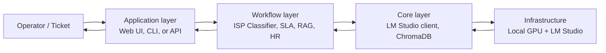

# Executive Summary

> A one-page overview of **AI Work Flow for Business** — what it is, the eleven modules it ships with, and how a new team should approach it.

---

## What this is

AI Work Flow for Business is a collection of eleven narrow, self-contained modules that use **local language models** to automate well-defined enterprise workflows — ticket classification, SLA risk assessment, runbook Q&A, leave approval, and so on. There is no cloud dependency, no shared infrastructure, and no general-purpose chatbot. Each module does one job and returns structured output.

The full case for the local-first design — and the compliance, cost, and latency reasons it exists — lives in [Why AI Work Flow for Business?](why-ai-work-flow.md). This page is the map of what ships today.

## The eleven modules

The current modules, grouped by audience, are:

| # | Module | What it does | Output |
| - | --- | --- | --- |
| 1 | [Getting Started](getting-started/index.md) | First steps with LM Studio and a local model | Working `talk_to_llm.py` |
| 2 | [ISP Classifier](isp-classifier/index.md) | Complaint → diagnostic code | `{code, confidence, reason}` |
| 3 | [ISP Classifier — Reasoning](isp-classifier-reasoning/index.md) | Same, with a written explanation | Code + narrative + evidence |
| 4 | [Qwen + RAG](qwen-rag/index.md) | Operator question → cited runbook answer | Cited paragraph |
| 5 | [Gemma E4B](gemma-e4b/index.md) | Same tasks, with a 4-bit quantized model | Module-specific |
| 6 | [HR Assistant](hr-assistant/index.md) | Leave approval, policy Q&A, sales funnel | Approval / cited answer |
| 7 | [SLA System](sla-system/index.md) | Ticket → SLA breach risk + ERP action | `{risk, action, approver}` |
| 8 | [Enterprise Apps](enterprise-apps/index.md) | Model use class, test harness, utility scripts | Reusable Python |
| 9 | [LLM Demos](llm-demos/index.md) | Basic, hierarchical, and stress-test demos | Behavioural output |
| 10 | [MLOps](mlops/index.md) | Registry, monitoring, A/B testing, retraining | Production tooling |
| 11 | [Smart Gift AI](smart-gift/index.md) | AI admin for the Smart Gift platform | Admin dashboard |

For the eleven modules' data flow and shared libraries, see [Architecture → Layers](architecture/layers.md).

## Architecture philosophy

The project is built on six principles. None of them are negotiable.

1. **Privacy first.** No cloud API call carries customer data. Period. The legal team does not get a vote on the design, because the design is already compliant.
2. **Locality only.** The model weights live on a machine the team controls. Inference happens on that machine. The same code runs on a developer laptop and on a production server.
3. **Speed matters.** The default model is **Qwen 2.5 1.5B** for classification and **Gemma E4B** for harder reasoning. Both fit on a single mid-range GPU and respond in 30–100 ms.
4. **Modular design.** Each module is self-contained. You can take the ISP Classifier and drop it into a different project without dragging the rest of the repo along.
5. **Production ready.** Every module has a structured input schema, a structured output schema, and logging for input, output, latency, and token count. You cannot operate what you cannot see.
6. **Human centric.** AI proposes. A human disposes. Every action is explainable and every escalation has an audit trail.

The trade-offs these principles force — and the cases where you should deliberately *not* use this stack — are covered in [Why AI Work Flow for Business?](why-ai-work-flow.md#what-this-project-is-not).

## How a workflow moves through the system

The same five-layer pattern applies to every module. The narrow AI task sits in the middle; the application surfaces the result; the operator makes the call.

The full data flow — including what crosses the network boundary, what does not, and what gets logged — lives in [Architecture → Data flow](architecture/data-flow.md).

## Quick start

The fastest way to evaluate the stack:

1. Install [LM Studio](https://lmstudio.ai) and download **Qwen 2.5 1.5B Instruct** (or **Gemma 4 E4B** for harder reasoning tasks).
2. Start the local server in LM Studio (`http://localhost:1234`).
3. Clone this repo and follow [Getting Started → Talk to LM Studio](getting-started/talk-to-llm.md) for a 10-minute sanity check.
4. Pick one module from the table above and follow the [adoption journey](adoption/index.md) — Discover → Pilot → Build → Scale — to take it to production.

A worked walkthrough of the ISP Classifier from ticket to routed owner is in [Case studies → ISP support triage](case-studies/index.md).

## Tech stack at a glance

| Layer | Tool |
| --- | --- |
| Language | Python 3.10+ |
| LLM runtime | LM Studio (OpenAI-compatible local server) |
| Default models | Qwen 2.5 1.5B Instruct, Gemma 4 E4B |
| Vector store | ChromaDB |
| Embeddings | sentence-transformers |
| Orchestration | LangChain, LlamaIndex |
| API server | FastAPI, Flask |
| Observability | Grafana, Prometheus |
| Packaging | Docker, Kubernetes |
| Docs | MkDocs Material (this site) |

## See also

- [Why AI Work Flow for Business?](why-ai-work-flow.md) — the case for local-first
- [Adoption journey](adoption/index.md) — the four phases that take a module from idea to production
- [Architecture](architecture/index.md) — the five layers, the data flow, and the security model
- [From rules to AI](from-rules-to-ai.md) — when to keep deterministic logic and when to reach for a model
- [Roadmap](ROADMAP.md) — what the next three phases add

## Next step

New here? Start with the [Demo](demo.md) page — it shows concrete output from each module. Then read [Adoption → Discover](adoption/discover.md) to see whether local-first AI is the right answer for your team's workflow.

---

**Repository:** [raqueeb/ai_work_flow](https://github.com/raqueeb/ai_work_flow) · **Docs:** [aiwithr.github.io/ai_llm](https://aiwithr.github.io/ai_llm/)
