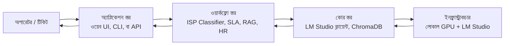

# এক্সিকিউটিভ সামারি

> **AI Work Flow for Business**-এর এক পাতার পরিচিতি — জিনিসটা কী, এগারোটা মডিউল কী কী, আর নতুন টিম প্রথমে কোনদিকে এগোবে।

---

## জিনিসটা আসলে কী

AI Work Flow for Business হলো এগারোটা ছোট ছোট, আলাদা আলাদা মডিউলের সংকলন। এগুলো **লোকাল ল্যাঙ্গুয়েজ মডেল** ব্যবহার করে এন্টারপ্রাইজের চেনা চেনা কাজগুলো অটোমেট করে — টিকিট ক্লাসিফিকেশন, SLA রিস্ক যাচাই, রানবুক থেকে উত্তর, ছুটি অ্যাপ্রুভাল, এরকম আরও নানা কাজ। এখানে কোনো ক্লাউড ডিপেন্ডেন্সি নেই, কোনো শেয়ার্ড ইনফ্রাস্ট্রাকচার নেই, কোনো সাধারণ চ্যাটবট নেই। প্রতিটা মডিউল একটাই কাজ করে, আর স্ট্রাকচার্ড আউটপুট দেয়।

লোকাল-ফার্স্ট ডিজাইনের পুরো যুক্তিটা — কমপ্লায়েন্স, খরচ, আর স্পিড — জানতে চাইলে পড়ো [কেন AI Work Flow for Business?](why-ai-work-flow.md) (ইংরেজি)। এই পেজটা হলো আজকে কী কী শিপ হচ্ছে তার ম্যাপ।

## এগারোটা মডিউল

অডিয়েন্স অনুযায়ী ভাগ করলে আজকের মডিউলগুলো এরকম দাঁড়ায়:

| # | মডিউল | কী করে | আউটপুট |
| - | --- | --- | --- |
| ১ | [Getting Started](bangla/getting-started/index.md) | LM Studio আর লোকাল মডেল দিয়ে প্রথম পদক্ষেপ | চলমান `talk_to_llm.py` |
| ২ | [ISP Classifier](bangla/isp-classifier/index.md) | কমপ্লেইন থেকে ডায়াগনস্টিক কোড | `{code, confidence, reason}` |
| ৩ | [ISP Classifier — Reasoning](bangla/isp-classifier-reasoning/index.md) | একই কাজ, লিখিত ব্যাখ্যাসহ | কোড + ব্যাখ্যা + প্রমাণ |
| ৪ | [Qwen + RAG](bangla/qwen-rag/index.md) | অপারেটরের প্রশ্ন → সোর্সসহ রানবুক উত্তর | সোর্স-সহ প্যারাগ্রাফ |
| ৫ | [Gemma E4B](bangla/gemma-e4b/index.md) | একই কাজ, ৪-বিট কোয়ান্টাইজড মডেল দিয়ে | মডিউল-নির্দিষ্ট |
| ৬ | [HR Assistant](bangla/hr-assistant/index.md) | ছুটি অ্যাপ্রুভাল, পলিসি প্রশ্ন, সেলস ফানেল | অ্যাপ্রুভাল / সোর্সসহ উত্তর |
| ৭ | [SLA System](bangla/sla-system/index.md) | টিকিট → SLA ব্রিচ রিস্ক + ERP অ্যাকশন | `{risk, action, approver}` |
| ৮ | [Enterprise Apps](bangla/enterprise-apps/index.md) | মডেল ইউজ ক্লাস, টেস্ট হার্নেস, ইউটিলিটি স্ক্রিপ্ট | পুনর্ব্যবহারযোগ্য পাইথন |
| ৯ | [LLM Demos](bangla/llm-demos/index.md) | বেসিক, হায়ারার্কিক্যাল, আর স্ট্রেস-টেস্ট ডেমো | বিহেভিয়ারাল আউটপুট |
| ১০ | [MLOps](bangla/mlops/index.md) | রেজিস্ট্রি, মনিটরিং, A/B টেস্টিং, রিট্রেনিং | প্রোডাকশন টুলিং |
| ১১ | [Smart Gift AI](bangla/smart-gift/index.md) | Smart Gift প্ল্যাটফর্মের AI অ্যাডমিন | অ্যাডমিন ড্যাশবোর্ড |

এগারোটা মডিউলের ডেটা ফ্লো আর শেয়ার্ড লাইব্রেরি জানতে দেখো [Architecture → Layers](architecture/layers.md) (ইংরেজি)।

## আর্কিটেকচারের দর্শন

পুরো প্রজেক্টটা দাঁড়িয়ে আছে ছয়টা নীতির ওপর। এগুলোর কোনোটাই আলোচনাসাপেক্ষ নয়।

১. **প্রাইভেসি আগে।** কোনো ক্লাউড API কলে কাস্টমার ডেটা যাবে না। এটাই শেষ কথা। লিগ্যাল টিমকে আর ডিজাইনের ওপর ভোট দিতে হবে না, কারণ ডিজাইন আগে থেকেই কমপ্লায়েন্ট।

২. **লোকালিটি মাত্র।** মডেলের ওজন থাকবে টিমের নিজের মেশিনে। ইনফারেন্স হবে সেই মেশিনে। ডেভেলপারের ল্যাপটপে যে কোড চলে, প্রোডাকশন সার্ভারেও একই কোড চলে।

৩. **স্পিড গুরুত্বপূর্ণ।** ডিফল্ট মডেল হলো ক্লাসিফিকেশনের জন্য **Qwen 2.5 1.5B**, আর কঠিন রিজনিং-এর জন্য **Gemma E4B**। দুটোই একটা মিড-রেঞ্জ GPU-তে চলে, আর ৩০ থেকে ১০০ মিলিসেকেন্ডে উত্তর দেয়।

৪. **মডিউলার ডিজাইন।** প্রতিটা মডিউল আলাদা। ISP Classifier তুমি তুলে অন্য প্রজেক্টে ঢুকাতে পারো, বাকি রিপোজিটরির বোঝা মাথায় না নিয়েই।

৫. **প্রোডাকশন-রেডি।** প্রতিটা মডিউলের স্ট্রাকচার্ড ইনপুট স্কিমা আছে, স্ট্রাকচার্ড আউটপুট স্কিমা আছে, আর ইনপুট, আউটপুট, লেটেন্সি, টোকেন কাউন্ট — সবকিছুর লগিং আছে। যেটাকে দেখা যায় না, সেটাকে অপারেট করা যায় না।

৬. **মানুষ-কেন্দ্রিক।** AI প্রস্তাব দেয়, মানুষ সিদ্ধান্ত নেয়। প্রতিটা অ্যাকশন ব্যাখ্যাযোগ্য, আর প্রতিটা এসক্যালেশনের অডিট ট্রেইল থাকে।

এই নীতিগুলো যে ট্রেড-অফগুলো টেনে আনে — আর কোন কোন ক্ষেত্রে তুমি ইচ্ছে করে এই স্ট্যাক **ব্যবহার করবে না** — সেটা আছে [কেন AI Work Flow for Business? → এই প্রজেক্ট যা নয়](why-ai-work-flow.md) (ইংরেজি) পেজে।

## একটা ওয়ার্কফ্লো সিস্টেমের ভেতর দিয়ে কীভাবে যায়

প্রতিটা মডিউলের পেছনে একই পাঁচ স্তরের প্যাটার্ন। মাঝখানে বসে আছে সংকীর্ণ AI টাস্ক, অ্যাপ্লিকেশন সেটার ফলাফল দেখায়, আর অপারেটর শেষ সিদ্ধান্ত নেয়।

পুরো ডেটা ফ্লো — নেটওয়ার্ক বর্ডারের কোন পাশ দিয়ে কী যায়, কী যায় না, কী লগ হয় — জানতে দেখো [Architecture → Data flow](architecture/data-flow.md) (ইইংরেজি)।

## কুইক স্টার্ট

স্ট্যাকটা দ্রুত পরীক্ষা করতে চাইলে এই চারটা পদক্ষেপ যথেষ্ট।

১. [LM Studio](https://lmstudio.ai) ইনস্টল করো, আর **Qwen 2.5 1.5B Instruct** ডাউনলোড করো। কঠিন রিজনিং টাস্কের জন্য বদলে **Gemma 4 E4B** নিতে পারো।

২. LM Studio-তে লোকাল সার্ভার চালু করো (`http://localhost:1234`)।

৩. এই রিপোজিটরি ক্লোন করো, আর ১০ মিনিটের স্যানিটি চেকের জন্য [Getting Started → Talk to LM Studio](getting-started/talk-to-llm.md) (ইংরেজি) ফলো করো।

৪. ওপরের টেবিল থেকে যেকোনো একটা মডিউল বেছে নাও, আর [Adoption journey](adoption/index.md) (ইংরেজি) — Discover → Pilot → Build → Scale — ফলো করে প্রোডাকশনে নিয়ে যাও।

ISP Classifier-এর একটা কাজের উদাহরণ — টিকিট থেকে শুরু করে রাউটেড ওনার পর্যন্ত — আছে [Case studies → ISP support triage](case-studies/index.md) (ইংরেজি) পেজে।

## টেক স্ট্যাক এক নজরে

| স্তর | টুল |
| --- | --- |
| ভাষা | Python 3.10+ |
| LLM রানটাইম | LM Studio (OpenAI-কম্প্যাটিবল লোকাল সার্ভার) |
| ডিফল্ট মডেল | Qwen 2.5 1.5B Instruct, Gemma 4 E4B |
| ভেক্টর স্টোর | ChromaDB |
| এম্বেডিং | sentence-transformers |
| অর্কেস্ট্রেশন | LangChain, LlamaIndex |
| API সার্ভার | FastAPI, Flask |
| অবজার্ভেবিলিটি | Grafana, Prometheus |
| প্যাকেজিং | Docker, Kubernetes |
| ডকুমেন্টেশন | MkDocs Material (এই সাইটটা) |

## আরও পড়ো

- [কেন AI Work Flow for Business?](why-ai-work-flow.md) (ইংরেজি) — লোকাল-ফার্স্টের যুক্তি
- [Adoption journey](adoption/index.md) (ইংরেজি) — আইডিয়া থেকে প্রোডাকশনে যাওয়ার চারটা ধাপ
- [Architecture](architecture/index.md) (ইংরেজি) — পাঁচটা স্তর, ডেটা ফ্লো, আর সিকিউরিটি মডেল
- [রুলস থেকে AI-তে](from-rules-to-ai.md) — কখন ডিটারমিনিস্টিক লজিক রাখবে, আর কখন মডেলের কাছে যাবে
- [Roadmap](ROADMAP.md) — পরের তিনটা ফেজে কী কী যোগ হবে

## পরের পদক্ষেপ

নতুন এসেছো? শুরু করো [Demo](demo.md) (ইংরেজি) পেজ দিয়ে — প্রতিটা মডিউলের বাস্তব আউটপুট দেখতে পাবে। তারপর পড়ো [Adoption → Discover](adoption/discover.md) (ইংরেজি), বুঝতে পারবে লোকাল-ফার্স্ট AI তোমার টিমের ওয়ার্কফ্লোর জন্য সঠিক উত্তর কি না।

---

**রিপোজিটরি:** [raqueeb/ai_work_flow](https://github.com/raqueeb/ai_work_flow) · **ডকুমেন্টেশন:** [aiwithr.github.io/ai_llm](https://aiwithr.github.io/ai_llm/)
