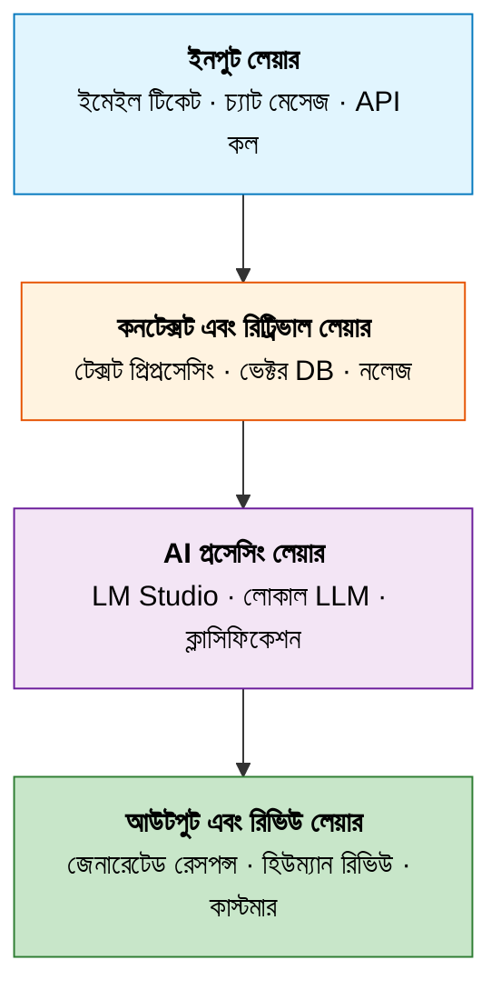
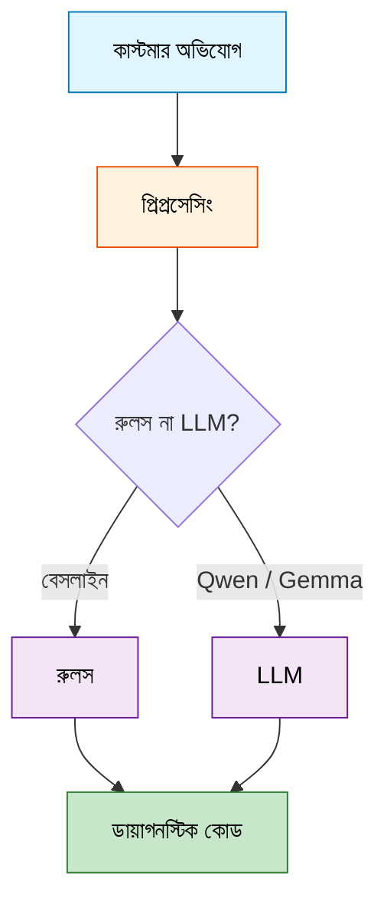
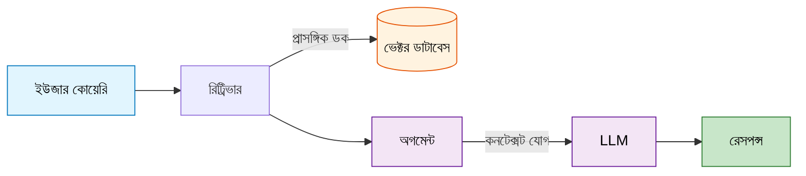
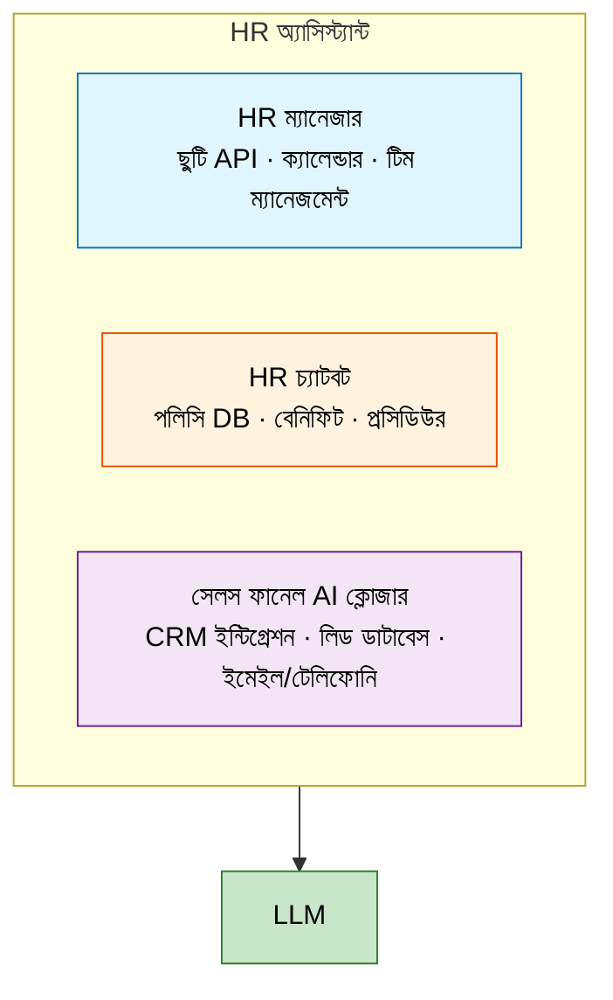
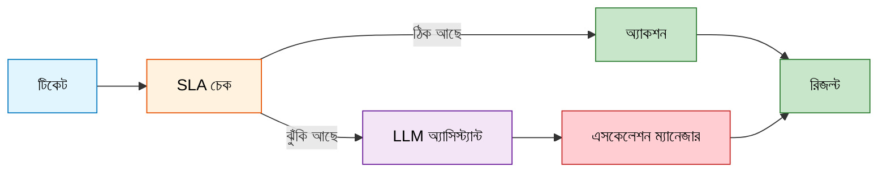

# এন্টারপ্রাইজ AI অটোমেশন - সম্পূর্ণ প্রজেক্ট সামারি

> প্রাইভেসি-ফার্স্ট AI এজেন্ট - রিয়েল ওয়ার্ল্ড ISP অপারেশনের জন্য। ক্লাউড নেই। ডেটা লিক নেই। খাঁটি লোকাল ইন্টেলিজেন্ট।

---

আপনি কি জানেন, একটা কোম্পানিতে প্রতিদিন কতগুলো কাজ বারবার করতে হয়? একটা ফর্ম ফিল করুন, একটা মেইল পাঠান, একটা রিপোর্ট বানান। এগুলো আসলে একই ধরনের। একটু বদলে যায়, কিন্তু মূল প্রসেস একই।

## প্রজেক্ট ওভারভিউ

এই রিপোজিটরিতে ১১টা প্রজেক্ট গ্রুপ আছে। প্রতিটা নিজস্ব ডকুমেন্টেশন এবং উদাহরণ সহ সম্পূর্ণ স্বতন্ত্র। প্রজেক্টটা দেখায় কিভাবে লোকাল LLM (Large Language Model) ব্যবহার করে ক্লাউডের উপর নির্ভর না করে এন্টারপ্রাইজ অটোমেশন করা যায়।

### কোন মডেল ব্যবহার করা হয়

| মডেল | প্যারামিটার | কাজ |
|------|-------------|-----|
| Qwen 2.5 | 1.5B | মূল ক্লাসিফিকেশন এবং রিজনিং |
| Gemma 4 | E4B (4-bit) | দক্ষ ইনফারেন্স, সিকিউরিটি অ্যানালাইসিস |

## আর্কিটেকচার ফিলোসোফি

প্রজেক্টটা ছয়টা মূল নীতির উপর দাঁড়িয়ে আছে:

**প্রাইভেসি ফার্স্ট** - সব ডেটা অন-প্রিমিসেসে থাকে। সেনসিটিভ ডেটার জন্য ক্লাউড API কল নেই। কাস্টমারের তথ্য কখনো আপনার ইনফ্রাস্ট্রাকচার ছেড়ে বেরোয় না।

**লোকালিটি অনলি** - সম্পূর্ণ নিজের হার্ডওয়্যারে চলে। ইন্টারনেটের উপর নির্ভরতা নেই। প্রয়োজনে সিস্টেম অফলাইন কাজ করে।

**স্পিড ম্যাটার্স** - ছোট, দক্ষ মডেল (1.5B - 7B প্যারামিটার) দ্রুত ইনফারেন্স টাইম দেয়। কাস্টমার সাপোর্টে রিয়েল-টাইম রেসপন্স।

**মডিউলার ডিজাইন** - প্রতিটা প্রজেক্ট নিজে সম্পূর্ণ এবং সহজে এক্সটেন্ড করা যায়।

**প্রোডাকশন রেডি** - শুরু থেকেই MLOps পাইপলাইন, মনিটরিং এবং A/B টেস্টিং ক্যাবিলিটি সহ বানানো।

**হিউম্যান সেন্ট্রিক** - AI সাহায্য করে কিন্তু মানুষ সিদ্ধান্ত নেয়। সব সিদ্ধান্ত ব্যাখ্যাযোগ্য এবং সম্পূর্ণ অডিট ট্রেইল সহ।

## সিস্টেম আর্কিটেকচার

সামগ্রিক সিস্টেম চারটি সংযুক্ত স্তর নিয়ে কাজ করে। প্রতিটা স্তরের নিজস্ব দায়িত্ব আছে এবং চাহিদা অনুযায়ী আলাদাভাবে স্কেল করা যায়।



## প্রজেক্ট মডিউলসমূহ

### ১. গেটিং স্টার্টেড

**লোকেশন:** `getting-started/`

আপনি যদি একদম নতুন হন, তাহলে এখান থেকে শুরু করুন। এখানে LM Studio এবং লোকাল LLM ডেভেলপমেন্টে প্রথম পদক্ষেপ শেখানো হয়েছে।

**আপনার দরকার হবে:**

- LM Studio ইনস্টল এবং রানিং
- Qwen 2.5 1.5B অথবা Gemma 4 E4B মডেল লোড করা
- Python 3.8+ ইনস্টল করা

**মূল স্ক্রিপ্ট:**

| স্ক্রিপ্ট | বর্ণনা |
|---------|-------|
| `talk_to_llm.py` | বেসিক LLM কমিউনিকেশন স্ক্রিপ্ট |

**দ্রুত শুরু:**

```python
import requests

response = requests.post(
    "http://localhost:1234/v1/chat/completions",
    json={
        "model": "qwen2.5-coder-1.5b-instruct",
        "messages": [{"role": "user", "content": "Hello"}]
    }
)
```

**মূল শেখা:**

- LM Studio সার্ভারের সাথে কমিউনিকেট করা কিভাবে
- বেসিক প্রম্পট-রেসপন্স প্যাটার্ন
- টেম্পারেচার এবং টোকেন সেটিংস

### ২. ISP ক্লাসিফায়ার

**লোকেশন:** `isp-classifier/`

এটা হল মূল প্রজেক্ট। এখানে লোকাল LLM ব্যবহার করে কাস্টমার কমপ্লেইন ক্লাসিফিকেশন সিস্টেম বানানো হয়েছে। কাস্টমারদের অভিযোগগুলো ডায়াগনস্টিক কোডে ম্যাপ করা হয় দ্রুত ট্রাবলশুটিংয়ের জন্য।

**লেখক:** রকিবুল হাসান, লিংক৩ টেকনোলজিস

**ক্লাসিফিকেশন ক্যাটাগরি:**

- **টেকনিক্যাল ইস্যু:** কানেকশন সমস্যা, স্পিড সমস্যা, ইকুইপমেন্ট ফেইলিওর
- **বিলিং:** ইনভয়েস বিরোধ, পেমেন্ট প্রসেসিং, সাবস্ক্রিপশন পরিবর্তন
- **সার্ভিস আউটেজ:** প্ল্যানড মেইনটেন্যান্স, আনপ্ল্যানড ডাউনটাইম
- **অ্যাকাউন্ট ম্যানেজমেন্ট:** প্রোফাইল আপডেট, পাসওয়ার্ড রিসেট, ক্যানসেলেশন

**ডায়াগনস্টিক কোড:**

| কোড | বর্ণনা |
|------|-------|
| ISP-001 | ONT/ফাইবার সমস্যা |
| ISP-002 | ওয়াইফাই/রাউটার সমস্যা |
| ISP-006 | আবহাওয়া-সম্পর্কিত আউটেজ |
| ISP-036 | ফাইবার কাট/ড্যামেজ |
| ISP-047 | সিগন্যাল লেভেল সমস্যা |

**মূল স্ক্রিপ্ট:**

| স্ক্রিপ্ট | বর্ণনা |
|---------|-------|
| `app-baseline-class.py` | বেসলাইন রুল-বেসড ক্লাসিফায়ার |
| `app-optimized-classifiers.py` | অপ্টিমাইজড ক্লাসিফায়ার |
| `app-classifier1.py` থেকে `app-classifier9.py` | বিভিন্ন ক্লাসিফায়ার ভার্সন |
| `traditional_vs_ai_workflow.py` | তুলনা স্ক্রিপ্ট |

**ব্যবহার:**

```python
from isp_classifier import LLMClassifier

classifier = LLMClassifier()
complaint = "আমার ONT-এ লাল বাতি জ্বলছে, ইন্টারনেট কাজ করছে না"
result = classifier.classify(complaint)
```

**আর্কিটেকচার:**



### ৩. ISP ক্লাসিফায়ার রিজনিং

**লোকেশন:** `isp-classifier-reasoning/`

ক্লাসিফিকেশনে ব্যাখ্যা ক্যাপাবিলিটি যোগ করে। শুধু ক্লাসিফাই করে না, বরং ব্যাখ্যা করে কেন এই নির্দিষ্ট ডায়াগনস্টিক কোড বেছে নেওয়া হল।

**রিজনিং কেন দরকার:**

| রিজনিং ছাড়া | রিজনিং সহ |
|--------------|-----------|
| "ISP-001" | "ISP-001 - ONT/ফাইবার সমস্যা ডিটেক্ট করা হয়েছে" |
| কোনো ব্যাখ্যা নেই | "লাল বাতির প্যাটার্ন ONT ফেইলিওরের সাথে মিলে যাচ্ছে" |
| ব্ল্যাক বক্স | স্বচ্ছ ডিসিশন-মেকিং |

**মূল স্ক্রিপ্ট:**

| স্ক্রিপ্ট | বর্ণনা |
|---------|-------|
| `app-reasoning1.py` | Qwen দিয়ে বেসিক রিজনিং |
| `app-reasoning2.py` | Gemma দিয়ে উন্নত রিজনিং |

**উদাহরণ আউটপুট:**

```
অভিযোগ: "আমার ONT-এ লাল বাতি জ্বলছে এবং ইন্টারনেট বন্ধ হয়ে গেছে"

{
  "code": "ISP-001",
  "reasoning": "ONT-এর 'লাল বাতি' ফাইবার ডিসকানেকশন বা ONT হার্ডওয়্যার
               ফেইলিওরের ক্লাসিক ইন্ডিকেটর।",
  "confidence": 0.92,
  "evidence": ["লাল বাতি", "ONT", "ইন্টারনেট বন্ধ"],
  "action": "ONT-তে ফাইবার কানেকশন চেক করুন, ONT রিবুট করুন"
}
```

**সুবিধা:**

১. **স্বচ্ছতা** - কেন সিদ্ধান্ত নেওয়া হল জানা যায়
২. **বিশ্বাসযোগ্যতা** - অপারেটররা ক্লাসিফিকেশন ভেরিফাই করতে পারে
৩. **ডিবাগিং** - ক্লাসিফিকেশন এরর সহজে খুঁজে বের করা যায়
৪. **কমপ্লায়েন্স** - রেগুলেটরি রিকোয়ারমেন্টের জন্য অডিট ট্রেইল

### ৪. Qwen + RAG

**লোকেশন:** `qwen-rag/`

Qwen 2.5 1.5B কে Retrieval-Augmented Generation (RAG) এর সাথে কম্বাইন করে নলেজ-বেসড রেসপন্স তৈরি করা হয়।

**RAG কী?**

১. নলেজ বেস থেকে প্রাসঙ্গিক ডকুমেন্ট রিট্রিভ করা
২. রিট্রিভ করা কনটেক্সট দিয়ে প্রম্পট অগমেন্ট করা
৩. সঠিক, আপডেট তথ্য সহ রেসপন্স জেনারেট করা

**আর্কিটেকচার:**



**মূল স্ক্রিপ্ট:**

| স্ক্রিপ্ট | বর্ণনা |
|---------|-------|
| `qwen_rag_demo.py` | সম্পূর্ণ RAG ইমপ্লিমেন্টেশন |
| `qwen_simple_rag.py` | বেসিক RAG উদাহরণ |
| `qwen_vector_storage.py` | ভেক্টর স্টোরেজ ইউটিলিটি |

**সুবিধা:**

| সুবিধা | বর্ণনা |
|--------|-------|
| অ্যাকুরেসি | প্রকৃত ডকুমেন্টের উপর ভিত্তি করে রেসপন্স |
| ফ্রেশনেস | নলেজ বেস আপডেট করা যায় |
| অ্যাট্রিবিউশন | সোর্স উদ্ধৃত করা যায় |
| হ্যালুসিনেশন | ডকুমেন্টে গ্রাউন্ড করে কমানো হয় |

**ব্যবহার ক্ষেত্র:**

১. টেকনিক্যাল সাপোর্ট - প্রাসঙ্গিক ট্রাবলশুটিং গাইড টানুন
২. পলিসি Q&A - কোম্পানি ডকুমেন্টেশনের ভিত্তিতে উত্তর
৩. ট্রেনিং - কনটেক্সট-অ্যাওয়ার লার্নিং ম্যাটেরিয়াল

### ৫. Gemma E4B

**লোকেশন:** `gemma-e4b/`

গুগলের Gemma 4 E4B (4-bit কোয়ান্টাইজড) মডেলের ক্যাপাবিলিটি এখানে দেখানো হয়েছে - জটিল রিজনিং এবং ক্লাসিফিকেশন টাস্কের জন্য।

**মডেল স্পেসিফিকেশন:**

| স্পেক | ভ্যালু |
|------|--------|
| মডেল | gemma-4-e4b |
| কোয়ান্টাইজেশন | 4-bit |
| কনটেক্সট | 8K টোকেন |
| স্পিড | মিডিয়াম |
| অ্যাকুরেসি | হাই |

**পারফরম্যান্স তুলনা:**

এটা গুরুত্বপূর্ণ - কোন মডেল কোথায় ভালো। আমাদের টেস্টে দেখা গেছে:

| মেট্রিক | Qwen 1.5B | Gemma E4B |
|---------|-----------|-----------|
| অ্যাকুরেসি | 32.7% | 58.2% |
| স্পিড (ms) | 2973 | 4500 |
| কনটেক্সট | 4K | 8K |
| রিজনিং | বেসিক | অ্যাডভান্সড |

মানে Gemma E4B বেশি অ্যাকুরেট, কিন্তু একটু ধীর। তাই সিম্পল কাজে Qwen, জটিল কাজে Gemma - এভাবে ব্যবহার করা যায়।

**মূল স্ক্রিপ্ট:**

| স্ক্রিপ্ট | বর্ণনা |
|---------|-------|
| `gemma-4-e4b-app-optimized-classifiers.py` | অপ্টিমাইজড ক্লাসিফায়ার |
| `gemma-4-e4b-app-reasoning2.py` | রিজনিং ক্লাসিফায়ার |
| `gemma-4-e4b-cybersec_analysis.py` | সাইবার সিকিউরিটি অ্যানালাইসিস |
| `gemma-4-e4b-network_monitor.py` | নেটওয়ার্ক মনিটরিং |
| `gemma-4-e4b-test_llm_ISP_ticket_classifier.py` | ISP টিকেট ক্লাসিফায়ার |
| `apps-standard.py` | স্ট্যান্ডার্ড LLM অ্যাপস |
| `apps-slm.py` | SLM (Small Language Model) অ্যাপস |

**সেরা অভ্যাস:**

১. জটিল ক্লাসিফিকেশন টাস্কে ব্যবহার করুন
২. স্বচ্ছতার জন্য রিজনিং অন করুন
৩. দক্ষতার জন্য ব্যাচে প্রসেস করুন
৪. টোকেন ব্যবহার মনিটর করুন

### ৬. HR অ্যাসিস্ট্যান্ট

**লোকেশন:** `hr-assistant/`

AI-পাওয়ারড HR অটোমেশন টুল - ছুটি ম্যানেজমেন্ট, এমপ্লয়ি কোয়েরি এবং সেলস ফানেল অপ্টিমাইজেশনের জন্য।

**উপাদান:**

#### HR ম্যানেজার - ছুটি অ্যাপ্রুভাল

ছুটির আবেদন প্রসেসিং এবং অ্যাপ্রুভাল ওয়ার্কফ্লো অটোমেট করে।

#### HR অ্যাসিস্ট্যান্ট চ্যাটবট

পলিসি, বেনিফিট এবং প্রসিডিউর নিয়ে এমপ্লয়ি কোয়েরি হ্যান্ডেল করে।

#### সেলস ফানেল AI ক্লোজার

লিড কনভার্ট করার জন্য AI-পাওয়ারড সেলস অটোমেশন।

**মূল স্ক্রিপ্ট:**

| স্ক্রিপ্ট | বর্ণনা |
|---------|-------|
| `HR_manager_Approve_leave.py` | ছুটি অ্যাপ্রুভাল অটোমেশন |
| `HR_Assistant.py` | এমপ্লয়ি কোয়েরি চ্যাটবট |
| `Link3_Sales_Funnel_AI_Closer.py` | সেলস ফানেল অটোমেশন |

**ফিচার:**

| ফিচার | বর্ণনা |
|--------|-------|
| ছুটি প্রসেসিং | অটো-অ্যাপ্রুভ অথবা রিভিউতে ফ্ল্যাগ |
| পলিসি Q&A | HR প্রশ্নের তাৎক্ষণিক উত্তর |
| লিড স্কোরিং | হাই-ভ্যালু লিড প্রায়োরিটাইজ |
| রেসপন্স জেনারেশন | পার্সোনালাইজড সেলস আউটরিচ |
| সেন্টিমেন্ট অ্যানালাইসিস | এমপ্লয়ি উদ্বেগ ডিটেক্ট |

**আর্কিটেকচার:**



### ৭. SLA সিস্টেম

**লোকেশন:** `sla-system/`

কাস্টমার টিকেটের জন্য AI-পাওয়ারড অ্যাপ্রুভাল এবং এসকেলেশন ম্যানেজমেন্ট। ইন্টেলিজেন্ট অটোমেশনের মাধ্যমে SLA কমপ্লায়েন্স নিশ্চিত করে।

**উপাদান:**

#### SLA LLM অ্যাসিস্ট্যান্ট

রিয়েল-টাইমে SLA রিকোয়ারমেন্ট মনিটর এবং ম্যানেজ করে।

#### ERP AI অ্যাপ্রুভাল

ERP ওয়ার্কফ্লোর সাথে ইন্টিগ্রেটেড অটোমেটেড অ্যাপ্রুভাল সিস্টেম।

**SLA টায়ার:**

আপনি জানেন, সব কাজ সমান জরুরি নয়। কোনো কাজ এক ঘণ্টায় করতে হবে, কোনোটা একদিনে। এই সিস্টেম সেটা অটোমেটিক ম্যানেজ করে।

| টায়ার | রেসপন্স টাইম | রেজোলিউশন টাইম | উদাহরণ |
|------|---------------|-----------------|-------|
| Critical | 1 ঘণ্টা | 4 ঘণ্টা | সম্পূর্ণ আউটেজ |
| High | 4 ঘণ্টা | 8 ঘণ্টা | আংশিক কানেক্টিভিটি |
| Medium | 8 ঘণ্টা | 24 ঘণ্টা | পারফরম্যান্স সমস্যা |
| Low | 24 ঘণ্টা | 72 ঘণ্টা | সাধারণ প্রশ্ন |

**ফিচার:**

| ফিচার | বর্ণনা |
|--------|-------|
| রিয়েল-টাইম মনিটরিং | SLA স্ট্যাটাস ক্রমাগত ট্র্যাক |
| অটো এসকেলেশন | SLA ঝুঁকিতে থাকলে স্বয়ংক্রিয় এসকেলেট |
| অ্যাপ্রুভাল ওয়ার্কফ্লো | অ্যাপ্রুভালের ইন্টেলিজেন্ট রাউটিং |
| রিপোর্টিং | SLA কমপ্লায়েন্স ড্যাশবোর্ড |
| ইন্টিগ্রেশন | বিদ্যমান টিকেটিং সিস্টেমের সাথে কাজ করে |

**আর্কিটেকচার:**



### ৮. এন্টারপ্রাইজ অ্যাপস

**লোকেশন:** `enterprise-apps/`

বিজনেস অপারেশনের জন্য প্রোডাকশন-রেডি অ্যাপ্লিকেশন - মডেল ম্যানেজমেন্ট, টেস্টিং ফ্রেমওয়ার্ক এবং ইউটিলিটি স্ক্রিপ্ট।

**মূল স্ক্রিপ্ট:**

| স্ক্রিপ্ট | বর্ণনা |
|---------|-------|
| `model_use_class.py` | মডেল ব্যবহার এবং ম্যানেজমেন্ট |
| `test_classifier.py` | ক্লাসিফায়ার টেস্টিং ফ্রেমওয়ার্ক |
| `test_one.py` | সিঙ্গেল কেস টেস্টিং |
| `test_llm_ISP_ticket_classifier.py` | ISP টিকেট ক্লাসিফায়ার টেস্ট |

**ফিচার:**

| ফিচার | বর্ণনা |
|--------|-------|
| মাল্টি-মডেল সাপোর্ট | Qwen এবং Gemma এর মধ্যে সুইচ |
| ব্যবহার ট্র্যাকিং | টোকেন কনজাম্পশন মনিটর |
| পারফরম্যান্স মেট্রিক্স | অ্যাকুরেসি এবং লেটেন্সি ট্র্যাক |
| টেস্ট ফ্রেমওয়ার্ক | বিস্তারিত টেস্টিং স্যুট |
| রিপোর্টিং | বিস্তারিত রিপোর্ট জেনারেট |

**মডেল ম্যানেজার ব্যবহার:**

```python
from model_use_class import ModelManager

manager = ModelManager()
manager.load_model("qwen2.5-coder-1.5b-instruct")
manager.use_model("gemma-4-e4b")
response = manager.generate("ফাইবার অপটিক ট্রাবলশুটিং কী?")
```

## কুইক স্টার্ট গাইড

১. **LM Studio ইনস্টল করুন** [https://lmstudio.ai](https://lmstudio.ai/) থেকে
২. **একটা মডেল ডাউনলোড করুন** (Qwen 2.5 1.5B অথবা Gemma 4 E4B)
৩. **লোকাল সার্ভার স্টার্ট করুন** LM Studio-তে (localhost:1234)
৪. **যেকোনো স্ক্রিপ্ট রান করুন** প্রজেক্ট গ্রুপ থেকে

### বেসিক উদাহরণ

```bash
cd getting-started
python talk_to_llm.py
```

### ISP ক্লাসিফিকেশন উদাহরণ

```bash
cd isp-classifier
python app-classifier1.py
```

## টেক স্ট্যাক

| ক্যাটাগরি | টুল |
|----------|-----|
| ভাষা | Python 3.10+ |
| LLM রানটাইম | LM Studio |
| ভেক্টর DB | ChromaDB |
| এম্বেডিং | sentence-transformers |
| ফ্রেমওয়ার্ক | LangChain, LlamaIndex |
| API সার্ভার | FastAPI, Flask |
| ডাটাবেস | PostgreSQL, MongoDB |
| মনিটরিং | Grafana, Prometheus |
| ডিপ্লয়মেন্ট | Docker, Kubernetes |

## লাইসেন্স

| MIT লাইসেন্স

---

!!! note "আমাদের এই টুলকিট আপনারা বাংলায় পড়তে পারেন"

    আমাদের এই টুলকিট আপনারা বাংলায় পড়তে পারেন এই লিংক থেকে: [bangla/index.md](bangla/index.md)। সেখানে প্রতিটা মডিউলের বাংলা মিরর আছে - ISP ক্লাসিফায়ার, RAG, HR অ্যাসিস্ট্যান্ট, SLA সিস্টেম, MLOps এবং আরও অনেক কিছু। যেটা আপনার দরকার, সেটা পড়ুন, নিজের টিমের সাথে শেয়ার করুন।

---

**রিপোজিটরি:** [https://github.com/raqueeb/ai_work_flow](https://github.com/raqueeb/ai_work_flow)  
**ডকুমেন্টেশন:** [https://aiwithr.github.io/ai_llm/](https://aiwithr.github.io/ai_llm/)
