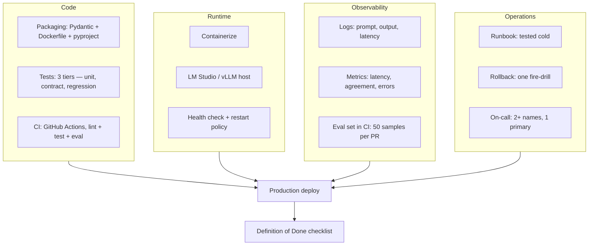

# 3. Build — from laptop script to production service

> **Time to complete:** 4–8 weeks, one workflow, 2–3 engineers + 1 ops/DevOps.
> **Exit criterion:** deployed in production, runbook exists, rollback tested, observability running.
> **Deliverable:** a service other engineers can deploy, monitor, and update without paging you.

By the end of [Pilot](pilot.md) you have a shadow-mode script that filled a bar for one week, and a "yes" decision: this workflow is worth productizing. Build is the phase that takes that laptop script and turns it into a service — something that runs for 90 days, is used by 5+ people, and does not break when one engineer goes on vacation.

Build is mostly not about writing code. It is about coordinating four parallel workstreams that all have to finish in the same 4–8 week window.

I am writing these four streams as separate workstreams because they are owned by different people, advance on different timelines, and any one of them slipping slips the whole Build. The Code stream can move with one engineer. Runtime needs ops/DevOps. Observability means infra. Operations means team agreement. "We can do it later" is not an option once you are in Build — something in production means people depend on it.

---

## What Build is NOT

This is not a new feature. This is not a model replacement. In Build you are not adding features, not fine-tuning a model, and not building a platform. Those belong in [Scale](scale.md). Build is: taking something that works on a laptop and turning it into something that runs reliably.

A small example. In [Pilot](pilot.md) you might have written a prompt for ISP ticket triage, run a Qwen 1.5B model on LM Studio, and tested it in shadow mode over 400 tickets. It runs on your laptop, the results are right, and you are happy. But in that moment nobody but you can run it — nobody else knows which port the model is on, which version of LM Studio is in use, which prompt file is the real one. If you go on vacation, the system stops. If your laptop dies, the project is over. Build's job is to break that "nothing without you" state — so the system outlives you.

---

## Workstream 1 — Code

**Goal:** turn the pilot script into a codebase that the rest of the team can read, test, and change. You wrote it alone, but tomorrow your colleague will run it — write for that colleague's eyes.

### Packaging

The project ships with Pydantic models (the contract), a Dockerfile (for runtime), a `pyproject.toml` or `requirements.txt` (pinned dependencies), and a "what this is" README. In Pilot your prompt and the LM Studio URL were enough. In Build that breaks down — because when your colleague opens the code tomorrow, they will not know which version of Pydantic you used, which prompt file is the real one, which output schema is being enforced. Packaging means writing those "known" things into files — so the codebase is legible without reading any documentation.

### Three-tier tests

**Tier 1 — unit tests.** Pure functions (confidence thresholds, priority caps, normalizers). Fast, no LLM involved, runs in milliseconds, and breaks surface immediately when wrong. Example: a `normalize_priority(raw: str) -> int` that converts the model's "P3" output into an integer. In Pilot you assumed the model always returned "P1", "P2", "P3", "P4". In reality one day the model returned "P-3", with a dash. The function crashed. In Pilot you might have fixed it by hand. In Build that case lives in a unit test, gets caught in CI, and tomorrow if anyone returns "P-3" the system handles it itself.

**Tier 2 — contract tests.** Prompt-output parsing validated against Pydantic. "Output validates against `TriageResult`", "Platinum + outage yields P1 or P2" — business rules like these live in contract tests. They catch: a missing field, a renamed field, an output that does not match the schema.

**Tier 3 — regression tests.** The 50-example shadow set from Pilot, frozen, run before every release, with failure modes counted. Those 50 examples are your "this used to work, does it still work" proof. If a prompt change moves the agreement rate from 92% to 81%, you see it before merge.

### CI

GitHub Actions (or whatever you have) now runs: lint, unit tests, contract tests, regression eval. Green to merge. No "I ran it manually, it works". No PR merges without CI green — that is the rule. A broken prompt, a lost Pydantic field, a changed model behaviour — all get caught before code merges.

---

## Workstream 2 — Runtime

**Goal:** turn the LM Studio that was on a laptop in Pilot into something that runs for 90 days, survives a restart, and serves 20 concurrent users.

Three realistic runtime options, from smallest to heaviest:

### Option A — LM Studio on a dedicated host (recommended for most teams)

A dedicated machine (an iGPU workstation or a small server). LM Studio runs as a systemd service with health checks. **Pros:** exact stack from Pilot, zero new ops load, engineers know it. **Cons:** manual scaling, single point of failure (one host = one failure). Best for one workflow, ≤ 20 concurrent users.

### Option B — vLLM container

Serve the model behind an OpenAI-compatible HTTP API, packaged in Docker. **Pros:** better throughput, GPU-friendly, standard ops tooling (Kubernetes, Helm) works. **Cons:** new infra path, vLLM-specific config, the "why not just LM Studio?" question. Consider when you have ≥ 50 concurrent users or ≥ 2 workflows.

### Option C — managed gateway (OpenRouter, LiteLLM, in-house)

Model routing, rate limits, caching, multi-model. **Pros:** easy to serve multiple workflows / models. **Cons:** another running system, another downstream vendor lock-in. Consider in [Scale](scale.md) when you have ≥ 3 workflows, not in Build.

### Health checks

The service exposes a `/health` endpoint. LB / k8s / systemd probes it. If the model is not loaded or it does not respond within 30 seconds — restart. In Pilot you checked health by opening the laptop and looking; in Build the system checks itself. That is the difference — from human eyes to system eyes.

---

## Workstream 3 — Observability

**Goal:** understand what is going wrong within 5 minutes of it going wrong. Three signals, that is enough — no more is needed in Build:

1. **Latency p50 + p95 (per workflow).** p50 tells you how fast the typical case is, p95 tells you how slow the bad case is. Including model + prompt + parsing. If p95 trends up over time, something is stuck — model is slower, prompt is longer, input is larger.
2. **Agreement rate (sampled).** For every 1000 invocations, 10 human-checked outcomes — a human sits down, looks at 10 cases, and says whether the model's answer was right. If it drops 10 points below baseline, page. This is cheap to maintain and incredibly valuable — because "is the model still giving good answers" is not something you can tell from latency alone.
3. **Error rate.** Parsing failures, timeouts, 5xx. If it goes from green to 1%, page.

Tooling — Grafana + Prometheus is enough, not Datadog. If you have a cookie jar at home, use that. The point of Build is that the signals are defined on paper, not in the tool — so the on-call engineer knows what to look at. A "good dashboard" is a bonus, a "good signal" is the real thing.

### Eval in CI

Every PR runs against a subset of the 50-example regression set. 10 minutes of work, answers the question "did we regress this week". When a PR opens, 10 minutes later green/red — no PR merges without this, well before Build.

---

## Workstream 4 — Operations

**Goal:** handle failures safely. Failures will happen — the question is when, how, and how fast you recover. Three things are needed, each written and tested.

### Runbook — tested cold

One page: "what to do if the model times out", "what to do if parsing errors spike", "what to do if the GPU fails", "what to do if confidence spikes low". "Tested cold" means an engineer who has not looked at the code in 3 months can solve the problem in 15 minutes at midnight. Writing the runbook is not enough — reading it, following it, timing it. Writing and reading are two different jobs.

### Rollback — one fire-drill

A rollback plan ("revert to the previous model version", "disable the workflow", "route all invocations to manual") is one thing. Running it once in a fire-drill is another. Build's deliverable: the fire-drill date, who ran it, how long it took — written, with witnesses.

### On-call — 2+ names, 1 primary

For any running workflow, PagerDuty / Telegram / phone call — whatever — rotates 2+ engineers, 1 primary, 1 secondary. The point: if one engineer is on vacation, the system does not stop. "Someone is on duty" written down is not enough; "Rakib this week, Tanvir next week, backup Habib" is enough. If the roster does not have names, on-call means everyone, which means nobody.

---

## What you should NOT do in Build

- **Do not fine-tune the model.** Not in the Build window. Fine-tuning data collection, training, eval, regression — does not fit in a 4–8 week Build. Fine-tuning is a [Scale](scale.md) activity, if it ever happens, when continuous eval keeps failing.
- **Do not build a generic AI platform.** Your Build is for this workflow. Platform work belongs in [Scale](scale.md), when 3+ workflows are running, 2+ teams. Building a platform for one workflow = over-engineering.
- **Do not skip the observability argument.** "We will look at it when we get paged" — the on-call engineer forgets, signals are seen late, users find out first. 5 minutes of setup, 90 days saved — easy math.
- **Do not make prompt changes outside of a release.** Prompt = code. One PR, one CI run, one regression eval. "I quickly changed a word" is not authorized in production, because today's small change can become tomorrow's big behaviour change.

---

## Definition of Done

Build is done. The following are all true, and you are ready for [Scale](scale.md):

- [ ] Code packaged (Pydantic, Dockerfile, pyproject) + CI green
- [ ] Three-tier tests: unit, contract, regression — all in CI
- [ ] Runtime dedicated (LM Studio / vLLM) + health check
- [ ] 3 signals on the dashboard: latency p50/p95, agreement, errors
- [ ] Runbook tested cold (date, who, how long)
- [ ] Rollback fire-drill (date, who, how long)
- [ ] On-call rota 2+ names, 1 primary
- [ ] ≥ 4 weeks of production uptime, 0 unplanned outages

If all of these are true, you have entered [Scale](scale.md). If one or more is missing — stay in Build, fix it, then move on. Rushing into Scale means that gap comes back 10x bigger — a problem you can hide with one workflow explodes across five.

---

For further reading: go back to [Discover](discover.md) (what happened before Build), or move on to [Scale](scale.md) (what happens after Build).
