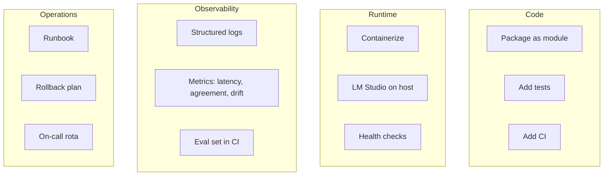

# 3. Build — how do we productionize it?

> **Time to complete:** 4–8 weeks, one workflow, 2–3 engineers, plus ops/DevOps.
> **Exit criterion:** the workflow is in production with the success bar met, observability in place, and a rollback plan tested.
> **Deliverable:** a service other engineers can deploy, monitor, and update without paging you.

Build is the phase where a working pilot becomes a service. The pilot script worked on your laptop; Build turns it into something an on-call engineer can run at 2 AM and a new hire can modify in their first week.

The four workstreams of Build run in parallel, not in sequence.

---

## Workstream 1 — code: package the contract

The pilot script lived in a `.py` file. Build turns it into a package.

What "package" means concretely:

- **One entry point.** `python -m isp_classifier.triage` or `aiwf triage isp <input>`. The shape of the command is the shape of the contract.
- **Typed boundary.** Pydantic models (or dataclasses) for inputs and outputs. The model returns a typed object, not a stringified JSON blob.
- **Tests in three layers.** Unit tests for the contract, golden tests for known cases from the pilot's failure log, integration tests against a running LM Studio instance.
- **A regression eval set.** The 30–50 cases from the pilot's shadow week, frozen as a test fixture. CI runs the eval on every commit.

The eval set is the single most important artifact of Build. It is the difference between "we changed a prompt and the system got worse" being caught in CI vs. being caught by a customer.

---

## Workstream 2 — runtime: where the model actually runs

LM Studio on a developer's laptop is fine for a pilot. It is not fine for production. Three options, in order of preference:

### Option A — LM Studio on a dedicated host (recommended to start)

A small box (16 GB RAM, no GPU needed for 1.5B / 4B models) running LM Studio's local server. The application calls `http://box.local:1234/v1/chat/completions` exactly like it would call any OpenAI-compatible API.

Pros: zero code change from the pilot, full data residency, easy to swap models.
Cons: single point of failure, manual capacity planning.

### Option B — vLLM / Ollama on a container

For higher throughput or GPU acceleration. vLLM exposes the same OpenAI-compatible API. The application code is identical to Option A; only the URL changes.

Pros: 10–30x throughput per box, GPU support, autoscaling.
Cons: ops complexity, more things that can go wrong at 2 AM.

### Option C — managed local-LLM service (e.g. enterprise LM Studio gateway)

A small in-house service that owns the model lifecycle, exposes a stable API, and handles model upgrades, A/B tests, and capacity. This is the right answer once you have 3+ teams running pilots. It is overkill for the first team.

**For Build, pick Option A.** Graduate to B or C in [Scale](scale.md).

---

## Workstream 3 — observability: what you measure in production

Three signals, in order of importance:

1. **Latency p50 and p95.** If p95 goes above 2x the pilot's p95, something is wrong — model is too big for the box, box is overloaded, or LM Studio swapped to a slower backend. Alert at 1.5x p95, page at 2x p95.
2. **Agreement rate (sampled).** Spot-check 5% of production traffic against the eval set. If agreement drops below the bar, page someone. This is the drift detector.
3. **Error rate.** 5xx from your service, 4xx from LM Studio, timeouts. A simple counter per category. Alert on any sustained rate > 1%.

Things you do **not** need in Build:

- A full ML monitoring platform. A Grafana dashboard and three Prometheus counters is enough.
- A model registry. You have one model. Add a registry when you have three.
- An LLM-specific tool. Plain observability works.

---

## Workstream 4 — operations: how a stranger runs it

The test for "done" in Build is: **a colleague who has never seen the code can deploy it, monitor it, and roll it back, using only the docs you wrote**.

Three artifacts:

- **A runbook.** "If latency p95 > 1.5x baseline, do X. If LM Studio returns 5xx, do Y. If eval set fails in CI, do Z." One page, printable, tested by having a colleague follow it cold.
- **A rollback plan.** "To roll back, redeploy the previous container image and revert the model to the previous version. Tested on YYYY-MM-DD." Rollback that has not been tested is not a rollback, it is a hope.
- **An on-call rota.** Even if the rota is "two engineers, one week each". If nobody is named, the on-call is everyone, which means it is nobody.

---

## What you should NOT do in Build

- Do not fine-tune the model. Base 1.5B / 4B is the test. Fine-tuning is its own phase, only justified by sustained eval failure.
- Do not build a generic AI platform. The package is for one workflow. The platform is a [Scale](scale.md) decision.
- Do not skip the runbook. "We have Grafana" is not a runbook.
- Do not skip the rollback test. "We can re-deploy" is not a rollback test.

---

## Definition of done

- [ ] Package installed via `pip install` or container image
- [ ] CI runs unit, golden, and eval-set tests on every commit
- [ ] Service running on a dedicated host, health checks green
- [ ] Latency, agreement, error metrics in Grafana
- [ ] Runbook written and tested cold by a colleague
- [ ] Rollback plan written and rehearsed once
- [ ] On-call rota has at least 2 named engineers
- [ ] One week of production traffic with no P1 incidents

When all eight are checked, you are in production. Go to [Scale](scale.md) when the second team wants in.
