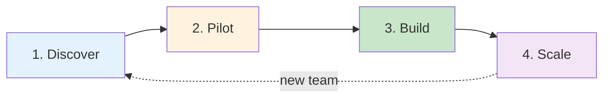

# Adoption journey

Bringing a local LLM workflow into production is not a single decision. It is a four-phase journey. Each phase has a clear entry criterion, a clear exit criterion, and a deliverable that the next phase can build on.

| Phase | Question you answer | Doc |
| --- | --- | --- |
| **1. Discover** | "Is local LLM worth considering for my team?" | [discover.md](discover.md) |
| **2. Pilot** | "Can we ship one workflow in 2 weeks?" | [pilot.md](pilot.md) |
| **3. Build** | "How do we put it in production?" | [build.md](build.md) |
| **4. Scale** | "How do we roll out to 5+ teams?" | [scale.md](scale.md) |

## When to use this

Use the four phases when you are evaluating AI Work Flow for Business for a **new team or workflow**. If you already have a working local-LLM prototype, jump to [Build](build.md). If you have one team in production and want to expand, jump to [Scale](scale.md).

## What you should NOT do

Do not skip Discover and go straight to building. Most failed local-LLM projects fail because the team picked the wrong workflow. The Discover phase exists to prevent that.

Do not stay in Pilot indefinitely. A pilot that has not graduated in 6 weeks is a sign the workflow was the wrong choice. Kill it and try another.

## See also

- [Why AI Work Flow for Business?](../why-ai-work-flow.md) — the case for local-first
- [Demo](../demo.md) — what the modules actually do
- [Case studies](../case-studies/index.md) — real or representative walkthroughs
