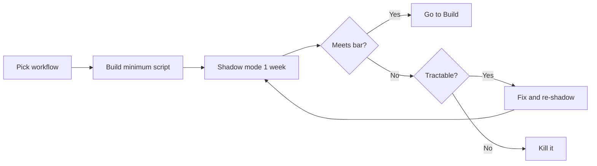

# 2. Pilot — can we ship one workflow in 2 weeks?

> **Time to complete:** 2–4 weeks, one workflow, 1–2 engineers, 5–10 internal users.
> **Exit criterion:** the workflow runs in shadow mode for one week with measurable success on the bar set in [Discover](discover.md).
> **Deliverable:** a working service or script that the next engineer can read, run, and extend — not a slide deck.

A pilot exists to answer one question: **can this workflow go to production?** It is not a research project, not a benchmark, and not a training exercise. If the pilot does not graduate in 6 weeks, the workflow was the wrong choice — kill it and try another.

---

## What a pilot looks like



A pilot is **bounded by time**, not by feature count. Two weeks of calendar time, even if the script only handles 60% of cases. The remaining 40% is the Build phase's problem, not yours.

---

## Step 1 — pick the smallest shippable surface (Day 1)

Strip the workflow to its **spine**:

- ISP triage → "classify this ticket into one of 5 categories"
- Bank IT triage → "is this a password reset, VPN, or hardware request?"
- Factory handover → "summarize the last 8 hours of shift log into 3 bullets"
- Config review → "flag the 3 highest-risk lines in this config"

If you cannot say it in one sentence, the surface is too big. Cut until you can.

---

## Step 2 — write the contract, not the code (Day 1–2)

A pilot script is a function with three inputs and one output. Define the contract in code or in a typed schema first.

```python
def triage_ticket(ticket: Ticket) -> TriageResult:
    """Classify an ISP support ticket.

    Contract:
        - Input:  Ticket (subject, body, customer_tier)
        - Output: TriageResult (category, priority, suggested_owner)
        - Bar:    >= baseline accuracy on the eval set from Discover
    """
```

Three properties of a good contract:

- **Inputs are typed.** A model that accepts `dict` is a model that will accept `None` at 3 AM.
- **Outputs are typed.** If you cannot say what the answer looks like, you cannot test for it.
- **The bar is in the docstring.** The next engineer (or future you) can read the contract and know what "done" means.

---

## Step 3 — wire up LM Studio, not a hosted API (Day 2)

Even if your long-term plan involves a hybrid gateway, **the pilot runs against LM Studio on a laptop**. Reasons:

- No cloud account, no DPA, no procurement.
- No rate limits, no quota surprise.
- No network dependency. The pilot works in the office or on a train.
- The 1.5B / 4B models are good enough for triage and summarization.

The reference module ([ISP classifier](../sla-system/classifier.md)) uses exactly this pattern. Start there before writing your own client.

---

## Step 4 — run shadow mode for one week (Day 3–9)

Shadow mode means: **the model runs on every real case, but the human still does the work**. The model's answer is logged, not acted on.

What you measure during shadow mode:

| Metric | Why it matters |
| --- | --- |
| **Agreement rate** | Of cases where the human made a final decision, what % matched the model? |
| **Latency p50, p95** | Slow is also a failure mode. 12 seconds per ticket is unusable. |
| **Failure cases** | The 5–10 cases the model got most wrong. These become the eval set for Build. |
| **User comments** | Free-form feedback from the 5–10 users. Often the most valuable signal. |

A common mistake is to skip shadow mode and go straight to "AI suggested, human approved". Do not skip it. Shadow mode is what tells you whether the bar is reachable without putting real users at risk.

---

## Step 5 — decide Yes / No / Pivot (Day 10)

Three honest outcomes:

- **Yes, graduate to [Build](build.md).** Agreement rate above the bar, latency acceptable, failure modes understood. Document and move on.
- **No, kill it.** Agreement rate below the bar after one iteration, or latency unusable, or failure modes show the model cannot learn the task. Do not retry. Go back to [Discover](discover.md).
- **Pivot.** The model is good at a *narrower* version of the workflow. Cut the surface again (Step 1) and re-shadow. This is rare but legitimate.

There is no fourth option. A pilot that has not graduated in 6 weeks is a No.

---

## What you should NOT do in Pilot

- Do not write a generic "AI platform". You are shipping one workflow.
- Do not integrate with the production system. Shadow mode is enough.
- Do not retrain or fine-tune. The base 1.5B / 4B models are the test. Fine-tuning is a Build-phase decision.
- Do not invite 50 users. Five to ten is enough. More users = more opinions = no decision.
- Do not skip the shadow week. "It worked in my testing" is not a pilot result.

---

## Deliverable checklist

- [ ] One workflow, one sentence
- [ ] Contract defined (typed inputs/outputs, bar in the docstring)
- [ ] LM Studio running locally, 1.5B / 4B model loaded
- [ ] Script reads real cases, logs model output, does not act
- [ ] Shadow mode ran for 5+ business days
- [ ] Agreement rate, latency p50/p95, failure cases documented
- [ ] Yes / No / Pivot decision, written down
- [ ] Sponsor sign-off on the decision

When the Yes decision is signed, go to [Build](build.md). When the Pivot decision is signed, return to Step 1. When the No decision is signed, return to [Discover](discover.md) and pick a different workflow.
