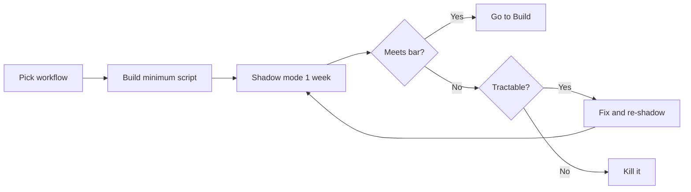

# 2. Pilot — can we ship one workflow in 2 weeks?

> **Time to complete:** 2–4 weeks, one workflow, 1–2 engineers, 5–10 internal users.
> **Exit criterion:** the workflow runs in shadow mode for one week with measurable success on the bar set in [Discover](discover.md).
> **Deliverable:** a working service or script that the next engineer can read, run, and extend — not a slide deck.

A pilot exists to answer one question: **can this workflow go to production?** It is not a research project, not a benchmark, and not a training exercise. If the pilot does not graduate in 6 weeks, the workflow was the wrong choice — kill it and try another. The pilot's value is not in what it builds; it is in the decision it makes possible. A pilot that ends in "let's keep going for a few more weeks" is a pilot that has not ended.

The reason the pilot is bounded by time, not by feature count, is that every week past 4 weeks of shadow mode is teaching you things that Build will already teach you, except at twice the cost. The pilot is supposed to validate two things: that the bar in [Discover](discover.md) is reachable on real data, and that the failure modes are tractable. It is not supposed to validate that the model handles every edge case. Edge cases are the Build phase's job — and Build has a budget for them that the pilot does not.



A pilot is **bounded by time**, not by feature count. Two weeks of calendar time, even if the script only handles 60% of cases. The remaining 40% is the Build phase's problem, not yours.

---

## What a pilot is not

It is a research project. It is not a benchmark. It is not an observability platform. It is not a fine-tuning exercise. It is not a UX study. It is not a procurement evaluation. The pilot answers one question — "can this workflow go to production?" — and the entire point of the pilot is to keep that question cheap. Adding anything that does not directly serve that question is adding cost without adding signal.

The temptation in pilots is to over-build. The model only needs to handle 60–70% of cases correctly for the bar to be reachable. The remaining 30% become "human-in-the-loop" cases, not "let me add another feature" cases. If the pilot ends with a script that covers 100% of cases, you have probably spent 8 weeks on the pilot. The bar of "60% correct + 100% served" is a feature of the pilot design, not a deficiency. Build's job is to raise that 60% to 95% — that is what Build is for.

A pilot is also not a final product. The pilot's script is a learning artifact, not a production artifact. The production artifact is what Build produces. The pilot's script will be rewritten in Build, will get packaging, will get tests, will get a Dockerfile, will get CI. Treating the pilot's script as a "first draft of production" is the most common way pilots turn into 6-month refactor projects. Treat it as throwaway code with a measurable outcome.

---

## Step 1 — pick the smallest shippable surface (Day 1)

Strip the workflow to its **spine**. The spine is the smallest subset of the workflow that is still the workflow — the part that, if it works, demonstrates the bar is reachable. Everything outside the spine is Build's problem.

A practical translation:

- ISP triage → "classify this ticket into one of 5 categories"
- Bank IT triage → "is this a password reset, VPN, or hardware request?"
- Factory handover → "summarize the last 8 hours of shift log into 3 bullets"
- Config review → "flag the 3 highest-risk lines in this config"
- HR Q&A → "answer one of the 12 most-asked policy questions with a citation"

The rule of thumb: if you cannot say the surface in one sentence, the surface is too big. Cut until you can. The cut should be along the dimension that is **least likely to change the bar's answer**. For triage, cutting the long tail of rare categories is fine. For summarization, cutting to one of the shift types is fine. For Q&A, cutting to the top-12 questions is fine. The cut is what makes the pilot tractable; the rest is Build's job.

Write the spine down, on paper or in the memo, in one sentence. The sentence is the project. If the spine changes during the pilot, the pilot is no longer a pilot — it is a research project, and research projects do not graduate to Build in 4 weeks.

---

## Step 2 — write the contract, not the code (Day 1–2)

A pilot script is a function with three inputs and one output. Define the contract in code or in a typed schema first. The contract is what makes the pilot's outcome falsifiable. Without a contract, "the model was good" is unfalsifiable, and an unfalsifiable outcome is the same as no outcome.

```python
from pydantic import BaseModel, Field

class Ticket(BaseModel):
    customer_tier: str          # "bronze" | "silver" | "gold" | "platinum"
    text: str                   # raw customer message
    received_at: str            # ISO 8601

class TriageResult(BaseModel):
    category: str = Field(description='"connectivity" | "billing" | "outage" | "speed" | "other"')
    priority: int = Field(ge=1, le=5, description="1=P1 outage, 5=P5 cosmetic")
    confidence: float = Field(ge=0.0, le=1.0)
    reason: str = Field(description="one-sentence justification")

def triage_ticket(ticket: Ticket) -> TriageResult:
    """Classify a customer ticket into category + priority.

    Contract:
    - Output `category` MUST be one of the 5 allowed values.
    - Output `priority` MUST respect customer_tier:
        * platinum + outage  -> priority 1 or 2
        * gold + outage      -> priority 2 or 3
        * silver/bronze      -> priority 3, 4, or 5
    - Output `reason` MUST cite a phrase from `ticket.text`.
    - Output `confidence` < 0.6 MUST be reviewed by a human.
    """
    ...
```

The contract does three things:

- **Inputs are typed.** A model that accepts `dict` is a model that will accept `None` at 3 AM, and the engineer on call will be the one paying for it.
- **Outputs are typed.** If you cannot say what the answer looks like, you cannot test for it. A typed output also gives the parser a contract — JSON-parse failures and schema violations become distinct failure modes, both of which the shadow-mode metrics will count.
- **The bar is in the docstring.** The next engineer (or future you) can read the contract and know what "done" means. The bar is the only thing in the contract that the user can argue with, and the user should not be able to argue with anything else. The contract's structure is the pilot's structure. If the contract is wrong, the pilot is wrong.

The contract is also the boundary between the pilot and Build. Build's job starts where the contract ends — once the contract is signed, the pilot's work is the contract's data; Build's work is the contract's implementation. Mixing those two is how pilots turn into Build by stealth.

---

## Step 3 — wire up LM Studio, not a hosted API (Day 2)

Even if your long-term plan involves a hybrid gateway, the pilot runs against LM Studio on a laptop. Reasons:

- **No data residency question.** The pilot's data never leaves the engineer's laptop. The legal team does not need to be involved; the security team does not need to be involved; the procurement team does not need to be involved.
- **No rate limits, no quota surprise.** A 2-week pilot that gets rate-limited on day 6 has learned nothing about the workflow, but has learned everything about the hosted API.
- **No network dependency.** The pilot works in the office or on a train. The pilot's latency is the model's latency, not the network's latency.
- **The 1.5B / 4B models are good enough for triage and summarization.** Discover already established that the bar is reachable with the smallest plausible model. Build's job is to optimize; the pilot's job is to validate.

The reference module ([ISP classifier](../sla-system/classifier.md)) uses exactly this pattern. Start there before writing your own client. The reason to start from the reference is that the reference has already paid for the mistakes you would otherwise pay for: the OpenAI-compatible client that retries on timeout, the prompt that survives a 1.5B model's confusions, the JSON parser that handles a model's stray text. The pilot is not the place to re-invent these.

The wire-up is also where the prompt is written. The prompt lives in code, not in a config file, not in a notebook, not in a wiki. The reason: the prompt is the contract's other half. Changing the prompt is changing the contract, and changing the contract is changing the bar. Putting the prompt in code forces the change to go through a code review, which is the right level of friction for a 2-week pilot.

---

## Step 4 — run shadow mode for one week (Day 3–9)

Shadow mode means: **the model runs on every real case, but the human still does the work**. The model's answer is logged, not acted on. The user sees the model's answer only in the dashboard, not in their workflow. The point of shadow mode is to measure the model's behavior under real traffic without putting real users at risk.

What you measure during shadow mode:

| Metric | Target | Why it matters |
| --- | --- | --- |
| **Categorical agreement rate** | ≥ 90% | Of cases where the human made a final decision, what % matched the model's category? |
| **Priority agreement rate** | ≥ 85% | Of cases where the human set a priority, what % matched the model's priority? |
| **Latency p50** | ≤ 3 seconds | Slow is also a failure mode. 12 seconds per ticket is unusable. |
| **Latency p95** | ≤ 8 seconds | The slowest 5% of cases is what makes the queue back up. |
| **Failure cases** | All catalogued | The 5–10 cases the model got most wrong. These become the eval set for Build. |
| **User comments** | ≥ 4/5 satisfaction | Free-form feedback from the 5–10 users. Often the most valuable signal. |

5 days, real tickets, real engineers. At the end of the week you have a 6-column table with targets in the "target" column and actuals in the "actual" column. If "actual" beats "target" on agreement rate, latency, and user satisfaction, the bar is reachable. If "actual" misses "target" on any of the three, you have evidence to either iterate (one more week of shadow mode) or kill (the bar is not reachable, the workflow is the wrong workflow).

A common mistake is to skip shadow mode and go straight to "AI suggested, human approved". Do not skip it. Shadow mode is what tells you whether the bar is reachable without putting real users at risk. "AI suggested, human approved" looks like progress because the users are using the system, but the metrics are now contaminated by the user's bias toward accepting the model's first answer. Shadow mode keeps the metrics clean.

---

## Step 5 — decide Yes / No / Pivot (Day 10)

Three honest outcomes:

- **Yes, graduate to [Build](build.md).** Agreement rate above the bar, latency acceptable, failure modes understood, user satisfaction ≥ 4/5. Document the actuals, the eval set, and the failure cases. Move to Build.
- **No, kill it.** Agreement rate below the bar after one iteration, or latency unusable, or failure modes show the model cannot learn the task. Do not retry. Do not try a different prompt for a third time. Go back to [Discover](discover.md) and pick a different workflow.
- **Pivot.** The model is good at a *narrower* version of the workflow. Cut the surface again (Step 1) and re-shadow for another week. This is rare but legitimate — the most common case is "the model handles 60% of cases well, but the other 40% are killing the agreement rate", and the right cut is to remove those 40% from the pilot's surface and let them be human-only.

There is no fourth option. A pilot that has not graduated in 6 weeks is a No. The fourth option is "let's keep going for a few more weeks", and that option is the same as killing the pilot slowly — a 6-week pilot that has not graduated has spent 6 weeks on a workflow that was the wrong workflow. The bar is the bar. The decision is the decision. The next step is the next step.

---

## What you should NOT do in Pilot

- **Do not write a generic "AI platform".** You are shipping one workflow. The platform is the Build phase's job. The pilot's platform is a laptop, a model, and a script.
- **Do not integrate with the production system.** Shadow mode is enough. Production integration is Build's job, and Build has the budget for the integration failures. A pilot that integrates with production has crossed the pilot/Build boundary by stealth.
- **Do not retrain or fine-tune.** The base 1.5B / 4B models are the test. Fine-tuning is a Build-phase decision, and the decision to fine-tune needs evidence from a 4-week shadow mode, not a 3-day pilot.
- **Do not invite 50 users.** Five to ten is enough. More users = more opinions = no decision. The 5–10 users should be the people who actually do the work, not the people who are curious about AI.
- **Do not skip the shadow week.** "It worked in my testing" is not a pilot result. The pilot's job is to measure on real traffic. If you skip the week, you have done a 3-day demo, not a 2-week pilot.
- **Do not change the contract mid-pilot.** Changing the contract is changing the bar. If the bar is wrong, return to [Discover](discover.md) and write a new bar. Changing the bar mid-pilot is the same as killing the pilot slowly.

---

## Deliverable checklist

- [ ] One workflow, one sentence (the spine)
- [ ] Contract defined (typed inputs/outputs, bar in the docstring) — code, not docs
- [ ] LM Studio running locally, 1.5B / 4B model loaded
- [ ] Prompt in code, reviewed
- [ ] Script reads real cases, logs model output, does not act
- [ ] Shadow mode ran for 5+ business days
- [ ] 6-column metrics table filled in (categorical agreement, priority agreement, p50, p95, failure cases, user satisfaction)
- [ ] Yes / No / Pivot decision, written down, time-lead signed off
- [ ] Failure-case catalog and shadow-mode eval set handed to Build

When the Yes decision is signed, go to [Build](build.md). When the Pivot decision is signed, return to Step 1. When the No decision is signed, return to [Discover](discover.md) and pick a different workflow.

The pilot's deliverable is the decision, not the code. The code is a means to the decision. Six months from now, when someone asks "why did team 1 ship that workflow and not this one", the answer is in the decision memo, not in the pilot's script. Write the decision memo. Sign it. File it. That is the pilot's only durable artifact.
