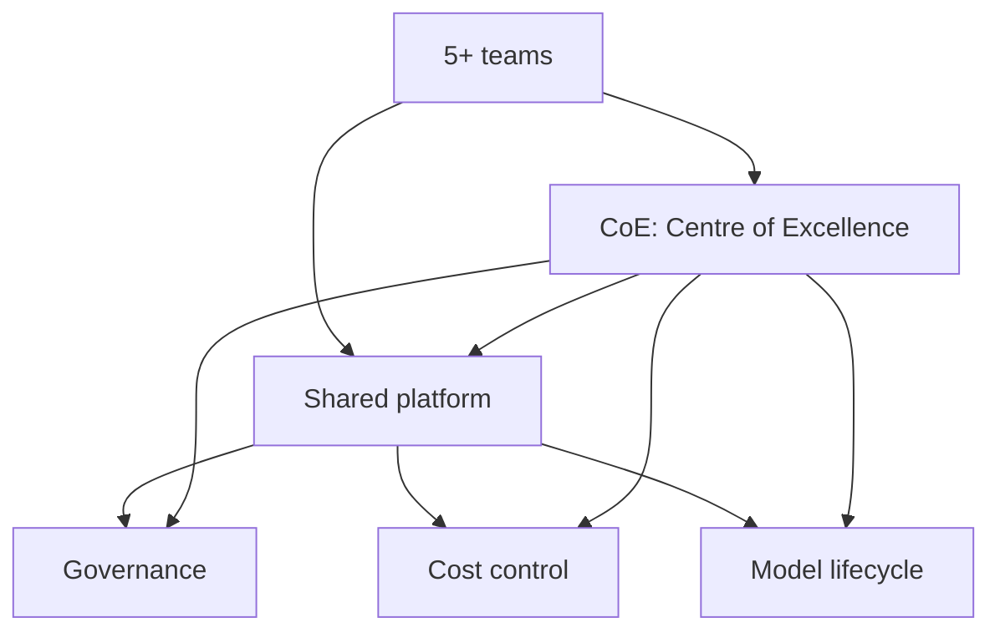

# 4. Scale — how do we roll out to 5+ teams?

> **Time to complete:** 3–6 months, many workflows, a small platform team.
> **Exit criterion:** 5+ teams are shipping their own local-LLM workflows, with shared platform services and clear governance.
> **Deliverable:** a platform that makes the second team's pilot cheaper than the first team's was.

Scale is the phase where local LLMs stop being "the thing that one team does on their laptop" and become "the way we build AI features here". The trap is treating Scale as a continuation of Build — it is not. Build optimises for one workflow; Scale optimises for the *next* workflow. The difference is structural, not incremental. A team that has shipped one workflow in production knows how to ship that workflow again. A team that has shipped five different workflows across five different business units needs a platform, not five more Build projects.

The reason the exit criterion is "5+ teams shipping their own workflows" and not "5+ workflows in production" is that the bottleneck at Scale is adoption, not engineering. A platform team that has built the perfect platform for one team has built a platform for one team. A platform team that has built a platform that 5 different teams can pick up and use, with no platform-team involvement, has built a programme. The difference between the two is 6 months and 4 team-onboardings.

The three jobs of Scale are templates, model lifecycle, and cost. They are listed in order of when the second team will need them: the second team needs templates on day 1, will need model-lifecycle decisions in month 3, and will need cost control in month 4. The platform team that builds the cost dashboard before the second team exists is building for an audience of one.

---

## What Scale is not

It is not "Build, but for more teams". It is not "let's standardise on one model across the company". It is not "let's write a fine-tune". It is not "let's hire an AI architect". It is not "let's buy a bigger GPU box". It is the phase where the question changes from "can we ship one workflow?" to "can the second team ship their workflow cheaper than the first did?".

The single most common mistake at Scale is to over-build the platform. A platform team that spends 6 months building a generic "AI platform" with a model registry, a vector DB, a fine-tuning service, and a feature store, before any second team has arrived, has built a platform that no one will use. The reason is that the second team's needs are not predictable — they will pick a workflow that the platform team has not designed for, and the platform will not fit. Build the platform from the second team's pain, not from the architect's slide deck. The architect's slide deck is a wish list; the second team's pain is a backlog.

Another common mistake is to treat Scale as the place to make the model uniform. Different workflows need different models. Triage needs a 1.5B model. Long-document summarization needs a 7B model. Multi-turn Q&A needs a 4B model with retrieval. Standardising on one model across all teams is the same as standardising on one hammer across all carpenters. What can be standardised is the **process** for picking a model: a small set of approved models, with eval criteria, with a CoE that reviews quarterly. The process is the standard; the models are the choices.

---

## Job 1 — make the second pilot cheaper than the first

The most expensive part of the first team's pilot was the work that the second team should not have to redo:

- Wrapping LM Studio's OpenAI-compatible API in a typed client with retries, timeouts, and a structured response.
- Standing up observability (latency, agreement, error rate, prompt-version correlation).
- Building a small CI pipeline that runs an eval set on every commit to a service.
- Writing the runbook template (the 5 most common incidents pre-filled).
- Defining the contract schema pattern (Pydantic models, JSON validation, retry-on-parse-failure).

If the second team rebuilds all five from scratch, Scale is failing. The platform team's job is to extract these into shared services and document them well enough that the second team can adopt them in a day. The "in a day" is the test: if a second team cannot go from "approved by sponsor" to "shadow mode running" in a day, the platform is not yet a platform.

Concrete deliverables:

- **A Python client package** (`aiwf-client` or similar) that wraps LM Studio, vLLM, or Ollama with retries, timeouts, structured output, and a typed response. Single import, single `chat()` call, returns a parsed Pydantic model.
- **A Grafana dashboard template** for LLM services (latency p50/p95, agreement rate sampled, error rate by category, token throughput, prompt-version correlation). The second team adds the data source; the dashboard renders.
- **A CI template** (GitHub Actions, GitLab CI, Jenkins — pick one) that runs a frozen eval set on every commit to a service. The eval set is a YAML file; the CI template knows how to run it.
- **A runbook template** with the five most common incidents pre-filled: "model is OOM", "model returned malformed JSON", "model latency spiked", "model gave wrong answer on 5+ consecutive cases", "infra is down". Each incident has a triage path and a rollback path.
- **A contract schema library** with the Pydantic patterns the first team learned to use: enums for category, ge/le for priority, regex for ID, citations for retrieval.

The cost-control mechanism is also part of Job 1. Every team's workflow should be tagged with a `team` and `cost-center` label from day 1, even if the cost report is not built until month 4. The label is free to add now and expensive to retrofit later.

---

## Job 2 — govern the model lifecycle

At 5+ teams, the model becomes a shared dependency. The first team chose Qwen 2.5 1.5B. The fourth team will want 7B. The sixth team will ask for a fine-tune. Without governance, the platform becomes a zoo — 14 models, 8 fine-tunes, 3 vector DBs, and no one knows which one is in production.

The minimum viable governance for Scale:

| Decision | Owner | Cadence |
| --- | --- | --- |
| Which base models are approved for which workflow class | CoE (Centre of Excellence) | Quarterly review |
| When to upgrade the default model version (e.g., Qwen 2.5 → Qwen 3) | CoE + on-call lead | Per release, with 30-day deprecation notice |
| When a fine-tune is allowed (vs. base model with better prompt) | CoE | Per request, with an explicit "no, you do not need a fine-tune" gate |
| Eval set for any new model in production | The team owning the workflow | Before each upgrade, frozen for 90 days |
| Cost per workflow, charged back to the team | Platform team + finance | Monthly |

The CoE is not a heavy committee. It is 2–3 senior engineers, meeting for 30 minutes a month, with a written decision log. The decision log is the artefact that survives the meeting — six months later, when a team asks "why was this model approved and not that one", the answer is in the log. The CoE is also the gate for fine-tunes. A fine-tune is a 6-week investment that locks the team to a model version for 12+ months. The CoE's job is to ask "have you tried a better prompt? A bigger base model? A different eval set?" before approving the fine-tune. In practice, the CoE rejects about 60% of fine-tune requests, and the rejected teams ship a better solution in 2 weeks using a base model.

The model registry is the operational artefact. One config file per approved model: model name, hardware target, expected p50/p95, eval-set path, cost-per-1k-tokens, deprecation date. The second team's `from aiwf_client import chat` looks up the model in the registry, picks the right hardware target, and falls back to the previous version if the current one is unavailable. The registry is what makes the platform "platform" and not "library" — the second team does not need to know which model they are using, only which workflow class they are in.

---

## Job 3 — control the cost

Local LLMs are cheap *per token* compared to hosted APIs. They are not free. The costs Scale has to track:

- **Hardware.** GPU boxes are $3k–$10k each. A team of 10 pilots each wanting their own box is $30k–$100k. The platform's job is to consolidate: one bigger box, model swapping, queueing. 5 small boxes are worse than 1 big box with model swapping — a single 8x A100 box serves more workflows at lower per-token cost than 5 single-GPU boxes.
- **Power and cooling.** An 8x A100 box draws 4–6 kW continuous. At $0.10/kWh that is $3,500–$5,000/year per box. Across 5 boxes, that is $17k–$25k/year in electricity alone.
- **Engineer time.** The hidden cost. 30% of a senior engineer's time on "AI plumbing" across 5 teams is one full FTE. The platform team's job is to make that 10% instead of 30%, by turning plumbing into shared services.

Cost-control levers, in order of effectiveness:

1. **Consolidate hardware.** 5 small boxes are worse than 1 big box with model swapping. A 100-GPU cluster with vLLM serves 5x the workflows at 1/3 the per-token cost.
2. **Use the smallest model that meets the bar.** Qwen 1.5B is roughly 10x cheaper to run than 13B. The eval set tells you when you can downgrade. Most "we need 13B" requests are "we did not try 4B with a better prompt". The CoE catches these.
3. **Cache responses.** Triage and summarization have high hit rates — 30–50% of incoming cases are near-duplicates of recent cases. A simple Redis cache in front of the model can cut traffic 30–50%, with a 0.1% cost in staleness.
4. **Queue, don't overprovision.** A small queue (Celery, RQ, or even a FastAPI background task) absorbs spikes without needing headroom for the 99.9th percentile. 90% of users wait 10 seconds for a 100-GPU cluster is a 100-GPU cluster that costs 10x as much. Queue-and-defer is cheaper.

The cost report itself is also part of Job 3. The first time finance asks "what does this cost?", the platform team should already have a dashboard. The dashboard is a Grafana panel: per-team, per-workflow, per-month, broken down by hardware, power, and engineer-time-allocation. The dashboard has a chargeback tag, and the chargeback tag has a finance-team owner. Without the chargeback tag, the cost is invisible. With the chargeback tag, the cost is a budget conversation, and budget conversations are the right place for cost discipline to live.

---

## What scaling actually looks like

A realistic Scale trajectory, in months from "first team in production":

| Month | What happens | What the platform team builds |
| --- | --- | --- |
| 0 | First team in production (end of [Build](build.md)) | — |
| 1 | Second team starts a pilot, copy-pastes the first team's pattern | Extract the LM Studio client into a shared package |
| 2 | Third team, fourth team ask "how do I do what team 1 did?" | Write the runbook, publish the dashboard template |
| 3 | Two teams want different models | Add model registry (one config file per model), CoE meeting starts |
| 4 | Fifth team, in a different business unit | Add SSO, role-based access, audit logging |
| 5 | Fine-tune request from team 1 | Add fine-tune workflow (data prep, eval, rollback), CoE rejects 60% of requests |
| 6 | "We need a cost report" | Add per-team cost dashboard, chargeback tags in place |

At month 6 you have a real platform, not a hack. The 5+ teams are shipping independently, with shared services and clear governance. The next phase is [Phase C — Distribution](../ROADMAP.md#phase-c-distribution) in the [roadmap](../ROADMAP.md): Docker images, `pip install ai-work-flow`, case-study videos, and the first external pilot.

The alternative — trying to build the platform before the first team ships — is the most common reason local-LLM programmes stall at year 1. The platform built in the abstract is a platform no one uses. The platform built from the second team's pain is a platform the third team adopts in a day.

---

## What you should NOT do in Scale

- **Do not build a generic "AI platform" before any team has shipped.** Build the platform from the second team's pain, not the architect's slide deck. The first 30 days of Scale should be reactive, not proactive.
- **Do not standardise on a single model across all teams.** Different workflows need different models. Standardise on a *small set* of approved models with clear eval criteria, and a process for adding to the set.
- **Do not fine-tune by default.** Most workflows do not need a fine-tune; they need a better prompt, a better eval set, or a better contract. The CoE's job is to ask the question before the 6-week investment starts.
- **Do not skip the cost report.** The first time finance asks "what does this cost?", you should already have a dashboard. Without the dashboard, the cost is invisible. With the dashboard, the cost is a conversation, and the conversation is where the discipline lives.
- **Do not add a new tool because one team asked for it.** One team asking for a vector DB is one team's preference. 3 teams asking for a vector DB is a pattern. The platform reacts to patterns, not to preferences.
- **Do not skip the CoE.** The CoE is the governance. Without the CoE, the platform becomes a zoo. The CoE is 2–3 engineers, 30 minutes a month, a written decision log. Cheap. The CoE's absence is what makes Scale expensive.

---

## Deliverable checklist

- [ ] Shared client package published internally, used by 2+ teams
- [ ] Standard dashboard, standard runbook template, standard CI template, standard contract schema library
- [ ] CoE meeting monthly, decision log published, 2–3 senior engineers attending
- [ ] Model registry with one config file per approved model, deprecation dates in place
- [ ] Per-team cost dashboard, chargeback tags in place, finance-team owner named
- [ ] Hardware consolidation plan, with capacity headroom quantified
- [ ] Fine-tune workflow documented, with a CoE gate that says "no, you do not need a fine-tune" at least 50% of the time
- [ ] 5+ teams running their own workflows without a dedicated platform engineer
- [ ] "Second pilot cheaper than first" measured: 2nd team's pilot took ≤ 5 days from sponsor approval to shadow mode

When all nine are checked, you have a programme, not a project. The next phase is [Phase C — Distribution](../ROADMAP.md#phase-c-distribution) in the [roadmap](../ROADMAP.md): Docker images, `pip install ai-work-flow`, case-study videos, and the first external pilot.
