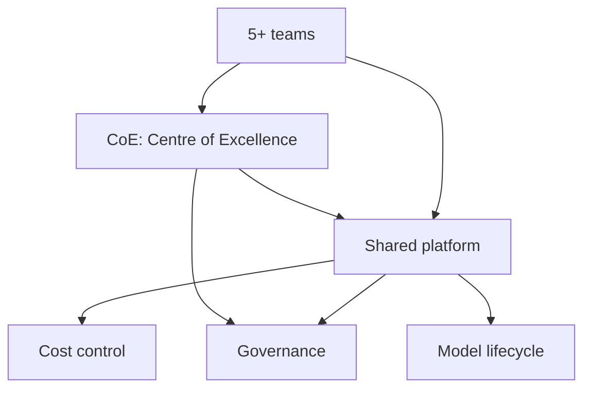

# 4. Scale — how do we roll out to 5+ teams?

> **Time to complete:** 3–6 months, many workflows, a small platform team.
> **Exit criterion:** 5+ teams are shipping their own local-LLM workflows, with shared platform services and clear governance.
> **Deliverable:** a platform that makes the second team's pilot cheaper than the first team's was.

Scale is the phase where local LLMs stop being "the thing that one team does on their laptop" and become "the way we build AI features here". The trap is treating Scale as a continuation of Build — it is not. Build optimises for one workflow; Scale optimises for the *next* workflow.

---

## The three jobs of Scale

### Job 1 — make the second pilot cheaper than the first

The most expensive part of the first team's pilot was the work that the second team should not have to redo:

- Wrapping LM Studio's OpenAI-compatible API in a typed client with retries.
- Standing up observability (latency, agreement, error rate).
- Building a small CI pipeline that runs an eval set on every commit.
- Writing the runbook template.

If the second team rebuilds all four from scratch, Scale is failing. The platform team's job is to extract these into shared services and document them well enough that the second team can adopt them in a day.

Concrete deliverables:

- **A Python client package** (`aiwf-client` or similar) that wraps LM Studio, vLLM, or Ollama with retries, timeouts, and a typed response.
- **A Grafana dashboard template** for LLM services (latency p50/p95, agreement rate sampled, error rate by category).
- **A CI template** (GitHub Actions, GitLab CI, Jenkins — pick one) that runs a frozen eval set on every commit to a service.
- **A runbook template** with the five most common incidents pre-filled.

### Job 2 — govern the model lifecycle

At 5+ teams, the model becomes a shared dependency. The first team chose Qwen 2.5 1.5B. The fourth team will want 7B. The sixth team will ask for a fine-tune. Without governance, the platform becomes a zoo.

The minimum viable governance for Scale:

| Decision | Owner | Cadence |
| --- | --- | --- |
| Which base models are approved for which workflow class | CoE (Centre of Excellence) | Quarterly review |
| When to upgrade the default model version | CoE + on-call lead | Per release |
| When a fine-tune is allowed (vs. base model with better prompt) | CoE | Per request |
| Eval set for any new model in production | The team owning the workflow | Before each upgrade |
| Cost per workflow, charged back to the team | Platform team + finance | Monthly |

The CoE is not a heavy committee. It is 2–3 senior engineers, meeting for 30 minutes a month, with a written decision log.

### Job 3 — control the cost

Local LLMs are cheap *per token* compared to hosted APIs. They are not free. The costs Scale has to track:

- **Hardware.** GPU boxes are $3k–$10k each. A team of 10 pilots each wanting their own box is $30k–$100k. The platform's job is to consolidate: one bigger box, model swapping, queueing.
- **Power and cooling.** A 8x A100 box draws 4–6 kW continuous. At $0.10/kWh that is $3,500–$5,000/year per box.
- **Engineer time.** The hidden cost. 30% of a senior engineer's time on "AI plumbing" across 5 teams is one full FTE. The platform team's job is to make that 10% instead of 30%.

Cost-control levers, in order of effectiveness:

1. **Consolidate hardware.** 5 small boxes are worse than 1 big box with model swapping.
2. **Use the smallest model that meets the bar.** Qwen 1.5B is roughly 10x cheaper to run than 13B. The eval set tells you when you can downgrade.
3. **Cache responses.** Triage and summarization have high hit rates. A simple Redis cache in front of the model can cut traffic 30–50%.
4. **Queue, don't overprovision.** A small queue (Celery, RQ, or even a FastAPI background task) absorbs spikes without needing headroom for the 99.9th percentile.

---

## What scaling actually looks like

A realistic Scale trajectory, in months from "first team in production":

| Month | What happens | What the platform team builds |
| --- | --- | --- |
| 0 | First team in production (end of [Build](build.md)) | — |
| 1 | Second team starts a pilot, copy-pastes the first team's pattern | Extract the LM Studio client into a shared package |
| 2 | Third team, fourth team ask "how do I do what team 1 did?" | Write the runbook, publish the dashboard template |
| 3 | Two teams want different models | Add model registry (one config file per model) |
| 4 | Fifth team, in a different business unit | Add SSO, role-based access, audit logging |
| 5 | Fine-tune request from team 1 | Add fine-tune workflow (data prep, eval, rollback) |
| 6 | "We need a cost report" | Add per-team cost dashboard, chargeback tags |

At month 6 you have a real platform, not a hack. The alternative — trying to build the platform before the first team ships — is the most common reason local-LLM programmes stall at year 1.

---

## What you should NOT do in Scale

- Do not build a generic "AI platform" before any team has shipped. Build the platform from the second team's pain, not the architect's slide deck.
- Do not standardise on a single model across all teams. Different workflows need different models. Standardise on a *small set* of approved models with clear eval criteria.
- Do not fine-tune by default. Most workflows do not need a fine-tune; they need a better prompt and a better eval set.
- Do not skip the cost report. The first time finance asks "what does this cost?", you should already have a dashboard.

---

## Deliverable checklist

- [ ] Shared client package published internally
- [ ] Standard dashboard, standard runbook template, standard CI template
- [ ] CoE meeting monthly, decision log published
- [ ] Model registry with one config file per approved model
- [ ] Per-team cost dashboard, chargeback tags in place
- [ ] Hardware consolidation plan, with capacity headroom quantified
- [ ] Fine-tune workflow documented, with a "no, you do not need a fine-tune" gate
- [ ] 5+ teams running their own workflows without a dedicated platform engineer

When all eight are checked, you have a programme, not a project. The next phase is [Phase C — Distribution](../ROADMAP.md#phase-c--distribution) in the [roadmap](../ROADMAP.md): Docker images, `pip install ai-work-flow`, case-study videos, and the first external pilot.
