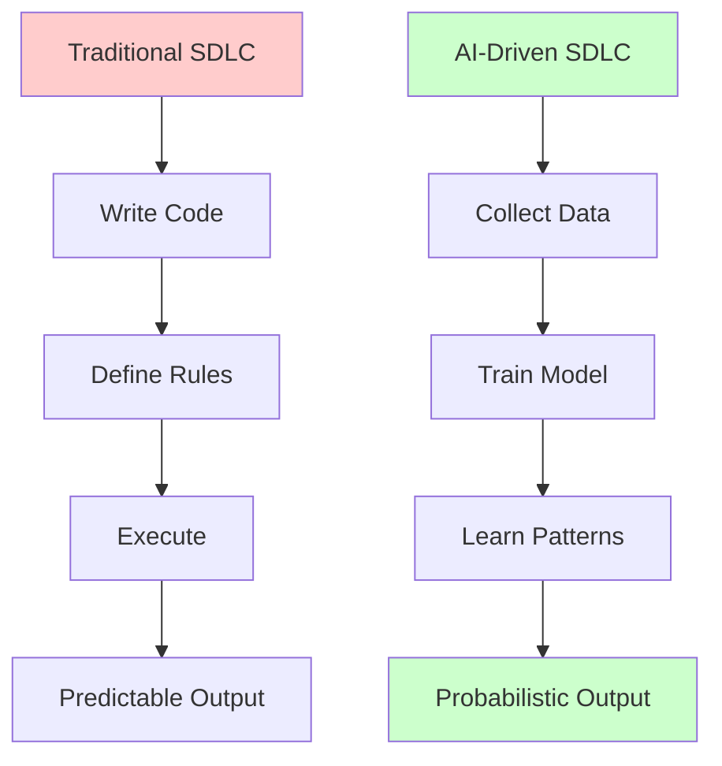
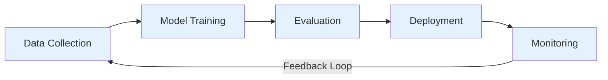

# AI-Driven Software Development
*From Deterministic Rules to Probabilistic Intelligence*
---

## The Paradigm Shift

Welcome to the new era of software development. For decades, we built software the same way: **write code → execute → get deterministic output**. If the code was correct, the output was always correct. **Not anymore.**

With AI-driven development, the rules are learned from data, not written in code. This fundamental shift changes everything:

| Traditional Development | AI-Driven Development |
| --- | --- |
| **Deterministic**: Same input → Same output | **Probabilistic**: Same input → Best prediction |
| **Rule-based logic** | **Pattern learning from data** |
| **Hard-coded decisions** | **Learned from examples** |
| **Explicit if/else conditions** | **Statistical inference** |
| **100% predictable** | **Confidence-based responses** |

## Why This Matters

> *"In traditional software, the algorithm is the rule. In AI-driven software, **the data is the algorithm**."*

This means:

- **No more hard-coded rules** for complex decisions
- **Adaptability** - systems learn and improve from new data
- **Handle ambiguity** - AI can deal with fuzzy, imprecise inputs
- **Scale** - one model can handle millions of variations

## What You'll Learn in This Section

- **AI Software Development Life Cycle (AI-SDLC)** - How to build AI systems systematically
- **Citizen Developer Guide** - How non-programmers can leverage AI development tools
- **From Waterfall to MLOps** - Modern practices for AI projects

---

## The Journey Ahead

The chapters in this documentation follow this philosophy:

Each module in this project demonstrates AI-driven approaches for real-world problems - from ticket classification to sales automation.

---

## Related Documentation

- [AI Software Development Life Cycle](sdlc.md)
- [Citizen Developer Guide](citizen-developers.md)
- [Why Reasoning Matters](reasoning.md)
- [Getting Started](../getting-started/index.md)
