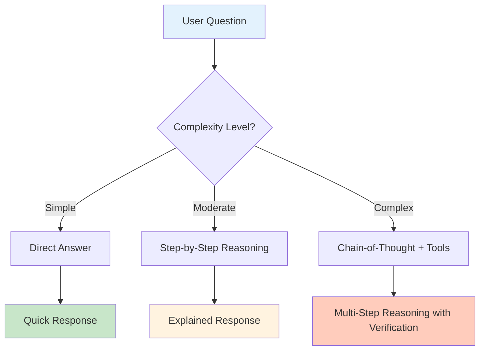
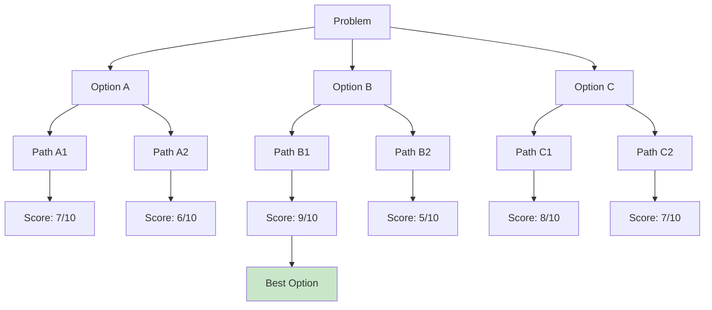

# Why Reasoning Matters
*Chain-of-Thought, ReAct, and the Art of Step-by-Thinking*
---

## The Problem with Jumping to Conclusions

Imagine asking a simple question: *"Should I approve this leave request?"*

A bad AI just says: **"Yes"** or **"No"** - no explanation, no reasoning.

A good AI explains:

> *"Looking at the employee's leave balance (5 days remaining), the project timeline (not in critical phase), and past attendance (95% present), I recommend APPROVAL with standard conditions."*

That reasoning makes the difference between **trust** and **blind faith**.

## What is AI Reasoning?

AI reasoning is the process of breaking down complex problems into **logical steps**, showing **how** an answer was reached, not just **what** the answer is.



## Types of Reasoning Techniques

### 1. Chain-of-Thought (CoT)

Break down the problem step by step:

```text
User: "Should I approve this network upgrade?"

Thinking:
1. Current downtime: 4 hours/week due to congestion
2. Cost: BDT 500,000
3. ROI timeline: 18 months
4. Business impact: High (customer satisfaction)

→ RECOMMENDATION: APPROVE with phased implementation
```

### 2. ReAct (Reasoning + Acting)

Combine thinking with tool usage:

```text
Question: What's the current SLA compliance rate?

Reasoning: I need to query the monitoring database
Action: Run SQL query on metrics table
Observation: 94.2% compliance this month
Reasoning: Below 95% target, flag for review
Final Answer: 94.2% - needs attention
```

### 3. Tree-of-Thought (ToT)

Explore multiple solution paths:



## Why Does This Matter for Your Business?

| Without Reasoning | With Reasoning |
| --- | --- |
| "Approved" | "Approved because: [reasons]" |
| "Rejected" | "Rejected with specific feedback" |
| No audit trail | Full decision explanation |
| Low trust | High confidence |
| Hard to debug | Easy to correct |

## Real-World Applications in This Project

### 1. ISP Ticket Classification

- **Without reasoning**: "Category: Billing"
- **With reasoning**: "Category: Billing → User mentions 'bill dispute' → Checking billing keywords → Confirmed"

### 2. HR Leave Approval

- **Without reasoning**: "Rejected"
- **With reasoning**: "Rejected → Balance insufficient (2 days left, requested 5 days) → Alternative: Apply for unpaid leave"

### 3. SLA Prioritization

- **Without reasoning**: "Priority: High"
- **With reasoning**: "Priority: High → VIP customer + Server down + Revenue impact > BDT 50K/hour"

## How to Implement Reasoning in Your Apps

```python
# Simple reasoning pattern
def classify_with_reasoning(ticket_text):
    reasons = []

    # Check keywords
    if "bill" in ticket_text.lower():
        reasons.append("Contains billing-related keywords")

    if "payment" in ticket_text.lower():
        reasons.append("Mentions payment issues")

    # Check patterns
    if "refund" in ticket_text.lower():
        reasons.append("Customer requesting refund")

    # Make decision
    category = "billing" if len(reasons) >= 2 else "general"

    return {
        "category": category,
        "confidence": min(len(reasons) * 30, 100),
        "reasoning": reasons
    }
```

## Key Takeaways

> **"An AI that can't explain its reasoning is like a doctor who won't tell you why they prescribed a medicine."**

- **Transparency builds trust** - Users need to understand why
- **Debugging is easier** - When you see the steps, you can fix errors
- **Compliance is simpler** - Audit trails for regulated industries
- **Human oversight works** - Humans can correct wrong reasoning paths

## What's Next?

In the ISP Classifier section, you'll see reasoning in action with:

- Chain-of-thought prompt engineering
- ReAct-based ticket classification
- Explainable AI outputs for support teams

---

## Related Documentation

- [AI-Driven Software Development Overview](index.md)
- [AI Software Development Life Cycle](sdlc.md)
- [Citizen Developer Guide](citizen-developers.md)
- [ISP Classifier Overview](../isp-classifier/index.md)
