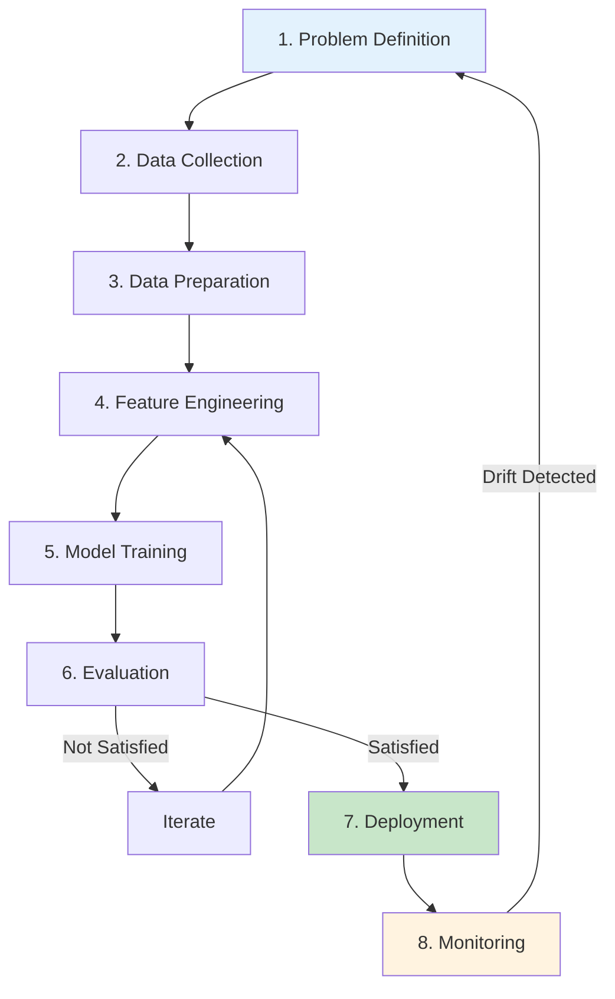
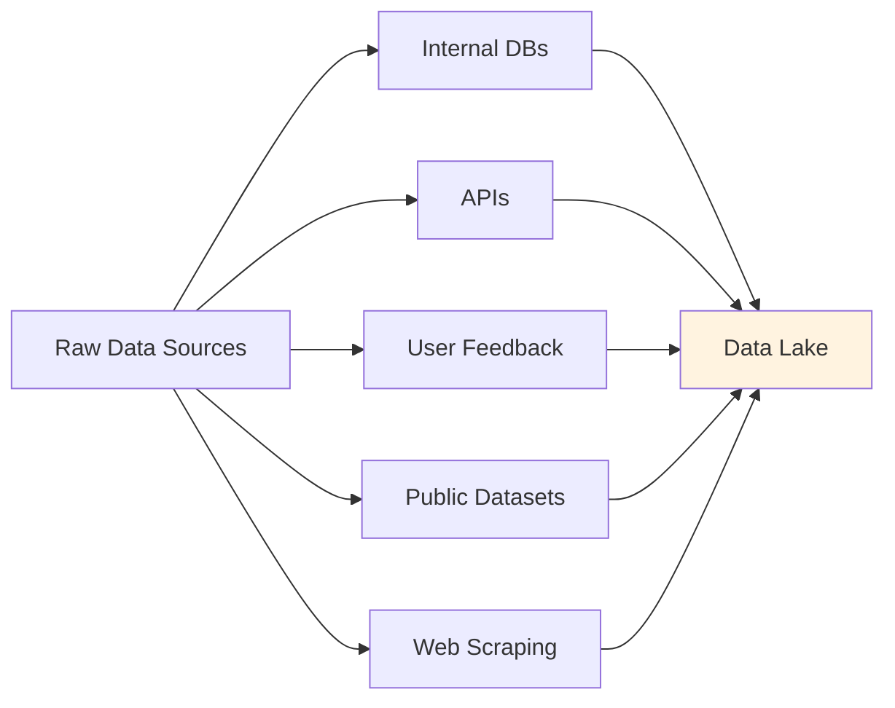
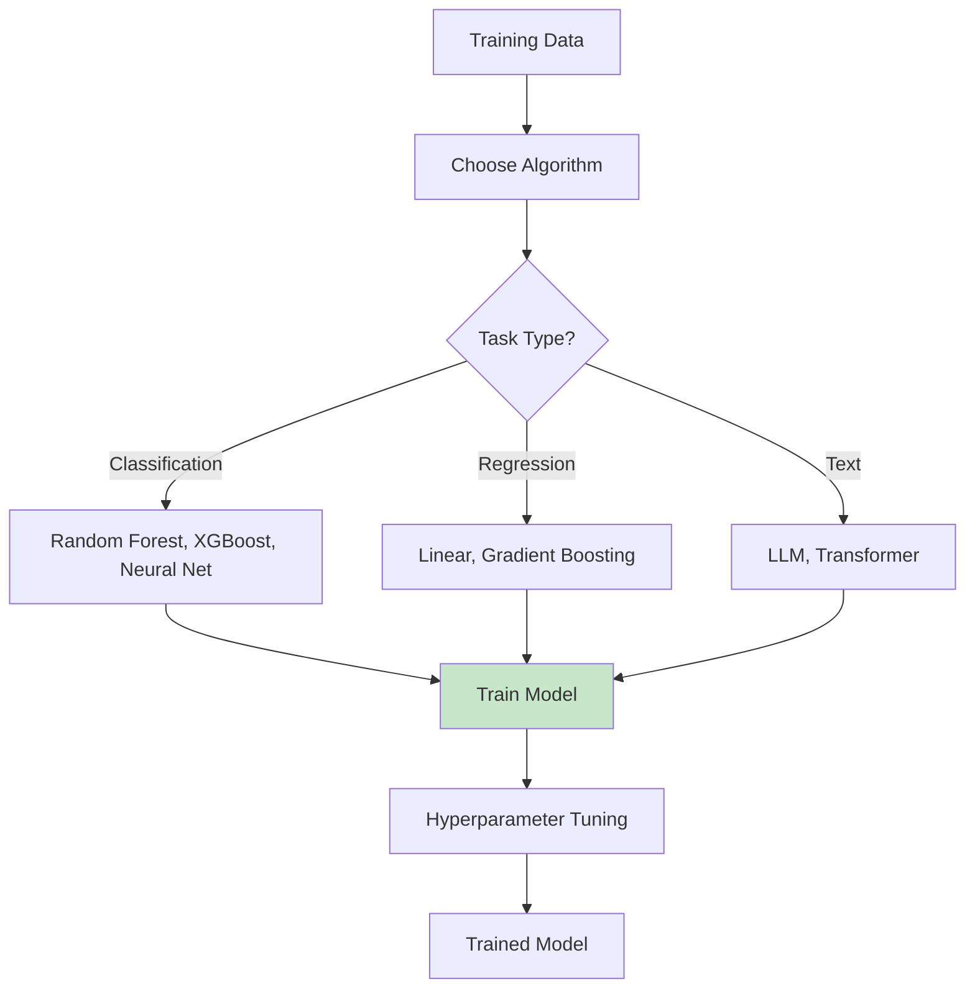
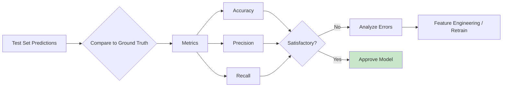
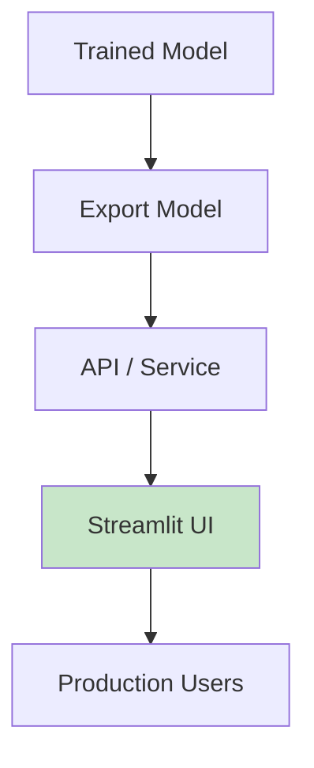
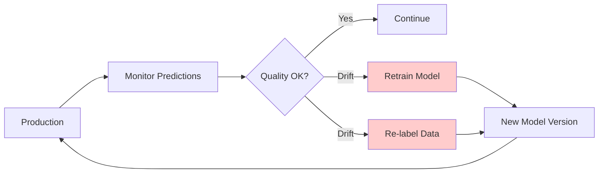
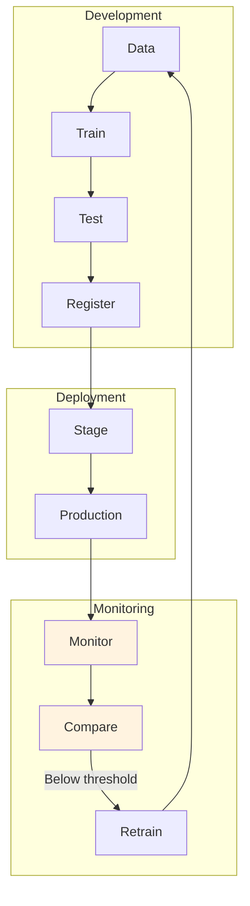

# AI Software Development Life Cycle (AI-SDLC)
*A systematic approach to building intelligent systems*
---

## The AI-SDLC Framework

Unlike traditional software development, AI projects have unique challenges:

- **Data dependency**: Quality outputs depend on quality inputs
- **Probabilistic outputs**: Results vary based on model confidence
- **Continuous learning**: Models need to adapt and retrain
- **Evaluation complexity**: "Correct" is subjective in ML



## Phase-by-Phase Breakdown

### Phase 1: Problem Definition

**Traditional**: Write requirements document
**AI-Driven**: Define the ML problem type

| Problem Type | Example | Output |
| --- | --- | --- |
| **Classification** | Spam detection | Category label |
| **Regression** | Price prediction | Continuous value |
| **Clustering** | Customer segmentation | Group assignment |
| **Generation** | Chatbot responses | Text content |

**Key Questions:**

- What decision will the AI assist with?
- What data is available?
- What does "correct" look like?
- How will errors be handled?

### Phase 2: Data Collection

**The most critical phase** - Garbage in, garbage out.



**Data Quality Checklist:**

- [ ] Sufficient volume (thousands of examples minimum)
- [ ] Labeled data for supervised learning
- [ ] No systematic biases
- [ ] Representative of production traffic
- [ ] Privacy-compliant

### Phase 3: Data Preparation

Cleaning and transforming data for ML.

```python
# Example: Data preparation pipeline
def prepare_data(raw_data):
    # Remove duplicates
    data = remove_duplicates(raw_data)

    # Handle missing values
    data = fill_missing(data, strategy='mean')

    # Normalize features
    data = normalize(data, columns=['price', 'quantity'])

    # Split for evaluation
    train, test = split_data(data, test_size=0.2)

    return train, test
```

### Phase 4: Feature Engineering

Transform raw data into model-friendly format.

| Raw Data | Feature | Why? |
| --- | --- | --- |
| "2024-01-15" | day_of_week=2 | Patterns vary by day |
| "[user@example.com](mailto:user@example.com)" | is_corporate=True | Business vs personal |
| 1234.56 | log(price)=7.12 | Normalize distribution |

### Phase 5: Model Training



**Algorithms for Citizen Developers:**

- **scikit-learn**: Beginner-friendly ML library
- **LangChain**: LLM integration for text tasks
- **LM Studio**: Local inference for privacy

### Phase 6: Evaluation

**Critical difference from traditional testing:**



**Evaluation Metrics:**

| Metric | Use Case | Good Value |
| --- | --- | --- |
| **Accuracy** | Balanced classes | >90% |
| **Precision** | Minimize false positives | >85% |
| **Recall** | Don't miss true cases | >85% |
| **F1 Score** | Balance precision/recall | >80% |

### Phase 7: Deployment



**For this project:**

```python
# Using LangChain with local LLM
from langchain_openai import ChatOpenAI

llm = ChatOpenAI(
    base_url="http://localhost:1234/v1",
    model="qwen2.5:1.5b"
)
```

### Phase 8: Monitoring

**AI systems require ongoing attention:**



**Monitoring Metrics:**

- Prediction distribution
- User satisfaction ratings
- Error rate trends
- Data drift detection

## MLOps: The AI Equivalent of DevOps



**Key MLOps Practices:**

1. **Version control** - Models, data, code
2. **Automated pipelines** - Train → Test → Deploy
3. **A/B testing** - Compare model versions
4. **Rollback capability** - Revert to previous model

---

## Practical Application in This Project

The modules in this documentation follow AI-SDLC:

| Module | AI-SDLC Phase |
| --- | --- |
| **ISP Classifier** | Data → Train → Evaluate |
| **Qwen + RAG** | Knowledge → Embed → Retrieve |
| **MLOps Pipeline** | Monitor → Trigger → Retrain |

---

## Next Steps

- [Citizen Developer Guide](citizen-developers.md) - How to apply AI-SDLC without deep ML expertise
- [Why Reasoning Matters](reasoning.md) - Reasoning techniques at every SDLC stage
- [ISP Classifier](../isp-classifier/index.md) - See AI-SDLC in action
