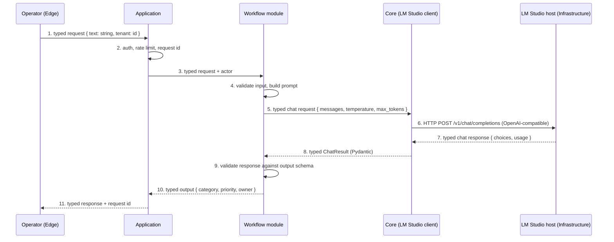
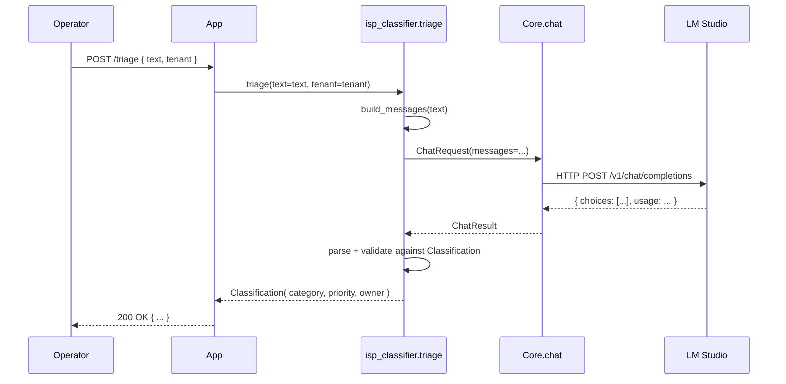
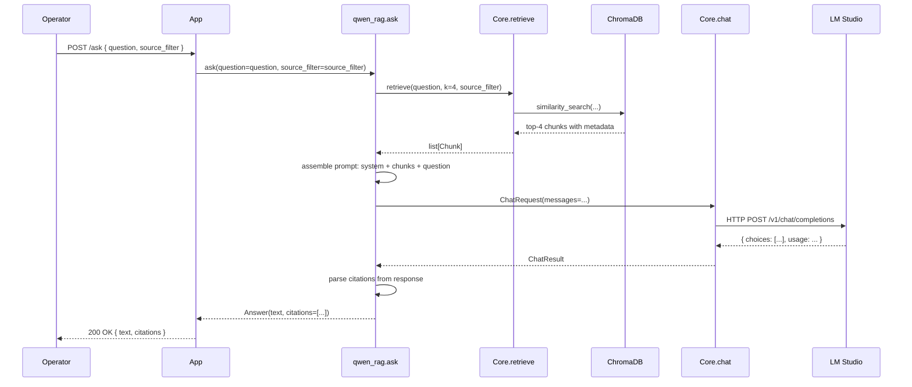

# 2. Data flow — what crosses which boundary

> **One sentence:** every layer boundary carries a typed object, never free-form text, and nothing ever crosses the network perimeter.

The layers page defined what each of the five layers is responsible for. This page is about the **seams between them** — what data crosses each seam, in what format, and which boundaries are absolute (data residency) versus which are just contracts (typed I/O).

---

## The single end-to-end flow

The same request from operator to model, traced all the way through. This is the canonical picture; everything else on this page is a closer view of one part of it.



Three things to notice:

1. **Arrows 5, 7, 8, 10 are typed objects.** The model never returns a free-form string to a downstream system. Free-form text is allowed only inside the model's own response object, and the Workflow layer is responsible for extracting the structured fields from it.
2. **The model call is on a private subnet.** Arrow 6 is between the application server and the LM Studio host, both inside the corporate network. There is no internet hop.
3. **Arrow 1 is a typed form, not a chat box.** The Edge does not send a "prompt" — it sends a request whose fields the Workflow module has already declared.

---

## What crosses each boundary

| Boundary | What crosses | Format | Who can read it |
| --- | --- | --- | --- |
| Edge → Application | Operator form fields, webhook payload, CLI args | Typed JSON (Pydantic-validated) | Application server, audit log |
| Application → Workflow | The same typed object + actor identity + request id | Typed kwargs to the module's `run()` function | Workflow module, audit log |
| Workflow → Core | Chat completion request (messages, params) | Typed dict (Pydantic `ChatRequest`) | LM Studio client |
| Core → Infrastructure | HTTP body to `/v1/chat/completions` | OpenAI-compatible JSON | LM Studio host process |
| Infrastructure → Core | HTTP response from `/v1/chat/completions` | OpenAI-compatible JSON | LM Studio client |
| Core → Workflow | Chat result, possibly with `usage` tokens | Typed `ChatResult` (Pydantic) | Workflow module |
| Workflow → Application | Final output | Typed object against the module's output schema | Application, audit log, downstream systems |
| Application → Edge | Final response | Typed JSON, possibly rendered to HTML | Edge, operator, ticketing system |

Everything that crosses a boundary is a typed object. There is no place in the system where a string flows from one layer to the next without a schema.

---

## What NEVER leaves your network

For absolute clarity — these things are guaranteed to stay inside your perimeter. They are not policy choices; they are consequences of the architecture.

- **Operator prompts.** The text the operator submits never leaves the application server's network. The only destination is the local LM Studio host.
- **Model responses.** The model's text and tool calls never leave your network. There is no "telemetry to vendor" path.
- **Retrieval chunks (RAG).** The runbook paragraphs, SOPs, and policy documents the retriever returns to the model never leave the model host. They are read by the model and discarded.
- **Audit logs.** Every log row — input, output, latency, tokens, model version, request id, actor — is written to **your** log store. Your SIEM, your retention rules, your jurisdiction.

The **only** thing that crosses the network perimeter is:

- A one-time model weight download (LM Studio pulls the GGUF, then never connects out again), and
- Optional outbound traffic from your monitoring / CI infrastructure (Prometheus, GitHub Actions, etc. — these are not on the AI data path).

Both of those are configurable. You can run the system fully air-gapped.

---

## The model call, viewed as a typed function

This is the only contract a Workflow module has with the model. It is the same contract regardless of which module is calling or which model is on the other side.

```python
# Core layer: typed LM Studio client (illustrative, not shipped yet)
class ChatRequest(BaseModel):
    messages: list[ChatMessage]   # system, user, assistant
    temperature: float = 0.0
    max_tokens: int = 512
    model: str | None = None      # None = whatever the host has loaded

class ChatResult(BaseModel):
    text: str
    finish_reason: str
    usage: TokenUsage             # prompt_tokens, completion_tokens, total
    latency_ms: int

def chat(req: ChatRequest) -> ChatResult: ...
```

```python
# Workflow layer: what a module actually does with it (illustrative)
def classify_complaint(text: str) -> Classification:
    messages = build_messages(text)            # system + user + few-shot
    raw = chat(ChatRequest(messages=messages)) # calls Core
    parsed = parse_classification(raw.text)    # extract typed fields
    return Classification.model_validate(parsed)  # validate
```

The Core layer has no idea what a "complaint" is. The Workflow layer has no idea that the model is running on LM Studio. The only way the two are coupled is the `ChatRequest` / `ChatResult` pair.

---

## Two worked examples

### Example A — ISP classifier (no RAG)

The simplest possible call path. The model has all the information it needs inside the prompt.



The model is called **once per request**. Latency budget: under 1 second p95 on a 1.5B model.

### Example B — Qwen RAG (retrieval between Workflow and Core)

A retrieval-augmented call. The Workflow module asks Core for relevant chunks, then asks the model to answer using them.



Two model-touching things happen: a vector search (Core ↔ ChromaDB) and a chat completion (Core ↔ LM Studio). The Workflow layer orchestrates both but does not directly touch ChromaDB or LM Studio.

---

## What this page is NOT

- **Not a code tutorial.** The Python snippets show the typed contract, not a runnable example. For runnable code, see the [ISP classifier module](../isp-classifier/index.md) and the [Qwen RAG module](../qwen-rag/index.md).
- **Not a deployment guide.** Network placement, ports, and firewall rules are in [Security](security.md).
- **Not a streaming story.** A future iteration will support streamed responses; the contract above describes the non-streamed case, which is what every shipped module uses today.

---

## See also

- [Architecture overview](index.md) — the five-layer stack
- [Layers](layers.md) — what each layer is responsible for
- [Security](security.md) — threat model and network placement
- [Adoption → Build](../adoption/build.md) — observability of these flows in production
