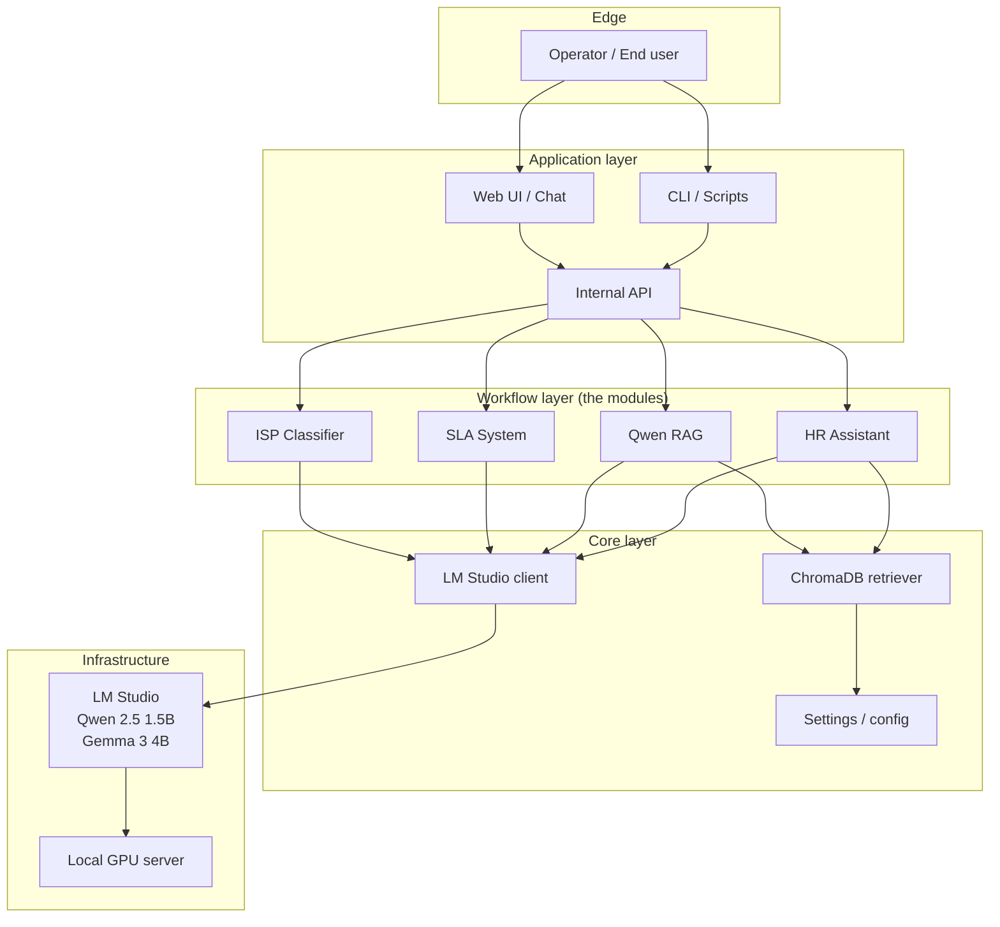

# Architecture

AI Work Flow for Business has a deliberately small set of layers. The whole point is that you can run it on one server and reason about the whole system.

## The five layers

| Layer | Lives in | Purpose |
| --- | --- | --- |
| **Edge** | Operator's browser or terminal | The person asking the question or triggering the workflow |
| **Application** | Your existing systems (intranet, Slack, ticketing) | Surfaces the AI to the end user |
| **Workflow** | This repo's modules | The actual narrow AI task (classify, route, retrieve) |
| **Core** | This repo's shared libraries | LM Studio client, RAG retriever, settings |
| **Infrastructure** | Your server room | The GPU and LM Studio runtime |

## Pages in this section

- [Layers](layers.md) — what each layer is responsible for, and what it is not
- [Data flow](data-flow.md) — what data moves where, and what never leaves your network
- [Security](security.md) — threat model, network placement, audit logging

## Design principles

1. **Local by default.** No cloud API calls. Ever. If a module needs a model, the model is on the same network.
2. **Structured I/O.** Every module has a typed input schema and a typed output schema. The model is a function, not a conversation partner.
3. **One job per module.** ISP Classifier classifies. SLA Classifier assesses risk. Qwen RAG retrieves. No module does two things.
4. **Observable.** Every model call is logged with input, output, latency, and token counts. You cannot operate what you cannot see.
5. **Replaceable.** The LM Studio client can be swapped for any OpenAI-compatible runtime. ChromaDB can be swapped for any vector store. No module is tightly coupled to a specific tool.

## See also

- [Why AI Work Flow for Business?](../why-ai-work-flow.md) — the case for this architecture
- [Adoption journey → Build](../adoption/build.md) — how to put this in production
- [Reference → Python API](../reference/python-api.md) — code-level details (forthcoming)
