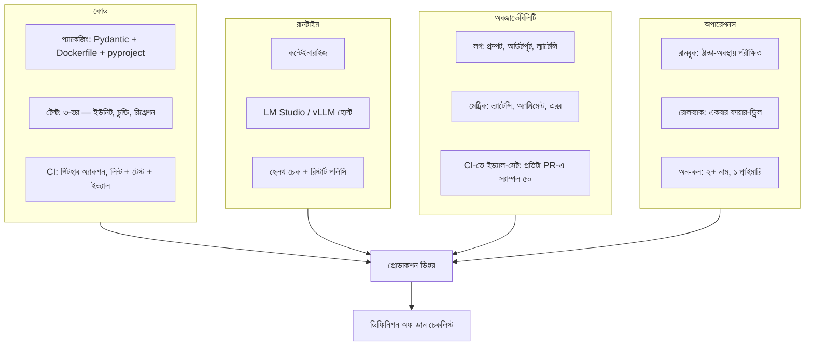

# ৩. বিল্ড — আমরা কিভাবে এটা প্রোডাকশনে আনবো?

> **সময়:** ৪–৮ সপ্তাহ, ২–৩ জন ইঞ্জিনিয়ার + অপস।
> **বের-হওয়ার মানদণ্ড:** প্রোডাকশনে ডিপ্লয় হয়েছে, রানবুক আছে, রোলব্যাক পরীক্ষিত, অবজার্ভেবিলিটি চলছে।

[পাইলট](pilot.md)-এ তোমার কাছে একটা শ্যাডো-মোড স্ক্রিপ্ট আছে যেটা বার পূরণ করে এবং একটা "হ্যাঁ" সিদ্ধান্ত আছে। বিল্ড সেই ল্যাপটপ স্ক্রিপ্টটাকে **পরিষেবায়** রূপান্তর করে — এমন কিছু যেটা ৯০ দিন ধরে চলে, ৫+ ব্যবহারকারী ব্যবহার করে, এবং একজন ইঞ্জিনিয়ার ছুটিতে থাকলেও ভাঙে না।

বিল্ড কাজটা বেশিরভাগ সময় কোড লেখা না — **চারটা প্যারালাল ওয়ার্কস্ট্রিমে সমন্বয় করা** যা ৪–৮ সপ্তাহে একসাথে শেষ হতে হবে।

---

## বিল্ডে যা না

এটা নতুন ফিচার না। এটা মডেল রিপ্লেসমেন্ট না। বিল্ডে তুমি ফিচার বাড়াচ্ছো না, মডেল টিউন করছো না, বা প্ল্যাটফর্ম বানাচ্ছো না। সেগুলো [স্কেল](scale.md)-এ। বিল্ড হলো: ল্যাপটপে যেটা কাজ করে সেটাকে এমন কিছুতে রূপান্তর করা যেটা **নির্ভরযোগ্যভাবে** চলে।

---

## ওয়ার্কস্ট্রিম ১ — কোড

লক্ষ্য: পাইলটের স্ক্রিপ্টকে এমন কোডবেসে রূপান্তর করা যেটা টিমের বাকি অংশ বুঝতে, পরীক্ষা করতে, আর পরিবর্তন করতে পারে।

**প্যাকেজিং।** প্রজেক্টে Pydantic মডেল থাকবে (চুক্তি), একটা Dockerfile থাকবে (রানটাইমের জন্য), একটা pyproject.toml বা requirements.txt থাকবে (নির্ভরতা পিন করা), আর একটা "এটা কী" README থাকবে। পাইলটে তোমার প্রম্পট আর LM Studio URL-ই যথেষ্ট ছিল। বিল্ডে সেটা ভাঙে।

**৩-স্তরের টেস্ট:**

1. **ইউনিট** — যেকোনো pure ফাংশন (যেমন কনফিডেন্স থ্রেশহোল্ড, প্রায়োরিটি ক্যাপ)। দ্রুত, কোনো LLM ছাড়া।
2. **চুক্তি** — প্রম্পট-আউটপুট পার্সিং Pydantic-এর বিরুদ্ধে। "আউটপুট TriageResult-এ ভ্যালিডেট হয়", "প্ল্যাটিনাম + আউটেজ P1 বা P2 দেয়"।
3. **রিগ্রেশন** — পাইলটের ৫০-উদাহরণের শ্যাডো সেট, সংরক্ষিত। প্রতিটা রিলিজের আগে রান করে, ব্যর্থতার ধরন গণনা করে।

**CI।** GitHub Actions (বা যেটাই আছে) এখন রান করে: লিন্ট, ইউনিট টেস্ট, চুক্তি টেস্ট, রিগ্রেশন ইভ্যাল। মার্জ করতে গেলে সবুজ। কোনো "আমি ম্যানুয়ালি রান করেছিলাম, কাজ করে" না। "CI সবুজ" ছাড়া কোনো PR মার্জ হয় না।

---

## ওয়ার্কস্ট্রিম ২ — রানটাইম

লক্ষ্য: LM Studio যেটা পাইলটে ল্যাপটপে ছিল সেটাকে এমন কিছুতে রূপান্তর করা যেটা ৯০ দিন চলে, রিস্টার্ট সারভাইভ করে, আর ২০ সমকালীন ব্যবহারকারীকে ধাক্কা দেয়।

তিনটা বাস্তবসম্মত রানটাইম বিকল্প, সবচেয়ে ছোট থেকে সবচেয়ে ভারী:

**অপশন A — LM Studio ডেডিকেটেড হোস্ট (বেশিরভাগ দলের জন্য সুপারিশকৃত)।** একটা ডেডিকেটেড মেশিন (iGPU ওয়ার্কস্টেশন বা ছোট সার্ভার)। সিস্টেমড সার্ভিস হিসেবে LM Studio চলে, হেলথ চেক সহ। সুবিধা: পাইলটের সঠিক স্ট্যাক, শূন্য নতুন অপস লোড, ইঞ্জিনিয়ার যা জানে তাই। অসুবিধা: ম্যানুয়াল স্কেলিং, একক পয়েন্ট অফ ফেইলিউর (একটা হোস্ট = একটা ব্যর্থতা)। একটা ওয়ার্কফ্লো, ≤ ২০ সমকালীন ব্যবহারকারীর জন্য সেরা।

**অপশন B — vLLM কন্টেইনার।** মডেলকে একটা OpenAI-সামঞ্জস্যপূর্ণ HTTP API-তে পরিবেশন করে, Docker-এ প্যাকেজড। সুবিধা: ভালো থ্রুপুট, GPU-বান্ধব, স্ট্যান্ডার্ড অপস টুলিং। অসুবিধা: নতুন ইনফ্রা পাথ, vLLM-নির্দিষ্ট কনফিগারেশন, "কেন এটা সব LM Studio না" প্রশ্ন। ≥ ৫০ সমকালীন ব্যবহারকারী বা ≥ ২ ওয়ার্কফ্লো চললে বিবেচনা করো।

**অপশন C — ম্যানেজড গেটওয়ে (OpenRouter, LiteLLM, নিজস্ব)।** মডেল রাউটিং, রেট লিমিট, ক্যাশিং, মাল্টি-মডেল। সুবিধা: একাধিক ওয়ার্কফ্লো / মডেল পরিবেশন করা সহজ। অসুবিধা: আরেকটা চলমান সিস্টেম, আরেকটা ডাউনস্ট্রিম ভেন্ডর লক-ইন। [স্কেল](scale.md)-এ ≥ ৩ ওয়ার্কফ্লো চললে বিবেচনা করো, বিল্ডে না।

**হেলথ চেক।** সার্ভিসটা `/health` এন্ডপয়েন্ট এক্সপোজ করে। LB / k8s / systemd চেক করে। মডেল লোড না হলে বা ৩০ সেকেন্ডের বেশি সাড়া না দিলে — রিস্টার্ট। পাইলটে স্বাস্থ্য পরীক্ষা করতাম ল্যাপটপ খুলে দেখে; বিল্ডে সিস্টেম দেখে।

---

## ওয়ার্কস্ট্রিম ৩ — অবজার্ভেবিলিটি

লক্ষ্য: সমস্যা হলে ৫ মিনিটে বুঝতে পারা।

তিনটা সিগন্যাল, পর্যাপ্ত:

1. **ল্যাটেন্সি p50 + p95** (প্রতিটা ওয়ার্কফ্লোর জন্য)। p50 বলে কত দ্রুত সাধারণ কেস, p95 বলে কত ধীর খারাপ কেস। মডেল + প্রম্পট + পার্সিং সহ।
2. **অ্যাগ্রিমেন্ট রেট (স্যাম্পল্ড)**। প্রতিটা ১০০০ ইনভোকেশনে ১০টা মানব-পরীক্ষিত ফলাফল। বেসলাইনের চেয়ে ১০ পয়েন্ট ড্রপ হলে পেজ।
3. **এরর রেট।** পার্সিং ফেইল, টাইমআউট, ৫xx। সবুজ থেকে ১% এ উঠলে পেজ।

**টুলিং** — Grafana + Prometheus যথেষ্ট, Datadog না। যদি বাড়িতে কুকি জার আছে, ওটাই। বিল্ডের মূল পয়েন্ট হলো সিগন্যালগুলো কাগজে সংজ্ঞায়িত, যাতে অন-কল ইঞ্জিনিয়ার জানে কোনটা দেখবে।

**CI-তে ইভ্যাল।** প্রতিটা PR রিগ্রেশন সেটের ৫০-উদাহরণের সাবসেটের বিরুদ্ধে চলে। ১০ মিনিটের কাজ, "আমরা কি এই সপ্তাহে লঙ্ঘন করেছি" প্রশ্নের উত্তর দেয়।

---

## ওয়ার্কস্ট্রিম ৪ — অপারেশনস

লক্ষ্য: ব্যর্থতা ঘটলে নিরাপদে সামলানো।

**রানবুক — ঠান্ডা-অবস্থায় পরীক্ষিত।** ১ পৃষ্ঠা: "মডেল টাইমআউট হলে কী", "পার্সিং এরর স্পাইক হলে কী", "GPU ফেইল হলে কী", "কম কনফিডেন্স স্পাইক হলে কী"। "ঠান্ডা-অবস্থায় পরীক্ষিত" মানে যে ইঞ্জিনিয়ার ৩ মাস ধরে কোড দেখেনি তিনি মাঝরাতে ১৫ মিনিটে সমস্যা সমাধান করতে পারেন। "রানবুক লেখা" যথেষ্ট না — পড়া, অনুসরণ করা, টাইমার ধরা।

**রোলব্যাক — একবার ফায়ার-ড্রিল।** রোলব্যাক প্ল্যান ("আগের মডেল ভার্সনে ফিরে যাও", "ওয়ার্কফ্লো ডিজেবল করো", "সব ইনভোকেশন ম্যানুয়ালিতে রাউট করো") থাকা একটা জিনিস। ফায়ার-ড্রিলে এটা **একবার** রান করা আরেকটা জিনিস। বিল্ডের ডেলিভারেবল: ফায়ার-ড্রিলের তারিখ, কে রান করেছে, কত সময় লেগেছে।

**অন-কল — ২+ নাম, ১ প্রাইমারি।** যেকোনো ওয়ার্কফ্লো চললে PagerDuty / টেলিগ্রাম / ফোন কল — যাই হোক — দিয়ে ২+ ইঞ্জিনিয়ার রোটেট করে, ১ জন প্রাইমারি, ১ জন সেকেন্ডারি। একজন ইঞ্জিনিয়ার ছুটিতে গেলে সিস্টেম স্টপ না হওয়াই এটার পয়েন্ট।

---

## যা করবে না

- **মডেল ফাইন-টিউন করবে না।** বিল্ডের উইন্ডোতে না। ফাইন-টিউনিং ডেটা সংগ্রহ, ট্রেনিং, ইভ্যাল, রিগ্রেশন — ৪–৮ সপ্তাহের বিল্ডের সাথে কাজ করে না। ফাইন-টিউনিং একটা [স্কেল](scale.md) পর্বের কাজ, যদি কখনো হয়।
- **জেনেরিক AI প্ল্যাটফর্ম বানাবে না।** তোমার বিল্ড **এই ওয়ার্কফ্লোর** জন্য। প্ল্যাটফর্ম কাজ [স্কেল](scale.md)-এ, ৩+ ওয়ার্কফ্লো চললে, ২+ টিম চললে।
- **অবজার্ভেবিলিটি আর্গুমেন্ট স্কিপ করবে না।** "আমরা পেজ করলে দেখব" — অন-কল ইঞ্জিনিয়ার ভুলে যায়। ৫ মিনিটের সেটআপ, ৯০ দিন সাশ্রয়।
- **প্রম্পট চেঞ্জকে রিলিজ ছাড়া করবে না।** প্রম্পট = কোড। একটা PR, একটা CI রান, একটা রিগ্রেশন ইভ্যাল।

---

## ডিফিনিশন অফ ডান

বিল্ড শেষ, নিচের সব সত্য হলে তুমি [স্কেল](scale.md)-এর জন্য প্রস্তুত:

- [ ] কোড প্যাকেজড (Pydantic, Dockerfile, pyproject) + CI সবুজ
- [ ] ৩-স্তরের টেস্ট: ইউনিট, চুক্তি, রিগ্রেশন — সব CI-তে
- [ ] রানটাইম ডেডিকেটেড (LM Studio / vLLM) + হেলথ চেক
- [ ] ৩ সিগন্যাল ড্যাশবোর্ডে: ল্যাটেন্সি p50/p95, অ্যাগ্রিমেন্ট, এরর
- [ ] রানবুক ঠান্ডা-অবস্থায় পরীক্ষিত (তারিখ, কে, কত সময়)
- [ ] রোলব্যাক ফায়ার-ড্রিল (তারিখ, কে, কত সময়)
- [ ] অন-কল রোস্টার ২+ নাম, ১ প্রাইমারি
- [ ] প্রোডাকশনে ≥ ৪ সপ্তাহ আপটাইম, ০ আনপ্ল্যান্ড আউটেজ

সব সত্য হলে তুমি [স্কেল](scale.md)-এ প্রবেশ করেছ। এক বা একাধিক মিস হলে — বিল্ডে থাকো, ঠিক করো, তারপর এগোও।
