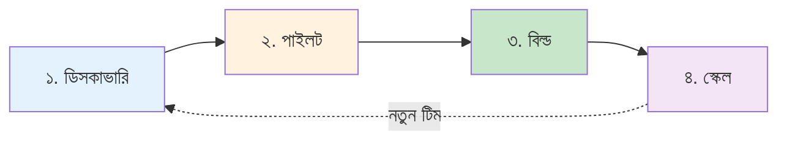

# গ্রহণযাত্রা

লোকাল LLM ওয়ার্কফ্লো প্রোডাকশনে আনা একটা একক সিদ্ধান্ত না — এটা চারটা ধাপের যাত্রা। প্রতিটা ধাপের একটা পরিষ্কার প্রবেশ মানদণ্ড, একটা পরিষ্কার বের হওয়ার মানদণ্ড, আর একটা ডেলিভারেবল আছে যার উপর পরের ধাপ গড়ে উঠবে।

---

## চারটা ধাপ

| ধাপ | প্রশ্ন | সময় | বের-হওয়ার মানদণ্ড |
| --- | --- | --- | --- |
| [**ডিসকাভারি**](discover.md) | "লোকাল LLM কি আমার টিমের জন্য বিবেচনা করার মতো?" | ১ দিন, ১ জন ইঞ্জিনিয়ার | এক পৃষ্ঠার মেমো: হ্যাঁ / না / হ্যাঁ-কিন্তু |
| [**পাইলট**](pilot.md) | "আমরা কি ২ সপ্তাহে একটা ওয়ার্কফ্লো শিপ করতে পারি?" | ২–৪ সপ্তাহ, ১–২ জন ইঞ্জিনিয়ার | শ্যাডো মোডে ১ সপ্তাহ, বার পূরণ |
| [**বিল্ড**](build.md) | "আমরা কিভাবে এটা প্রোডাকশনে আনবো?" | ৪–৮ সপ্তাহ, ২–৩ জন ইঞ্জিনিয়ার + অপস | সার্ভিস ডিপ্লয় হয়েছে, রানবুক আছে, রোলব্যাক পরীক্ষিত |
| [**স্কেল**](scale.md) | "৫+ টিমে কিভাবে রোল আউট করবো?" | ৩–৬ মাস, ছোট প্ল্যাটফর্ম টিম | ৫+ টিম নিজস্ব ওয়ার্কফ্লো শিপ করছে, শেয়ার্ড প্ল্যাটফর্ম আছে |

প্রতিটা ধাপ **নির্দিষ্ট সময়সীমায় বাঁধা**, ফিচার সংখ্যায় না। ছয় সপ্তাহের পাইলট যা ডেলিভার করতে পারে না, সেটা ভুল ওয়ার্কফ্লো — ছেড়ে দিন, আরেকটা চেষ্টা করুন।

---

## কোথা থেকে শুরু করবে

- **একটা ওয়ার্কফ্লো থাকলে, কোনো প্রোটোটাইপ নেই** → [ডিসকাভারি](discover.md) দিয়ে শুরু করুন।
- **একটা ল্যাপটপে কাজ করা প্রোটোটাইপ আছে** → [পাইলট](pilot.md)-এ চলে যান।
- **একটা টিম প্রোডাকশনে আছে, আরেকটা যোগ দিতে চায়** → [স্কেল](scale.md) পড়ুন।
- **আপনি ইতিমধ্যে বিল্ড পর্বে আছেন** → [বিল্ড](build.md) পড়ুন।

---

## সাধারণ ভুল

| ভুল | কেন ব্যর্থ হয় |
| --- | --- |
| ডিসকাভারি ছাড়াই সরাসরি পাইলট | ৬ সপ্তাহ পরে ডিসকাভারি হয় যে হার্ডওয়্যার ফিট হয়নি, বা ওয়ার্কফ্লো ভুল ছিল |
| পাইলট ছাড়াই সরাসরি বিল্ড | ৩ মাস পরে ডিসকাভারি হয় যে মডেল বার পূরণ করতে পারে না |
| স্কেল ছাড়াই একাধিক টিম | প্রতিটা টিম একই LM Studio ক্লায়েন্ট, একই রানবুক, একই ড্যাশবোর্ড আবার লেখে |
| ১০+ টিম আগে প্ল্যাটফর্ম বানানো | কোনো রিয়েল ওয়ার্কফ্লো ছাড়াই প্ল্যাটফর্ম ডিজাইন = আর্কিটেক্টের স্লাইড ডেক, বাস্তব কাজ না |

গ্রহণযাত্রার পুরো পয়েন্ট: **প্রতিটা ধাপের ডেলিভারেবল হলো পরের ধাপের ইনপুট**। কোনো ধাপ বাদ দিলে কাজ বেশি হয়, কম না।
