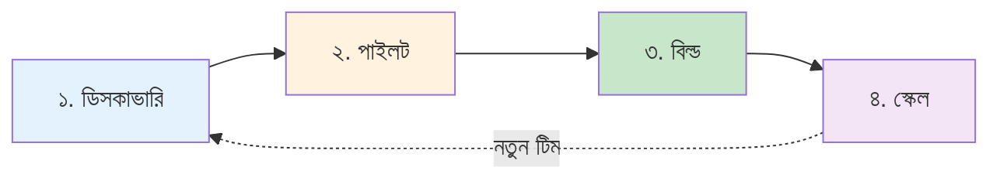

লোকাল LLM ওয়ার্কফ্লো প্রোডাকশনে আনা মানে একদিনে একটা বড় সিদ্ধান্ত নেওয়া না। বরং এটা চারটা ছোট ধাপের একটা যাত্রা — আর প্রতিটা ধাপের একটা পরিষ্কার **প্রবেশ মানদণ্ড** আছে (কখন ঢুকবেন), একটা পরিষ্কার **বের-হওয়ার মানদণ্ড** আছে (কখন বের হবেন), আর একটা **ডেলিভারেবল** আছে (কী বানিয়ে বের হবেন) — যেটা পরের ধাপের ইনপুট হিসেবে কাজ করবে। একটা ধাপ বাদ দিলে আসলে কাজ কমে না, বাড়ে — কারণ পরের ধাপে গিয়ে আবার আগের কাজটা ঠিক করতে হয়।

---

## চারটা ধাপ — এক নজরে

| ধাপ | মূল প্রশ্ন | এই ধাপে কী করবেন | সময় | বের-হওয়ার মানদণ্ড |
| --- | --- | --- | --- | --- |
| [**ডিসকাভারি**](discover.md) | "লোকাল LLM কি আমার টিমের জন্য বিবেচনা করার মতো?" | ২-৩টা কাজের ক্ষেত্র বাছাই, হার্ডওয়্যার ফিট চেক, এক পাতার বিজনেস কেস লেখা | ১ দিন, ১ জন ইঞ্জিনিয়ার | এক পৃষ্ঠার মেমো: **হ্যাঁ** / **না** / **হ্যাঁ-কিন্তু** |
| [**পাইলট**](pilot.md) | "আমরা কি ২ সপ্তাহে একটা ওয়ার্কফ্লো শিপ করতে পারি?" | ল্যাপটপে প্রোটোটাইপ, একটা রিয়েল টিকিটে শ্যাডো মোড, ১০০+ কেস টেস্ট সেট | ২–৪ সপ্তাহ, ১–২ জন ইঞ্জিনিয়ার | শ্যাডো মোডে ১ সপ্তাহ, বার (precision) পূরণ |
| [**বিল্ড**](build.md) | "আমরা কিভাবে এটা প্রোডাকশনে আনবো?" | সার্ভিস বানানো, প্রম্পট ভার্সনিং, মনিটরিং, অপস রানবুক | ৪–৮ সপ্তাহ, ২–৩ জন ইঞ্জিনিয়ার + অপস | সার্ভিস ডিপ্লয় হয়েছে, রানবুক আছে, রোলব্যাক পরীক্ষিত |
| [**স্কেল**](scale.md) | "৫+ টিমে কিভাবে রোল আউট করবো?" | শেয়ার্ড প্ল্যাটফর্ম, CoE (Center of Excellence), টিম-অনবোর্ডিং কিট | ৩–৬ মাস, ছোট প্ল্যাটফর্ম টিম | ৫+ টিম নিজস্ব ওয়ার্কফ্লো শিপ করছে, শেয়ার্ড প্ল্যাটফর্ম আছে |
| [**FDE**](fde.md) | "চারটা ধাপ চালায় এমন ভূমিকাটা কী?" | অডিট → ইভালস → ডিপ্লয়মেন্ট, ফরওয়ার্ড ডিপ্লয়েড ইঞ্জিনিয়ারের পদ্ধতি | ১২ সপ্তাহ, ১–৩ জন ইঞ্জিনিয়ার | গ্রাহকের ইঞ্জিনিয়াররা সিস্টেমের মালিক, হস্তান্তর মেমো স্বাক্ষরিত |

---

## FDE দৃষ্টিভঙ্গি — ভূমিকাটি যা চারটা ধাপ চালায়

চারটা ধাপ হলো অপারেশনাল playbook। সেগুলো চালায় এমন ভূমিকাটি হলো **ফরওয়ার্ড ডিপ্লয়েড ইঞ্জিনিয়ার (FDE)** — গ্রাহকের সাথে embedded সিনিয়র ইঞ্জিনিয়ার, যিনি গ্রাহকের নিজস্ব হার্ডওয়্যারে প্রথম কার্যকর সিস্টেম শিপ করেন এবং চলে যাওয়ার আগে সেটি হস্তান্তর করেন। FDE হলো সেই শব্দ যা AI শিল্পের বাকি অংশ এই কাজের জন্য ব্যবহার করে, এবং এটি এমন একটি ভূমিকা যা লোকাল-LLM কর্মসূচি *ছাড়া পারে না*: ডেটা-রেসিডেন্সি সীমাবদ্ধতা কাউকে অন-সাইটে বাধ্য করে, আর "অন-সাইটে কেউ" হলেন FDE।

[FDE অধ্যায় (৫)](fde.md) হলো সেই দৃষ্টিভঙ্গি যা চারটা ধাপকে শিল্পের বাকি অংশের সাথে সংযুক্ত করে। এটি ম্যাপ করে **অডিট → ডিসকাভারি**, **ইভালস → পাইলট**, **ডিপ্লয়মেন্ট → বিল্ড + স্কেল**, এবং ব্যাখ্যা করে কেন on-prem সীমাবদ্ধতা FDE-কে ঐচ্ছিকের বদলে বাধ্যতামূলক করে তোলে। ডিসকাভারির পরে, নিয়োগের আগে, এটি পড়ুন।

প্রতিটা ধাপ **নির্দিষ্ট সময়সীমায় বাঁধা**, ফিচার সংখ্যায় না। মানে হলো — ছয় সপ্তাহের পাইলট যদি কাজটা ডেলিভার করতে না পারে, তাহলে সমস্যাটা ওয়ার্কফ্লোতে, সময় বাড়ালে ঠিক হবে না। ছেড়ে দিন, আরেকটা কাজের ক্ষেত্র বাছুন, আবার চেষ্টা করুন।

---

## প্রতিটা ধাপে আসলে কী হয়

### ১. ডিসকাভারি — "এটা কি আমাদের কাজ?"

এই ধাপে আপনি কোনো মডেল ট্রেন করছেন না, কোনো সার্ভিস বানাচ্ছেন না। শুধু একটা প্রশ্নের উত্তর খুঁজছেন: **আমার টিমের এই নির্দিষ্ট কাজটা কি লোকাল LLM দিয়ে সম্ভব — আর সেটা করার মতো?** একদিনে, একজন মানুষ, ২-৩টা প্রশ্নের উত্তর লিখে ফেলুন। কাজ শেষে আপনার হাতে থাকবে এক পাতার একটা মেমো — সেটাই পরের ধাপে ঢোকার টিকিট।

ভালোভাবে বের হতে হলে যা লাগে: একটা **আনুমানিক বিজনেস ভ্যালু** (ঘণ্টায় কত সাশ্রয়, বা ভুল কমানো), একটা **হার্ডওয়্যার ফিট চেক** (আপনার ৩০-৫০ GB VRAM লাগবে, আছে?), আর একটা **এক-লাইন সিদ্ধান্ত** — হ্যাঁ, না, বা হ্যাঁ-কিন্তু-যদি-এই-শর্তে।

### ২. পাইলট — "এটা কি আসলে কাজ করে?"

ডিসকাভারিতে যদি "হ্যাঁ" পান, তাহলে পাইলটে ঢুকুন। এখানে আপনি **ল্যাপটপে বা একটা ছোট GPU-তে একটা প্রোটোটাইপ বানান** — একটা ওয়ার্কফ্লো, একটা রিয়েল কাজের ক্ষেত্র, একটা ১০০ কেসের টেস্ট সেট। তারপর সেই প্রোটোটাইপকে এক সপ্তাহ **শ্যাডো মোডে** চালান — মানে মানুষ সিদ্ধান্ত নেয়, মডেল শুধু পরামর্শ দেয়। দেখুন বার (precision/recall) কত। কাজ শেষে আপনার হাতে থাকবে: "এই মডেল, এই প্রম্পট, এই ডেটা — এই কাজের জন্য কাজ করে, এই সংখ্যায়।"

পাইলট সফল হতে হলে আপনাকে **একটা রিয়েল টিকিটে টেস্ট করতে হবে** — সিনথেটিক ডেটা না, মানুষের লেখা আসল টিকিট। আর **সময় বাঁধা**: ৪ সপ্তাহের বেশি না। ৪ সপ্তাহে না হলে, এটা এই ওয়ার্কফ্লোর জন্য না।

### ৩. বিল্ড — "এটা কিভাবে প্রোডাকশনে চলবে?"

পাইলট যদি বলে "কাজ করে", তাহলে বিল্ডে ঢুকুন। এখানে আপনি সেই প্রোটোটাইপকে একটা **প্রোডাকশন সার্ভিসে** রূপান্তর করেন: API এন্ডপয়েন্ট, প্রম্পট ভার্সন কন্ট্রোল, লগিং, মনিটরিং, অপস রানবুক, রোলব্যাক প্ল্যান। এখানে **সবচেয়ে বেশি কাজ** হয় — কারণ আপনি শুধু "কাজ করে" থেকে "নির্ভরযোগ্যভাবে কাজ করে"-তে যাচ্ছেন।

বিল্ড সফল হতে হলে: সার্ভিস আপনার আপস টিমের মতো যেকোনো সার্ভিসের মতোই দেখতে হবে — **ডিপ্লয় স্ক্রিপ্ট, হেলথ চেক, অ্যালার্ট, রানবুক, রোলব্যাক**। ৮ সপ্তাহের বেশি না।

### ৪. স্কেল — "আরো টিম কিভাবে এটা ব্যবহার করবে?"

বিল্ড যদি একটা টিমের জন্য কাজ করে, তাহলে স্কেলে ঢুকুন। এখানে আপনি **সেই একটা সার্ভিসকে ৫+ টিমে ছড়িয়ে দেন** — শেয়ার্ড প্ল্যাটফর্ম, সেলফ-সার্ভিভ টেমপ্লেট, টিম-অনবোর্ডিং কিট, একটা ছোট **CoE (Center of Excellence)** যেটা প্ল্যাটফর্ম মেইনটেইন করে। এই ধাপে আপনি "AI মডেল" বানাচ্ছেন না — আপনি "AI অ্যাডপশন সিস্টেম" বানাচ্ছেন।

স্কেল সফল হতে হলে: **ন্যূনতম ৫টা ভিন্ন টিম** নিজেরাই (আপনার হাত ধরে না) ওয়ার্কফ্লো শিপ করছে, আর **একটা শেয়ার্ড প্ল্যাটফর্ম** আছে যেটা তারা নিজেরা ব্যবহার করতে পারে। ৬ মাসের বেশি না।

---

## ধাপ থেকে ধাপে কিভাবে যাবেন

একটা ধাপ শেষ হলে আপনি দুইটা জিনিস দাঁড় করান:

1. **ডেলিভারেবল** — একটা কাগজ, একটা কোড, একটা ডিপ্লয়মেন্ট — যেটা পরের ধাপের টিম ধরতে পারে।
2. **বের-হওয়ার মানদণ্ড পূরণ** — সেই নির্দিষ্ট সংখ্যাগুলো (বার, সময়, টিম সংখ্যা) যেগুলো ছাড়া পরের ধাপে যাওয়া যায় না।

তারপর একটা ছোট **রিট্রো** করুন (৩০ মিনিট, যা কাজ করেছে আর যা করেনি), আর পরের ধাপের টিমের সাথে হ্যান্ডঅফ মিটিং রাখুন। এই হ্যান্ডঅফটাই আসল — কারণ এখানেই প্রথম ধাপের "টাইম-বক্সড সিদ্ধান্ত" পরের ধাপের "ইনপুট" হয়ে যায়। হ্যান্ডঅফ ভুল হলে পরের ধাপে গিয়ে আগের কাজ আবার করতে হয় — আর সেটাই এই যাত্রার আসল সময় নষ্ট।

---

## কোথা থেকে শুরু করবে

- **একটা ওয়ার্কফ্লো থাকলে, কোনো প্রোটোটাইপ নেই** → [ডিসকাভারি](discover.md) দিয়ে শুরু করুন।
- **একটা ল্যাপটপে কাজ করা প্রোটোটাইপ আছে** → [পাইলট](pilot.md)-এ চলে যান।
- **একটা টিম প্রোডাকশনে আছে, আরেকটা যোগ দিতে চায়** → [স্কেল](scale.md) পড়ুন।
- **আপনি ইতিমধ্যে বিল্ড পর্বে আছেন** → [বিল্ড](build.md) পড়ুন।

---

## সাধারণ ভুল

| ভুল | কেন ব্যর্থ হয় |
| --- | --- |
| ডিসকাভারি ছাড়াই সরাসরি পাইলট | ৬ সপ্তাহ পরে ডিসকাভারি হয় যে হার্ডওয়্যার ফিট হয়নি, বা ওয়ার্কফ্লো ভুল ছিল |
| পাইলট ছাড়াই সরাসরি বিল্ড | ৩ মাস পরে ডিসকাভারি হয় যে মডেল বার পূরণ করতে পারে না |
| স্কেল ছাড়াই একাধিক টিম | প্রতিটা টিম একই LM Studio ক্লায়েন্ট, একই রানবুক, একই ড্যাশবোর্ড আবার লেখে |
| ১০+ টিম আগে প্ল্যাটফর্ম বানানো | কোনো রিয়েল ওয়ার্কফ্লো ছাড়াই প্ল্যাটফর্ম ডিজাইন = আর্কিটেক্টের স্লাইড ডেক, বাস্তব কাজ না |

গ্রহণযাত্রার পুরো পয়েন্ট: **প্রতিটা ধাপের ডেলিভারেবল হলো পরের ধাপের ইনপুট**। কোনো ধাপ বাদ দিলে কাজ বেশি হয়, কম না।
