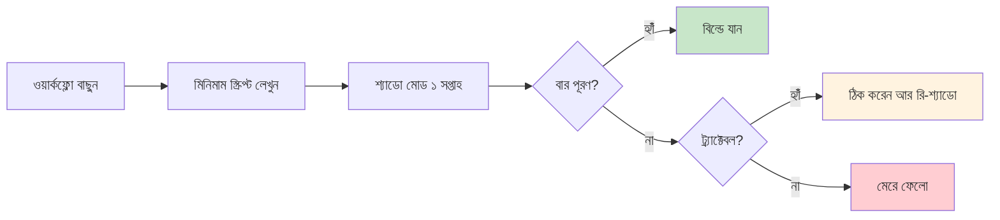

# ২. পাইলট — আমরা কি ২ সপ্তাহে একটা ওয়ার্কফ্লো শিপ করতে পারি?

> **সময়:** ২–৪ সপ্তাহ, ১–২ জন ইঞ্জিনিয়ার।
> **বের-হওয়ার মানদণ্ড:** একটা চলমান স্ক্রিপ্ট যা শ্যাডো মোডে ১ সপ্তাহ চলে, আর [ডিসকাভারি\]\(discover.md\)-তে ধরা বার পূরণ করে।

[ডিসকাভারি\]\(discover.md\)-তে আপনি ঠিক করেছেন কোন ওয়ার্কফ্লো আর কোন হার্ডওয়্যার। পাইলট যায় কঠিন অংশে: ১ সপ্তাহ ধরে একটা কাজ করা স্ক্রিপ্ট লিখে দেখানো — মানুষের পাশে, সরাসরি ইউজার ফেস করা ছাড়াই — আজকের মানুষের রুটিনের মান পূরণ করতে পারে।



আপনার কাছে যদি ইতিমধ্যে কাজ করা প্রোটোটাইপ থাকে, এখানে সময় নষ্ট করেন না — [বিল্ড](build.md)-এ যান। পাইলট তাদের জন্য যাদের কাছে শুধু ডিসকাভারি-ধাপের মেমো আছে, কাজ করা কোড নেই।

---

## পাইলট যা না

এটা প্রোডাকশন রিলিজ না। ১–৫ জন ইউজার ইনভলভড, ১–২ সপ্তাহের সময়সীমা, বাস্তব ইউজার কিন্তু মানুষ-ইন-দ্য-লপ ভ্যালিডেশন সহ। রোলব্যাক, অবজার্ভেবিলিটি, অন-কল — এসব এখানে না। সেগুলো [বিল্ড](build.md)-এ।

পাইলটের আউটপুট ফিচার-সম্পূর্ণ সিস্টেম না। পাইলটের আউটপুট হলো **সিদ্ধান্ত** — ফাংশন সিগনেচার, ইনপুট/আউটপুট শেপ, এবং প্রতিটা এজ কেসে কী আচরণ করা উচিত সেই ডকুমেন্টেশন। নিচে যেমন:

```python
from pydantic import BaseModel, Field

class Ticket(BaseModel):
    customer_tier: str          # "bronze" | "silver" | "gold" | "platinum"
    text: str                   # raw customer message
    received_at: str            # ISO 8601

class TriageResult(BaseModel):
    category: str = Field(description='"connectivity" | "billing" | "outage" | "speed" | "other"')
    priority: int = Field(ge=1, le=5, description="1=P1 outage, 5=P5 cosmetic")
    confidence: float = Field(ge=0.0, le=1.0)
    reason: str = Field(description="one-sentence justification")

def triage_ticket(ticket: Ticket) -> TriageResult:
    """Classify a customer ticket into category + priority.

    Contract:
    - Output `category` MUST be one of the 5 allowed values.
    - Output `priority` MUST respect customer_tier:
        * platinum + outage  -> priority 1 or 2
        * gold + outage      -> priority 2 or 3
        * silver/bronze      -> priority 3, 4, or 5
    - Output `reason` MUST cite a phrase from `ticket.text`.
    - Output `confidence` < 0.6 MUST be reviewed by a human.
    """
    ...
```

এই চুক্তি যা কাজ করে:

- **প্রম্পট** = একটা সিস্টেম মেসেজ ("You are a triage classifier. Follow this contract...") প্লাস কয়েকটা ফিউ-শট উদাহরণ।
- **পার্সার** = Pydantic, `TriageResult`-এ আউটপুট ভ্যালিডেট। স্কিমা ভায়োলেশন = রিট্রাই, তারপর ফলব্যাক।
- **এজ কেস** = প্ল্যাটিনাম + আউটেজ P1, সিলভার + ব্রাউজিং P4, কম কনফিডেন্স রিভিউতে। এগুলো চুক্তিতে আছে, কোডে হার্ডকোড না।

চুক্তি লেখা মানে আপনি ব্যবসায়িক লজিককে ইঞ্জিনিয়ারিং আর্টিফ্যাক্টে ভাগ করছেন। চুক্তি ভাঙলে আপনি জানবে কোথায়; ইউনিট টেস্ট যেভাবে API ভাঙলে ধরে।

---

## ধাপ ১ — সবচেয়ে ছোট যেটা শিপ করা যায় সেটা বাছুন (১ দিন)

পাইলটের প্রথম সিদ্ধান্ত ফিচারের না, পৃষ্ঠতলের (surface)। পাইলটের পৃষ্ঠতল হলো ওয়ার্কফ্লোর কোন অংশটা সম্পূর্ণ স্বয়ংকরিয় হবে, আর কোন অংশটা মানুষ-ইন-দ্য-লপ থাকবে।

| পৃষ্ঠতল | কখন বাছবেন | কখন বাছবেন না |
| --- | --- | --- |
| শ্যাডো মোড — মডেল সুপারিশ করে, মানুষ সিদ্ধান্ত নেয় | সবসময়, প্রথম | কখনো না, যদি আগে থেকে ভালো সিস্টেম থাকে |
| অ্যাসিস্টেড — মডেল পরামর্শ দেয়, এক ক্লিকে গ্রহণ | মানুষ সম্পূর্ণ স্বয়ংকরিয়তায় আস্তা রাখে না | সমালোচনামূলক বিষয়ে (ফ্রড ফল্লোয়িং) |
| ফুল অটো — মডেল সিদ্ধান্ত নেয়, মানুষ শুধু অডিট | ইউজার কলান্ত, সিদ্ধান্ত বিপরীতমুখী | কখনো না পাইলটে — সবসময় প্রথম [বিল্ড](build.md) পারবেন |

[ডিসকাভারি\]\(discover.md\)-র মতোই, এক বাক্যে পৃষ্ঠতলের বিবরণ লেখুন: _"আমি টিকিট X-এর জন্য ওয়ার্কফ্লো Y-এর উপর শ্যাডো মোড পাইলট করছি, বার Z-এ।"_

উদাহরণ — ISP ট্রায়াজ: _"আমি পল্যাটিনাম টিয়ারের ISP গ্রাহক-অভিযোগ টিকিটের উপর শ্যাডো-মোড ট্রায়াজ পাইলট করছি, বার হলো গত ১০০০ টিকিটের মানব রাউটিং লেবেলের সাথে ৯০% ক্যাটেগরি অ্যাগ্রিমেন্ট।"_ বার পরিমাপযোগ্য, তুলনীয়, সীমাবদ্ধ।

---

## ধাপ ২ — কোড না, চুক্তি লেখুন (আধা দিন)

পাইলটের আউটপুট ফিচার-সম্পূর্ণ সিস্টেম না। পাইলটের আউটপুট হলো **চুক্তি** — ফাংশন সিগনেচার, ইনপুট/আউটপুট শেপ, এবং প্রতিটা এজ কেসে কী আচরণ করা উচিত সেই ডকুমেন্টেশন। নিচে যেমন:

```python
from pydantic import BaseModel, Field

class Ticket(BaseModel):
    customer_tier: str
    text: str
    received_at: str

class TriageResult(BaseModel):
    category: str = Field(description='"connectivity" | "billing" | "outage" | "speed" | "other"')
    priority: int = Field(ge=1, le=5)
    confidence: float = Field(ge=0.0, le=1.0)
    reason: str
```

এই চুক্তি যা কাজ করে:

- **প্রম্পট** = একটা সিস্টেম মেসেজ প্লাস কয়েকটা ফিউ-শট উদাহরণ।
- **পার্সার** = Pydantic, `TriageResult`-এ আউটপুট ভ্যালিডেট। স্কিমা ভায়োলেশন = রিট্রাই, তারপর ফলব্যাক।
- **এজ কেস** = প্ল্যাটিনাম + আউটেজ P1, সিলভার + ব্রাউজিং P4, কম কনফিডেন্স রিভিউতে।

চুক্তি লেখা মানে আপনি ব্যবসায়িক লজিককে ইঞ্জিনিয়ারিং আর্টিফ্যাক্টে ভাগ করছেন। চুক্তি ভাঙলে আপনি জানবে কোথায়; ইউনিট টেস্ট যেভাবে API ভাঙলে ধরে।

টাইপড চুক্তির তিনটা মূল সুবিধা:

- **পার্সিং এরর ধরা পড়ে।** মডেল যদি ভুল শেপের JSON দেয়, পার্সার ধরে — আপনি রিট্রাই করেন বা ফলব্যাক পাঠান।
- **আউটপুট স্কিমা স্থিতিশীল থাকে।** কোড এক জায়গায় ভরসা করে — `result.priority` সবসময় `int`, `result.category` সবসময় enum।
- **ডকুমেন্টেশন হিসেবেও কাজ করে।** নতুন ডেভেলপার `TriageResult` দেখেই বুঝবে কী আশা করা যায়।

চুক্তি ছাড়া পাইলট চলে না। "মডেল যা-ই দিক আমরা নেব" হলো প্রোডাকশন ডিজাস্টারের রেসিপি।

---

## ধাপ ৩ — হোস্টেড API-তে না, LM Studio-তে ওয়্যার করেন (আধা দিন)

পাইলট সময় LM Studio-তে একটা ডেডিকেটেড হোস্ট ব্যবহার করেন — ডেভেলপার ল্যাপটপে ফল্যাপি ওয়ার্কস্টেশনে — কিন্তু **হোস্টেড API-তে ফলব্যাক করবেন না**। দুটো কারণে:

1. **ডেটা রেসিডেন্সি প্রমাণ করা।** টিম লিড ও ম্যানেজমেন্টের কাছে পাইলটের বিশ্বাসযোগ্যতা এটার উপর নির্ভর করে। "আমরা ক্লাউডে পাঠাইনি" হলো পাইলটের প্রমাণ।
2. **প্রোডাকশন বাস্তবতা।** [বিল্ডে](build.md) যা আসবে সেটা LM Studio / vLLM / ম্যানেজড গেটওয়ে, OpenAI ক্লায়েন্ট না। চুক্তি আজকে LM Studio-তে ভ্যালিডেট হলে [বিল্ডের](build.md) খরচ ৬ গুণ কমে।

ধাপ ৩-এ ডেডিকেটেড হোস্টের অর্থ হলো "পাইলটের টিমের জন্য একটা নির্দিষ্ট মেশিন" — এটা প্রোডাকশন না, [বিল্ডে](build.md) সেটা আসবে। পাইলটের মেশিন হলো ১টা ডেভেলপার ল্যাপটপ বা ১টা GPU বক্স, যেটার উপর শুধু এই পাইলট চলে।

একটা সাধারণ ভুল হলো পাইলটের জন্য "আমরা ঠিক যেমন API-তে পাঠাব সেভাবেই পাঠাই" — এটা ভুল। [বিল্ড](build.md)-এ API-এর বদলে vLLM-এ যাওয়া হবে, চুক্তি পরিবর্তন হবে না। পাইলটে API ব্যবহার করলে পরে vLLM-এ যাওয়ার সময় চুক্তি আবার টেস্ট করতে হয়। LM Studio-তে শুরু করলে সেই চক্র বাঁচে।

---

## ধাপ ৪ — শ্যাডো মোড ১ সপ্তাহ চালান (৫ দিন)

পাইলটের হৃদয় হলো শ্যাডো সপ্তাহ। মডেল প্রতিটা ইনপুটে সুপারিশ দেয়, কিন্তু সিদ্ধান্ত নেয় না — মানুষ নেয়। আপনি মাপো:

| মেট্রিক | টার্গেট | আসল |
| --- | --- | --- |
| **ক্যাটেগরি অ্যাগ্রিমেন্ট রেট** | ≥ ৯০% | ??? |
| **প্রায়োরিটি অ্যাগ্রিমেন্ট রেট** | ≥ ৮৫% | ??? |
| **ল্যাটেন্সি p50** | ≤ ৩ সেকেন্ড | ??? |
| **ল্যাটেন্সি p95** | ≤ ৮ সেকেন্ড | ??? |
| **ব্যর্থতার কেস** (মডেল আউটপুট ভল, ফরম্যাট ভাঙা, কম কনফিডেন্স) | সব সংরক্ষিত | ??? |
| **ইউজার মন্তব্য** (NOC ইঞ্জিনিয়ার কি এটা ব্যবহার করবেন?) | ≥ ৪/৫ | ??? |

৫ দিন, আসল টিকিট, আসল ইঞ্জিনিয়ার। সপ্তাহের শেষে আপনার কাছে একটা ৬-সারির টেবিল আছে যেখানে "আসল" কলাম পূরণ করা আছে, "টার্গেট" কলামের পাশে।

**ভল পাইলটের চিহ্ন:** আপনি "ভালো দেখাচ্ছে" অনুমব করছেন, কিন্তু কোনো সংখ্যা নেই। সংখ্যা ছাড়া ১ সপ্তাহ = ১ সপ্তাহ বেড়ে গেছে।

শ্যাডো মোডে কিছু ব্যর্থতা আসবে — এটা স্বাভাবিক, এটাই পাইলটের কাজ। ব্যর্থতার ধরন ডকুমেন্ট করেন, কারণ পাইলটের সিদ্ধান্ত "হ্যাঁ/না/পাইভট"-এর ভিত্তি এই ডেটা। ব্যর্থতা ধরার সবচেয়ে সহজ উপায় হলো প্রতিটা ইনপুট-আউটপুট জোড়া JSONL-এ লগ করা, তারপর সপ্তাহ শেষে স্ক্রিপ্ট দিয়ে অ্যাগ্রিমেন্ট মাপা। লগ ছাড়া শ্যাডো মোড হলো "আমরা মনে হয় ভালো দেখলাম" — সেটা পাইলট না।

একটা কঠিন সত্য: ৫ দিনের শ্যাডো মোডে ১০০% অ্যাগ্রিমেন্ট পাওয়া যাবে না। ৯০% ক্যাটেগরি অ্যাগ্রিমেন্ট হলো ভালো, ৮৫% হলো সীমান্তে, ৮০% এর নিচে হলো "আরো কাজ লাগবে"। কিন্তু এটা আগে থেকে ঠিক করা থাকতে হবে — শ্যাডো সপ্তাহের আগে না হলে শ্যাডো শেষে আপনি "ভালো দেখাচ্ছে" বলবে, যেটা সিদ্ধান্ত না।

---

## ধাপ ৫ — হ্যাঁ / না / পাইভট সিদ্ধান্ত নিন (১ দিন)

শ্যাডো সপ্তাহের পরে তিনটা সৎ রাস্তা:

| রায় | ট্রিগার | পরের পদক্ষেপ |
| --- | --- | --- |
| **হ্যাঁ — বিল্ডে যান** | প্রতিটা মেট্রিক টার্গেটে, কোনো "ধরন" ব্যর্থতা মারাত্মক না | [বিল্ড](build.md)-এ যান |
| **না — মেরে ফেলো** | টার্গেটের ১+ এ কঠিন মিস, বা মেট্রিক সংগ্রহ করতে পারেননি | থামুন, ডকুমেন্ট করেন কেন, [ডিসকাভারি\]\(discover.md\) থেকে নতুন ওয়ার্কফ্লো |
| **পাইভট** | ডেটা রেসিডেন্সি ঠিক ছিল, কিন্তু ওয়ার্কফ্লো ভল — বা ওয়ার্কফ্লো ঠিক, কিন্তু মডেল সাইজ ভল | [ডিসকাভারি\]\(discover.md\)-তে ফিরে যান, একটা ভেরিয়েবল বদলান, আবার চেষ্টা করেন |

**তিনটাই সফল পাইলট।** "না" সিদ্ধান্ত যেটা বাঁচায় সেটা হলো ৬ মাসের বিল্ড সময় যেটা কোনোদিন কাজ করত না। পাইলটের ডেলিভারেবল হলো শুধু চলমান স্ক্রিপ্ট না, **সিদ্ধান্ত**।

সিদ্ধান্ত না নেওয়া হলো পাইলটের সবচেয়ে ব্যয়বহুল ফলাফল। ৬ মাস আগে যে পাইলট চলছে, কেউ জানে না সে কাজ করছে কিনা, কেউ জানে না কেন চলছে, কেউ জানে না কখন শেষ হবে — এটা পাইলট না, এটা প্রজেক্টের ক্যান্সার। কঠিন সিদ্ধান্ত নেওয়া সস্তা।

---

## যা করবেন না

- **বড় মডেল দিয়ে শুরু করবেন না।** সবচেয়ে ছোট মডেল দিয়ে শুরু করেন যেটা বার পূরণ করে, তারপর উপরে যান।
- **প্রোম্পট ইঞ্জিনিয়ারিং ২ সপ্তাহ ধরে করবেন না।** ৩ দিন, ১০ ফিউ-শট, তারপর শ্যাডো। ইঞ্জিনিয়াররা ৫ নম্বর ফিউ-শট চেঞ্জের সবিধা বুঝবে না।
- **মডেলকে প্রোডাকশনে ছাড়বেন না।** শ্যাডো মোডে ১ সপ্তাহ, তারপর [বিল্ড](build.md)।
- **চুক্তি পরিবর্তন ছাড়া কোড পরিবর্তন করবেন না।** চুক্তি ডকুমেন্টেশন; কোড চুক্তি অনুযায়ী আসে।
- **ব্যবহারকারীদের "কাজ শেষ" বলবে না যদি না মেট্রিক বলে।** পাইলট ডেটা ছাড়া শেষ হয় না।

---

## ডেলিভারেবল চেকলিস্ট

- [ ] পৃষ্ঠতল বাছা (শ্যাডো / অ্যাসিস্টেড / ফুল অটো) — লিখিত
- [ ] চুক্তি লেখা (Pydantic মডেল, এজ-কেস ডকুমেন্টেশন) — কোডে
- [ ] LM Studio-তে প্রম্পট চলছে, পার্সার ভ্যালিডেট করছে — কাজ করে
- [ ] শ্যাডো মোড ৫ দিন, ১+ আসল ইউজার — মেট্রিক টেবিল পূরণ
- [ ] হ্যাঁ / না / পাইভট সিদ্ধান্ত — লিখিত, টিম লিড সাইন-অফ
- [ ] [বিল্ড](build.md)-এর জন্য প্রম্পট, পার্সার, এবং শ্যাডো লগ — সংরক্ষিত

"হ্যাঁ" হলে আপনি [বিল্ড](build.md)-এ প্রবেশ করেছেন।
