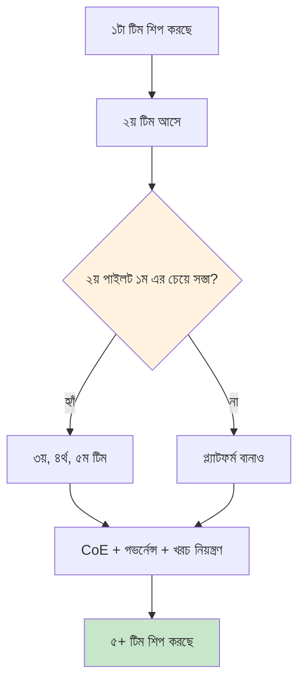

# ৪. স্কেল — ৫+ টিমে কিভাবে রোল আউট করবো?

> **সময়:** ৩–৬ মাস।
> **বের-হওয়ার মানদণ্ড:** ৫+ টিম নিজস্ব ওয়ার্কফ্লো শিপ করছে, আর "দ্বিতীয় টিমের পাইলট প্রথম টিমের চেয়ে সস্তা ছিল" — একটা পরিমাপযোগ্য কথা, স্লোগান না।

[বিল্ড](build.md) শেষে তোমার কাছে একটা ওয়ার্কফ্লো আছে যেটা নির্ভরযোগ্যভাবে চলে। স্কেল শুরু হয় দ্বিতীয় টিম সেটা দেখে বললে "আমরাও চাই" — এবং তুমি সেই মুহূর্তে যা কিছু বানিয়েছ সেটা ৫ টিমে একই খরচে শিপ করা সম্ভব কিনা সেই প্রশ্নে।

তোমার কাছে যদি একটা কাজ করা ওয়ার্কফ্লো না থাকে, এখানে কিছু করার নেই — [আবিষ্কার](discover.md) থেকে শুরু করো। ১+ ওয়ার্কফ্লো চলছে কিন্তু ২য় টিম আসছে না — তুমি এখনো স্কেলে নেই।

---

## স্কেলে যা না

এটা মডেল ভালো করা না। এটা প্রম্পট টিউনিং না। এটা নতুন মডেল ভার্সন বের করা না। স্কেল হলো: ১টা থেকে ৫+ টিমে যাওয়া, আর **প্রতিটা নতুন টিমের পাইলট যেন আগেরটার চেয়ে সস্তা হয়**। "সস্তা" মানে কম ইঞ্জিনিয়ার-সপ্তাহ, কম নতুন ইনফ্রা, কম নতুন রানবুক। যদি ২য় টিমের পাইলট ১ম টিমের মতো ব্যয় হয়, তুমি প্ল্যাটফর্ম বানাওনি — তুমি ২ বার একই কাজ করেছ।

---

## ৩টা কাজ, ৩টা ভিন্ন দক্ষতা

### কাজ ১ — দ্বিতীয় পাইলটকে সস্তা করো

দ্বিতীয় টিম আসলে তারা আবিষ্কার-থেকে-শুরু করবে কিন্তু তোমার কাছে এখন টেমপ্লেট আছে। এই ৪টা ডেলিভারেবল সেই পাইলটকে ২ সপ্তাহে ২ দিনে নামিয়ে আনে:

1. **পাইথন ক্লায়েন্ট।** "from local_llm import triage" — যেকোনো ইঞ্জিনিয়ার LM Studio URL, প্রম্পট পাথ, পার্সার জানার আগেই কল করতে পারে।
2. **Grafana টেমপ্লেট।** নতুন ওয়ার্কফ্লো আপলোড, তিনটা সিগন্যাল আগে থেকেই দৃশ্যমান। জিরো ড্যাশবোর্ড কনফিগারেশন।
3. **CI টেমপ্লেট।** "এই GitHub Actions YAML এই রেপোতে কপি করো, ৩-স্তর টেস্ট + রিগ্রেশন ইভ্যাল আগে থেকেই চলে"।
4. **রানবুক টেমপ্লেট।** "সাধারণ ব্যর্থতা + সাধারণ সমাধান" — ৮০% কেস কভার, বাকি ২০% এস্কেলেশন পাথ।

চারটাই আগে থেকে থাকা উচিত। এগুলো [বিল্ড](build.md) চলাকালীন তৈরি হয়নি, তাহলে বিল্ড ভুল ছিল — কিন্তু স্কেলের শুরুতে ১ সপ্তাহে লেখা যায়।

### কাজ ২ — মডেল লাইফসাইকেল শাসন করো

৫+ টিম শিপ করলে "কোন মডেল আমরা চালাই" প্রশ্নটা প্রতি মাসে আসে। সিদ্ধান্ত টেবিল:

| সিদ্ধান্ত | কে সিদ্ধান্ত নেয় | কখন |
| --- | --- | --- |
| **নতুন মডেল অনুমোদন** | CoE লিড + সিকিউরিটি | নতুন মডেল আসলে, পুরনো বদলানোর আগে |
| **মডেল আপগ্রেড** | ওয়ার্কফ্লো মালিক | কোনো ক্ষতিহীন আপগ্রেড প্রমাণিত, বা ইউজার চাইলে |
| **ফাইন-টিউন গেট** | CoE + ওয়ার্কফ্লো মালিক | ≥ ১০k উদাহরণ ডেটাসেট + ≥ ৫% মেট্রিক উন্নতি ডেমো + রিগ্রেশন পাস |
| **ইভ্যাল সেট** | CoE | প্রতি কোয়ার্টারে নতুন ১০০ উদাহরণ যোগ, বিদ্যমান ওয়ার্কফ্লোর জন্য |
| **খরচ চার্জব্যাক** | ফাইন্যান্স + CoE | মাসিক রিপোর্ট, প্রতি টিমকে চার্জ |

এই ৫টা সিদ্ধান্ত ছাড়া ৫+ টিম চালানো মানে প্রতিটা টিম নিজের মডেল, নিজের ইভ্যাল, নিজের খরচ — যেটা ৬ মাসের মধ্যে বিস্ফোরিত হয়।

### কাজ ৩ — খরচ নিয়ন্ত্রণ করো

লোকাল LLM সস্তা কিন্তু বিনামূল্যে না। খরচের তিনটা উৎস:

1. **হার্ডওয়্যার + পাওয়ার।** GPU/ওয়ার্কস্টেশন ক্যাপেক্স, বিদ্যুৎ opex।
2. **ইঞ্জিনিয়ার সময়।** প্ল্যাটফর্ম টিম, অন-কল রোটেশন, ইভ্যাল সেট রক্ষণাবেক্ষণ।
3. **সুযোগের খরচ।** ইঞ্জিনিয়ার যে ওয়ার্কফ্লোতে সময় দেয় সেটা ব্যবসায়িক মূল্য তৈরি করছে কিনা।

৪টা লিভার আছে:

- **হার্ডওয়্যার একত্রিত করো।** ৩টা আলাদা ওয়ার্কস্টেশনে ৩টা ওয়ার্কফ্লো চালানোর চেয়ে ১টা ভালো মেশিনে ৩টা কনটেইনার সস্তা।
- **সবচেয়ে ছোট মডেল ব্যবহার করো যেটা বার পূরণ করে।** ১৩B যেখানে ৪B চলে সেখানে ৩ গুণ পাওয়ার, ৩ গুণ হার্ডওয়্যার।
- **রেসপন্স ক্যাশ করো।** "পাসওয়ার্ড রিসেট কিভাবে করবো" ১০০০ বার জিজ্ঞেস করলে ১ বারের উত্তর ৯৯৯ বার রিইউজ — সাশ্রয় ও ল্যাটেন্সি দুটোতেই।
- **কিউ করো, ওভার-প্রোভিশন করবে না।** ১০০ সমকালীন ব্যবহারকারীর জন্য ১০০-GPU ক্লাস্টার কেনা সস্তা সমাধান না — ৯০% ব্যবহারকারী ১০ সেকেন্ড অপেক্ষা করতে রাজি। কিউ সস্তা, প্রায়ই দ্রুত।

---

## বাস্তবসম্মত ট্রাজেক্টরি

| মাস | প্ল্যাটফর্ম টিম ডেলিভারেবল | টিম কাউন্ট |
| --- | --- | --- |
| ০ | টেমপ্লেট লেখা (ক্লায়েন্ট, Grafana, CI, রানবুক) | ১ |
| ১ | টেমপ্লেট দিয়ে ২য় টিমের পাইলট | ২ |
| ২ | মডেল অনুমোদন + ইভ্যাল সেট ভিত্তি | ২–৩ |
| ৩ | ৩য় টিমের পাইলট (ক্লায়েন্ট + টেমপ্লেট ব্যবহার করে) | ৩ |
| ৪ | ৪র্থ টিমের পাইলট, খরচ চার্জব্যাক চলছে | ৪ |
| ৫ | ৫ম টিমের পাইলট, CoE রিভিউ সক্রিয় | ৫ |
| ৬ | ৫+ টিম শিপ করছে, "২য় পাইলট ১ম এর চেয়ে সস্তা" পরিমাপযোগ্য | ৫+ |

এই গতি আক্রমণাত্মক; বাস্তবে ৬–১২ মাস। "১ মাসে ১০ টিম" সাধারণত মানে ১০টা অন-বোর্ডিং সেশন, ১০টা ভিন্ন স্ট্যাক। প্ল্যাটফর্মের পয়েন্ট **বিপরীত**: ১০টা ওয়ার্কফ্লো যেন একই ক্লায়েন্ট, একই ড্যাশবোর্ড, একই রানবুক।

---

## স্কেলে যা করবে না

- **কোনো টিম শিপ করার আগে জেনেরিক AI প্ল্যাটফর্ম বানাবে না।** প্রথম ১টা ওয়ার্কফ্লো আসল, ২য় টেমপ্লেট তৈরি হয়, ৩য়+ টেমপ্লেট ব্যবহার করে। রিয়েল ওয়ার্কফ্লো ছাড়া প্ল্যাটফর্ম = আর্কিটেক্টের স্লাইড ডেক, বাস্তব কাজ না।
- **প্রতিটা নতুন টিমকে শূন্য থেকে অন-বোর্ড করবে না।** টেমপ্লেট, ক্লায়েন্ট, ড্যাশবোর্ড আছে — ব্যবহার করো। ৫-দিনের অন-বোর্ডিং, ৫-সপ্তাহের না।
- **মডেল ফাইন-টিউনিংকে "স্কেল" ভাববে না।** ফাইন-টিউনিং একটা সিদ্ধান্ত, স্বয়ংক্রিয় স্কেলিং না। "প্রতি টিমের ফাইন-টিউন" মানে ৫+ ফাইন-টিউনড মডেল, ৫+ ইভ্যাল সেট, ৫+ রিগ্রেশন — কোনো সুবিধা ছাড়াই ৫ গুণ খরচ।
- **CoE-কে একজন মানুষ ভাববে না।** CoE (Center of Excellence) একটা ছোট দল + একটা মাসিক রিভিউ আর্টিকেকচার, "একজন AI গুরু" না।

---

## ডেলিভারেবল চেকলিস্ট

- [ ] পাইথন ক্লায়েন্ট প্রকাশিত, ≥ ১টা দ্বিতীয় টিম এটা ব্যবহার করছে
- [ ] Grafana টেমপ্লেট প্রকাশিত, নতুন ওয়ার্কফ্লো ১ ঘন্টায় ড্যাশবোর্ড পাচ্ছে
- [ ] CI টেমপ্লেট প্রকাশিত, নতুন রেপো ১ দিনে CI সবুজ
- [ ] রানবুক টেমপ্লেট প্রকাশিত, ≥ ১টা দ্বিতীয় টিম ১ সপ্তাহে চালু
- [ ] মডেল অনুমোদন প্রক্রিয়া ডকুমেন্টেড, CoE-তে মাসিক রিভিউ হচ্ছে
- [ ] ইভ্যাল সেট প্রতি কোয়ার্টারে ১০০+ নতুন উদাহরণ যোগ হচ্ছে
- [ ] খরচ চার্জব্যাক মাসিক রিপোর্ট, প্রতি টিম ভিজিবল
- [ ] "২য় পাইলট ১ম এর চেয়ে সস্তা" পরিমাপযোগ্য: ইঞ্জিনিয়ার-সপ্তাহের সংখ্যা, সেটআপ সময়, ইনফ্রা পরিবর্তন

সব সত্য হলে তুমি ৫+ টিমে সফলভাবে স্কেল করেছ। এর পরের ধাপ — [ফেজ C ডিস্ট্রিবিউশন](../../ROADMAP.md#phase-c-distribution) — আলাদা একটা পর্ব, যেখানে ওয়ার্কফ্লো বাইরের পার্টির কাছে যায়।

আরও পড়ার জন্য: [রোডম্যাপ](../../ROADMAP.md), [কেস স্টাডিজ](../../case-studies/index.md), অথবা [বিল্ড](build.md) ফিরে দেখো — স্কেল শুরু হয় ১টা শিপ করা ওয়ার্কফ্লো থেকে।
