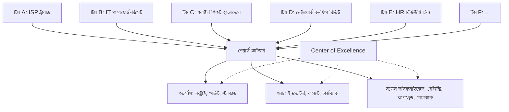

# ৪. স্কেল — একটা মডেল, দশটা টিম, একটা বাজেট

> **সময়:** ৩–৬ মাস, ১ CoE-চিফ + ২–৩ সাপোর্টিং ইঞ্জিনিয়ার।
> **বের-হওয়ার মানদণ্ড:** ৫+ টিম সক্রিয়ভাবে একই টেমপ্লেট, কন্ট্রাক্ট, মডেল-রেজিস্ট্রি ব্যবহার করছে; খরচ প্রতি টিম আগের চেয়ে ৪০% কম।

[বিল্ড](build.md) আপনাকে দিয়েছে একটা টিমের জন্য কাজ করা পাইপলাইন। [পাইলট](pilot.md) আপনাকে দিয়েছে একটা বাস্তব ওয়ার্কফ্লোতে কাজ করা প্রম্পট-পার্সার জোড়া। [ডিসকাভারি\]\(discover.md\) আপনাকে দিয়েছে সঠিক হার্ডওয়্যার আর ডেটা-রেসিডেন্সি ম্যাপ। কিন্তু স্কেল এর কোনো কিছুরই উত্তরাধিকারী না।

স্কেলের কাজ হলো একটা বিচ্ছিন্ন একটা-টিমের সিস্টেমকে **শেয়ার্ড প্ল্যাটফর্মে** রূপান্তর করা। প্রতিটা টিম স্বাধীনভাবে নিজের মডেল হোস্ট করে, নিজের প্রম্পট লেখে, নিজের বাজেট ট্র্যাক করে — সেটা কাজ করে যতক্ষণ টিম সংখ্যা ১। ৩+ টিম হলে আধুনিক-ওয়েস্ট শুরু হয়: একই কাজ ৩ জায়গায়, একই বাগ ৩ জায়গায়, একই মডেল ৩ বার ডাউনলোড।

---

## স্কেল যা না

স্কেল [বিল্ড](build.md) এর ধারাবাহিকতা না। বিল্ড আপনাকে দেয় ১টা টিমের জন্য ১টা প্রোডাকশন-রেডি সিস্টেম। স্কেল আপনাকে দেয় N টিমের জন্য ১টা **প্ল্যাটফর্ম** — সাথে গভর্নেন্স, খরচ-কন্ট্রোল, মডেল-লাইফসাইকেল। বিল্ড-পরবর্তী সিস্টেম ১০ টিমে কপি করা স্কেল না — সেটা ১০টা আলাদা সিস্টেম, ১০টা আলাদা বাজেট, ১০টা আলাদা বিপদ।

আরেকটা ভুল ধারণা: স্কেল মানে আরো বড় মডেল। স্কেল মানে **আরো দক্ষ** মডেল — ছোট মডেল যেগুলো সঠিক কাজে ব্যবহৃত, ক্যাশিং যোগ করা, লোড ব্যালান্স করা। বড় মডেলের দিকে যাওয়া স্কেলের ব্যর্থতার লক্ষণ, সাফল্যের না।

স্কেল "আরো স্মার্ট হও" ফিচারও না। স্কেল "প্রতিটা নতুন টিম ১ দিনে ওপেন হতে পারে, ৩ সপ্তাহে না"। স্কেলের KPI হলো **টাইম-টু-ভ্যালু**, মডেল কোয়ালিটি না।

---

## স্কেলের তিনটা কাজ

### কাজ ১ — টেমপ্লেট যা প্রতিটা টিম কপি-পেস্ট করতে পারে

[বিল্ড](build.md) শেষে প্রতিটা টিমের কাছে তাদের নিজস্ব প্রম্পট-পার্সার-অবজার্ভেবিলিটি স্ট্যাক আছে। ৫ টিমে এটা ৫ বার লেখা, ৫ বার বাগ ফিক্স, ৫ বার ডকুমেন্ট। স্কেলে আপনি এটাকে **শেয়ার্ড ক্লায়েন্ট প্যাকেজে** রূপান্তর করেন — একটা পাইথন প্যাকেজ বা একটা রেপো যেখানে কমন ক্লায়েন্ট, কমন পার্সার, কমন অবজার্ভেবিলিটি হুক আছে। নতুন টিম প্যাকেজ ইনস্টল করে, তাদের নিজস্ব কন্ট্রাক্ট আর প্রম্পট যোগ করে, ১ দিনে শিপ।

কনক্রিট ডেলিভারেবল:

- **`llmkit` (বা যে নামই দিন)** পাইথন প্যাকেজ — `LLMClient`, `PydanticParser`, `MetricsCollector`, `RetryPolicy` সব এখানে। ক্লায়েন্ট-ফেসিং API ইচ্ছাকৃতভাবে সরল: ১টা `complete()` ফাংশন, প্রতিটা টিম বুঝতে পারে ১০ মিনিটে।
- **ড্যাশবোর্ড টেমপ্লেট** — Grafana JSON বা Streamlit পেজ, প্রতিটা টিম তাদের ওয়ার্কফ্লো ডেটা এখানে প্লাগ করে। ৫ টিমের ৫ আলাদা Grafana ইনস্টল না — ১টা Grafana, ৫টা ডেটা সোর্স।
- **CI টেমপ্লেট** — GitHub Actions workflow যা প্রম্পট পরিবর্তনে অটো-টেস্ট চালায়। প্রম্পট পুশ করলে CI ২০০ সোনার উদাহরণের সাথে তুলনা করে, পারফরম্যান্স রিগ্রেশন হলে PR ব্লক।
- **রানবুক** — অন-কল ইঞ্জিনিয়ারের জন্য ১-পৃষ্ঠার ডক: "মডেল ৫০৩ দিচ্ছে? এটা চেক করেন।" ৩টা সবচেয়ে কমন সমস্যা, ৩টা ১-লাইনার ফিক্স — রাত ৩টায় যেন অন-কল ইঞ্জিনিয়ার বুঝতে পারে।
- **কন্ট্রাক্ট স্কিমা লাইব্রেরি** — `Ticket`, `TriageResult` এর মতো Pydantic মডেল, কিন্তু ক্রস-টিম কমন ডেটা শেপের জন্য। নতুন টিম ১ দিনে শিপ করে কারণ তারা স্ক্র্যাচ থেকে কিছু লেখে না।

প্রতিটা টেমপ্লেটের ৩টা সাধারণ নিয়ম:

- **ডিফল্ট সেফ।** টেমপ্লেট থেকে কিছু না বদলালেও মডেল চলে, পার্সার ভ্যালিডেট করে, মেট্রিক লগ হয়। টিমকে অপশনাল কনফিগ দেওয়া হয়, বাধ্যতামূলক কোডিং না।
- **ওভাররাইড যোগ্য, সরল।** টিম যদি কাস্টম পার্সার চায়, ১টা ইন্টারফেস ইমপ্লিমেন্ট করে, ৫ মিনিটে প্লাগ-ইন। কিন্তু ডিফল্ট থেকে শুরু করলে সেই কাজ ০।
- **ডকুমেন্টেশন স্ব-পরিষ্কার।** `llmkit` এর প্রতিটা পাবলিক ফাংশনে docstring, প্রতিটা কনফিগ ফিল্ডে উদাহরণ। নতুন টিমের প্রশ্ন ১ ঘন্টায় উত্তর হবে — README থেকে।

১ বার লেখা, ১০ বার ব্যবহার — এটাই স্কেলের ROI। টেমপ্লেট ছাড়া CoE প্রতিটা টিমের কাছে আলাদা কনসালট্যান্ট হয়ে যায়, যেটা ৩+ টিমে ভাঙে।

### কাজ ২ — মডেল লাইফসাইকেল যা CoE পরিচালনা করে

[ডিসকাভারি\]\(discover.md\) একটা মডেল বাছাই করিয়েছে, কিন্তু ৬ মাস পরে সেটা সেরা থাকবে না। নতুন ভার্সন আসবে, কোয়ান্টাইজেশন উন্নত হবে, কাজের চাহিদা বদলাবে। CoE-র (Center of Excellence) কাজ হলো **মডেল রেজিস্ট্রি** পরিচালনা করা — কোন মডেল কোন ওয়ার্কফ্লোতে চলছে, কোনটা আপগ্রেডের জন্য প্রস্তুত, কোনটা রোলব্যাক হওয়া উচিত।

| রেজিস্ট্রি ফিল্ড | উদাহরণ | কেন গুরুত্বপূর্ণ |
| --- | --- | --- |
| মডেল আইডি | `qwen2.5-1.5b-instruct-q4` | টিম A ও টিম B যাতে একই স্পেক চালায় |
| সার্ভিং এন্ডপয়েন্ট | `http://gpu-01.internal:8080` | কোথায় হোস্টেড, কোন GPU |
| পারফরম্যান্স বেসলাইন | p95 latency = ২.৪ সেকেন্ড | আপগ্রেডের আগে তুলনা |
| ব্যবহারকারী টিম | ISP, IT, ফ্যাক্টরি | কোন টিম ভরসা করে |
| শেষ আপগ্রেড | ২০২৬-০১-১৫ | যখন আবার টেস্ট করতে হবে |

মডেল রেজিস্ট্রি একটা YAML ফাইল হতে পারে, একটা MLflow ইনস্ট্যান্স হতে পারে, বা একটা কাস্টম ড্যাশবোর্ড। গুরুত্বপূর্ণ হলো এটা **এক জায়গায় থাকবে** — ৫টা টিম ৫টা আলাদা জায়গায় মডেল ভার্সন ট্র্যাক করলে, আপগ্রেড ১ বার হবে না, ৫ বার হবে।

### কাজ ৩ — খরচ নিয়ন্ত্রণ যা CFO-কে রিপোর্ট করা যায়

[পাইলট](pilot.md) ও [বিল্ড](build.md) খরচকে ২-সংখ্যার টেবিল হিসেবে দেখে। ১০ টিমে সেটা ৩-সংখ্যার ক্যাপেক্স প্রশ্ন। স্কেলে আপনার খরচ-কন্ট্রোল ৪টা লিভার:

1. **হার্ডওয়্যার কনসোলিডেশন।** ১০টা আলাদা GPU বক্সের বদলে ২-৩টা শেয়ার্ড GPU সার্ভার, vLLM দিয়ে। ৪০-৬০% খরচ সাশ্রয়। আলাদা GPU-এর ইউটিলাইজেশন সাধারণত ১৫-২৫%, শেয়ার্ড সার্ভারে ৬০-৭৫% — এটাই ব্যবধান।
2. **সবচেয়ে ছোট মডেল যেটা বার পূরণ করে।** ৭B এর বদলে ৪B, যদি বার পূরণ হয়। প্রতিটা টাইটল ছোট হলে ৩০% ল্যাটেন্সি কম, GPU মেমোরি কম। ১.৫B থেকে ৪B যাওয়া কখনো কখনো ১৫% কোয়ালিটি বাড়ায়, ৪B থেকে ৭B যাওয়া ৫% বাড়ায়, ৭B থেকে ১৩B যাওয়া ৩% — ডাইমিনিশিং রিটার্ন স্পষ্ট।
3. **ক্যাশিং।** একই ইনপুট ১০ বার আসলে ১ বার ইনফারেন্স। ট্রায়াজে ২০% ক্যাশ হিট থাকলে ২০% খরচ কম। ক্যাশ কী ধরে রাখবে: সাধারণত ইনপুট-হ্যাশ + আউটপুট, ২৪-৭২ ঘন্টা TTL। ইউজার-স্পেসিফিক ক্যাশ করবেন না — গোপনীয়তা ঝুঁকি।
4. **কিউইং।** burst-এ যাতে GPU ওভারলোড না হয়। রিয়েল-টাইম ট্রায়াজ ও ব্যাচ সামারাইজেশন আলাদা সার্ভিসে। burst-এ ১০x লোড আসলে সব রিয়েল-টাইম ইউজার লেটেন্সি খায় — কিউইং সেটা সর্বোচ্চ p99 নিয়ন্ত্রণে রাখে, এবং অপ্রয়োজনীয় প্রভিশনিং এড়ায়।

এই ৪টা লিভারের বাইরে আরেকটা "লিভার" আছে যেটা সবচেয়ে শক্তিশালী: **অপ্রয়োজনীয় কল বন্ধ করা।** বেশিরভাগ টিম প্রথমে মডেলকে বেশি ব্যবহার করে — প্রতিটা ফর্ম সাবমিশনে কল, প্রতিটা ইউজার ইন্টারঅ্যাকশনে কল। ৩ মাস পরে CoE দেখে কোন কলগুলো আসলে দরকারি — ৩০-৪০% কল বাদ দেওয়া যায়, কোয়ালিটিতে কোনো প্রভাব না পড়ে।

খরচ-কন্ট্রোল ছাড়া স্কেল হলো "আমরা সবাইকে LLM দিচ্ছি কিন্তু কেউ জানে না কত খরচ হচ্ছে"। ৬ মাস পরে CFO জিজ্ঞেস করবেন, আপনার কাছে উত্তর থাকবে না — তখন সব প্রজেক্ট ফ্রিজ। চার্জব্যাক মডেল — প্রতিটা টিম তাদের ব্যবহার অনুযায়ী CoE-র খরচ বহন করে — এটাই সবচেয়ে টেকসই ফান্ডিং মডেল। "ফ্রি সেন্ট্রাল টিম" হলো ১ FY-র বেশি টিকে না।

---

## ৬-মাসের ট্রাজেক্টরি

কোনো একটা দিনে "স্কেল হয়ে গেছে" বলা যায় না। স্কেল একটা ট্রাজেক্টরি, ৬ মাস ধরে ৩ স্টেজে:

| স্টেজ | সময় | টিম সংখ্যা | CoE-র ভূমিকা | প্রধান ঝুঁকি |
| --- | --- | --- | --- | --- |
| **১. ভিত্তি** | মাস ১–২ | ২–৩ | টেমপ্লেট + রেজিস্ট্রি তৈরি, ডকুমেন্টেশন | CoE-র কাজ প্রমাণ না হলে CoE-র বাজেট কাটা যাবে |
| **২. অন-বোর্ডিং** | মাস ৩–৪ | ৪–৭ | নতুন টিম অন-বোর্ড, প্রশ্নের উত্তর, ছোট আপগ্রেড | টেমপ্লেট বাগ ধরা পড়লে সব টিম ব্রেক |
| **৩. লিভারেজ** | মাস ৫–৬ | ৮+ | খরচ অপ্টিমাইজ, মডেল আপগ্রেড, কম টিম-স্পেসিফিক কোড | CoE এত বড় হয়ে যায় যে নিজেই বটলেনেক হয়ে যায় |

**স্টেজ ১ (মাস ১–২) — ভিত্তি:** CoE-র প্রথম কাজ হলো নিজেকে প্রমাণ করা। এই সময়ে আপনি ২-৩ টিমের সাথে কাজ করেন, টেমপ্লেট + রেজিস্ট্রি + ড্যাশবোর্ড তৈরি করেন, আর ১টা উজ্জ্বল কেস স্টাডি তৈরি করেন। "আমরা ৩ সপ্তাহে যেটা করেছেনি, আগে ৩ মাস লাগত" — এটা CFO-র কাছে দেখানোর উপাদান। ২ মাসে যদি ১টা টিমও ১ দিনে অন-বোর্ড হতে পারে, তাহলে CoE-র বাজেট পরবর্তী FY-তে নিশ্চিত। স্টেজ ১-এর ব্যর্থতা: ৬ মাস পরেও টেমপ্লেট ৫০% সম্পূর্ণ, টিমগুলো নিজেরাই ব্যবহার করে না — তখন CoE অপ্রয়োজনীয় প্রমাণিত হয়।

**স্টেজ ২ (মাস ৩–৪) — অন-বোর্ডিং:** এখন CoE প্রমাণিত, নতুন টিম আসছে। এই স্টেজে আপনি ৪-৭ টিম অন-বোর্ড করেন, প্রতিটা টিমের জন্য ওয়ার্কফ্লো-স্পেসিফিক কন্ট্রাক্ট ও প্রম্পট লিখতে সাহায্য করেন, ছোট মডেল আপগ্রেড চালান। সবচেয়ে বড় ঝুঁকি: টেমপ্লেটে ১টা বাগ ধরা পড়লে ৫+ টিমের প্রোডাকশন ভেঙে যায়। CoE-র উত্তর: টেমপ্লেট সিমান্টিক ভার্সনিং (semver), প্রতিটা রিলিজে রিগ্রেশন স্যুট, রোলব্যাক প্ল্যান। স্টেজ ২-এর ব্যর্থতা: ১টা টিমের ভুলে ৪ টিম ক্ষতিগ্রস্ত — টেমপ্লেটের ভরসা ভেঙে যায়, অন-বোর্ডিং থেমে যায়।

**স্টেজ ৩ (মাস ৫–৬) — লিভারেজ:** ৮+ টিম চলছে। এখন CoE-র কাজ হলো খরচ অপ্টিমাইজ (ক্যাশিং, কিউইং, সবচেয়ে ছোট মডেল), বড় মডেল আপগ্রেড, ক্রস-টিম লেসন ডকুমেন্টেশন। সবচেয়ে বড় ঝুঁকি: CoE নিজেই বটলেনেক হয়ে যায় — ২-৩ জন ইঞ্জিনিয়ার ৮+ টিমের চাহিদা মেটাতে পারে না, প্রতিটা টিম কাস্টম কিছু চায়, "শেয়ার্ড" ধারণা ভেঙে যায়। CoE-র উত্তর: টিম-স্পেসিফিক কোডের বদলে শেয়ার্ড এক্সটেনশন পয়েন্ট, CoE রিভিউ করে প্রতিটা কাস্টম রিকোয়েস্ট।

প্রথম ২ মাসে আপনি কিছু টিমের চাহিদা মেটান — CoE-র উপর প্রমাণ না আনা পর্যন্ত "আমরা CoE রাখব" বলার সাহস কারো নেই। তৃতীয় স্টেজে CoE প্রমাণিত, এখন কোর্স-কারেকশনের সময়। ষষ্ঠ মাসে ৫+ টিম সক্রিয়ভাবে শেয়ার্ড প্ল্যাটফর্ম ব্যবহার করলে, খরচ প্রতি টিম আগের চেয়ে ৪০% কম হলে — স্কেল সফল।

---

## যা করবেন না

- **প্রতিটা টিমের জন্য আলাদা স্ট্যাক বানাবেন না।** CoE এর পুরো পয়েন্ট হলো শেয়ার্ড কম্পোনেন্ট। ১০ আলাদা স্ট্যাক = ১০ আলাদা বিপদ।
- **"একটু পরে আপগ্রেড করব" বলবে না।** আপগ্রেড প্ল্যান ছাড়া মডেল পুরনো হয়, সিকিউরিটি প্যাচ মিস হয়, পারফরম্যান্স পিছিয়ে যায়।
- **খরচ রিপোর্ট দেরি করবেন না।** মাসিক খরচ রিপোর্ট CFO-র কাছে ১ সপ্তাহের মধ্যে। দেরি হলে CFO নিজে সিদ্ধান্ত নেয় — সাধারণত খরচ কাটা।
- **প্রতিটা টিমের চাহিদায় কাস্টম মডেল বানাবেন না।** ১ টিমের জন্য ফাইন-টিউন করা মডেল ৯ টিম ব্যবহার করতে পারে না, CoE-র ভারসাম্য নষ্ট হয়।
- **শেয়ার্ড প্ল্যাটফর্মকে "ফ্রি" ভাববে না।** CoE-র সময়, GPU, লাইসেন্স — এসব খরচ। চার্জব্যাক মডেল ছাড়া CoE বাজেট পায় না।
- **মডেল রেজিস্ট্রি ছাড়া কাজ করবেন না।** "আমরা জানি কোন মডেল চলছে" — এটা ৫ টিমে সত্যি, ১০ টিমে মিথ্যা। রেজিস্ট্রি = সত্যের এক জায়গা।

---

## ডেলিভারেবল চেকলিস্ট

- [ ] `llmkit` (বা সমতুল্য) প্যাকেজ ১+ সংস্করণে — ৩+ টিম ইনস্টল করেছে
- [ ] ড্যাশবোর্ড টেমপ্লেট — প্রতিটা টিমের নিজস্ব ডেটা প্লাগ-ইন
- [ ] CI টেমপ্লেট — প্রম্পট পরিবর্তনে অটো-রিগ্রেশন
- [ ] মডেল রেজিস্ট্রি — সব চলমান মডেল ও ওয়ার্কফ্লো তালিকাভুক্ত
- [ ] মাসিক খরচ রিপোর্ট — CFO বা ফিনান্সের কাছে পৌঁছায়
- [ ] অন-কল রানবুক — ১-পৃষ্ঠার ডক, ইঞ্জিনিয়ার খুলে বুঝতে পারে
- [ ] ৫+ টিম সক্রিয়ভাবে শেয়ার্ড প্ল্যাটফর্মে — ৬ মাসের মধ্যে
- [ ] চার্জব্যাক মডেল — CoE-র খরচ টিমগুলোতে বণ্টিত
- [ ] CoE-র বাজেট ও ক্যাডার — ২-৩ জন ইঞ্জিনিয়ার, পরবর্তী FY-তে নিশ্চিত

[হোম](../index.md) · [রোডম্যাপ](../ROADMAP.md)
