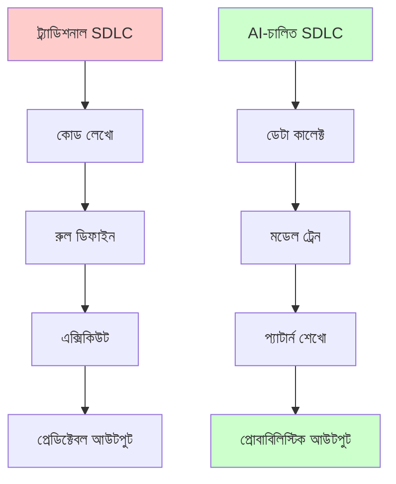
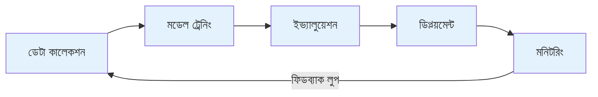

# AI-চালিত সফটওয়্যার ডেভেলপমেন্ট
*ডিটারমিনিস্টিক রুল থেকে প্রোবাবিলিস্টিক ইন্টেলিজেন্সে*
---

## প্যারাডাইম শিফট

সফটওয়্যার ডেভেলপমেন্টের নতুন যুগে স্বাগতম। দশকের পর দশক আমরা সফটওয়্যার একইভাবে বানিয়েছি: **কোড লেখো → এক্সিকিউট করো → ডিটারমিনিস্টিক আউটপুট পাও**। কোড সঠিক হলে আউটপুটও সবসময় সঠিক। **এটা আর নেই।**

AI-চালিত ডেভেলপমেন্টে নিয়মগুলো কোডে লেখা হয় না — ডেটা থেকে শেখা হয়। এই মৌলিক শিফট সবকিছু বদলে দেয়:

| ট্র্যাডিশনাল ডেভেলপমেন্ট | AI-চালিত ডেভেলপমেন্ট |
| --- | --- |
| **ডিটারমিনিস্টিক**: একই ইনপুট → একই আউটপুট | **প্রোবাবিলিস্টিক**: একই ইনপুট → সেরা প্রেডিকশন |
| **রুল-ভিত্তিক লজিক** | **ডেটা থেকে প্যাটার্ন শেখা** |
| **হার্ডকোডেড সিদ্ধান্ত** | **উদাহরণ থেকে শেখা** |
| **এক্সপ্লিসিট if/else শর্ত** | **পরিসংখ্যানগত ইনফারেন্স** |
| **১০০% প্রেডিক্টেবল** | **কনফিডেন্স-ভিত্তিক রেসপন্স** |

## কেন এটা গুরুত্বপূর্ণ

> *"ট্র্যাডিশনাল সফটওয়্যারে অ্যালগরিদমই নিয়ম। AI-চালিত সফটওয়্যারে **ডেটাই অ্যালগরিদম**।"*

এর মানে:

- জটিল সিদ্ধান্তে আর **হার্ডকোডেড রুল নেই**
- **অ্যাডাপ্টেবিলিটি** — সিস্টেম নতুন ডেটা থেকে শিখে আর উন্নত হয়
- **অ্যাম্বিগুইটি সামলায়** — AI অস্পষ্ট, ইমপ্রিসাইজ ইনপুটও নিতে পারে
- **স্কেল** — একটা মডেল লক্ষ লক্ষ ভ্যারিয়েশন সামলাতে পারে

## এই সেকশনে তুমি কী শিখবে

- **AI Software Development Life Cycle (AI-SDLC)** — AI সিস্টেম সিস্টেমেটিকভাবে বানানোর পদ্ধতি
- **Citizen Developer Guide** — নন-প্রোগ্রামাররা কীভাবে AI ডেভেলপমেন্ট টুল কাজে লাগাবে
- **Waterfall থেকে MLOps-এ** — AI প্রজেক্টের আধুনিক প্র্যাকটিস

---

## সামনের যাত্রা

এই ডকুমেন্টেশনের চ্যাপ্টারগুলো এই ফিলোসফি ফলো করে:

এই প্রজেক্টের প্রতিটা মডিউল রিয়েল-ওয়ার্ল্ড সমস্যায় AI-চালিত অ্যাপ্রোচ দেখায় — টিকেট ক্লাসিফিকেশন থেকে সেলস অটোমেশন পর্যন্ত।

---

## সম্পর্কিত ডকুমেন্টেশন

- [AI Software Development Life Cycle](sdlc.md)
- [Citizen Developer Guide](citizen-developers.md)
- [Why Reasoning Matters](reasoning.md)
- [শুরু করুন](../../getting-started/index.md)
