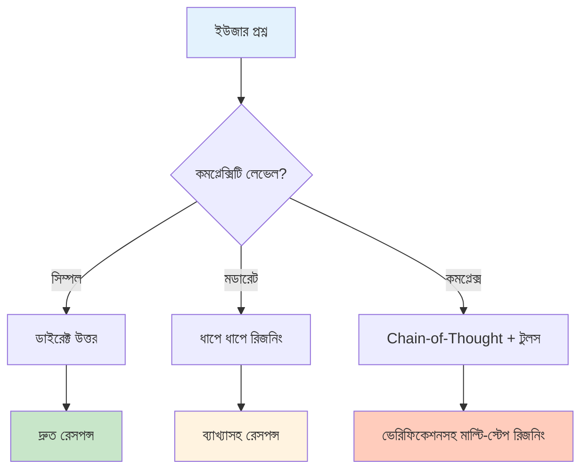
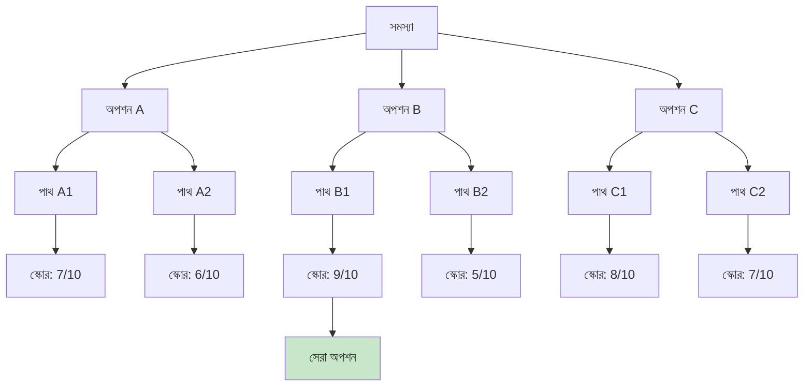

# কেন রিজনিং গুরুত্বপূর্ণ
*Chain-of-Thought, ReAct, আর ধাপে ধাপে চিন্তার শিল্প*
---

## উত্তরে লাফ দেওয়ার সমস্যা

একটা সহজ প্রশ্ন কল্পনা করো: *"এই ছুটির রিকোয়েস্ট কি আমি অনুমোদন করব?"*

খারাপ AI শুধু বলে: **"হ্যাঁ"** বা **"না"** — কোনো ব্যাখ্যা নেই, কোনো রিজনিং নেই।

ভালো AI ব্যাখ্যা করে:

> *"কর্মচারীর ছুটির ব্যালেন্স (৫ দিন বাকি), প্রজেক্টের টাইমলাইন (ক্রিটিক্যাল ফেজে নেই), আর অতীত উপস্থিতি (৯৫%) দেখে আমি স্ট্যান্ডার্ড শর্তে অনুমোদনের সুপারিশ করছি।"*

সেই রিজনিং-ই **ট্রাস্ট** আর **অন্ধ বিশ্বাসের** মধ্যে পার্থক্য।

## AI রিজনিং কী?

AI রিজনিং হলো জটিল সমস্যাকে **লজিক্যাল ধাপে** ভাঙা — উত্তর কী তা না, কীভাবে পৌঁছাল তা দেখানো।



## রিজনিং টেকনিকের ধরন

### ১. Chain-of-Thought (CoT)

সমস্যাকে ধাপে ধাপে ভাঙো:

```text
User: "এই নেটওয়ার্ক আপগ্রেড কি আমি অনুমোদন করব?"

Thinking:
1. বর্তমান ডাউনটাইম: কনজেশনের কারণে সপ্তাহে ৪ ঘণ্টা
2. খরচ: BDT ৫,০০,০০০
3. ROI টাইমলাইন: ১৮ মাস
4. বিজনেস ইমপ্যাক্ট: উচ্চ (কাস্টমার স্যাটিসফ্যাকশন)

→ RECOMMENDATION: ফেজড ইমপ্লিমেন্টেশনে APPROVE
```

### ২. ReAct (Reasoning + Acting)

চিন্তাকে টুল ইউজেজের সাথে কম্বাইন:

```text
Question: বর্তমান SLA কমপ্লায়েন্স রেট কত?

Reasoning: আমাকে মনিটরিং ডেটাবেস কোয়েরি করতে হবে
Action: metrics টেবিলে SQL কোয়েরি চালাও
Observation: এই মাসে ৯৪.২% কমপ্লায়েন্স
Reasoning: ৯৫% টার্গেটের নিচে, রিভিউয়ের জন্য ফ্ল্যাগ
Final Answer: ৯৪.২% - মনোযোগ দরকার
```

### ৩. Tree-of-Thought (ToT)

একাধিক সলিউশন পাথ এক্সপ্লোর:



## তোমার বিজনেসে এটা কেন ম্যাটার করে?

| রিজনিং ছাড়া | রিজনিং সহ |
| --- | --- |
| "অনুমোদিত" | "অনুমোদিত কারণ: [কারণসমূহ]" |
| "রিজেক্টেড" | "সুনির্দিষ্ট ফিডব্যাকসহ রিজেক্টেড" |
| কোনো অডিট ট্রেইল নেই | সম্পূর্ণ সিদ্ধান্তের ব্যাখ্যা |
| কম ট্রাস্ট | উচ্চ কনফিডেন্স |
| ডিবাগ কঠিন | সহজে সংশোধনযোগ্য |

## এই প্রজেক্টে রিয়েল-ওয়ার্ল্ড অ্যাপ্লিকেশন

### ১. ISP টিকেট ক্লাসিফিকেশন

- **রিজনিং ছাড়া**: "ক্যাটেগরি: বিলিং"
- **রিজনিং সহ**: "ক্যাটেগরি: বিলিং → ইউজার 'বিল ডিসপিউট' উল্লেখ করেছেন → বিলিং কীওয়ার্ড চেক → নিশ্চিত"

### ২. HR ছুটি অনুমোদন

- **রিজনিং ছাড়া**: "রিজেক্টেড"
- **রিজনিং সহ**: "রিজেক্টেড → ব্যালেন্স অপর্যাপ্ত (২ দিন বাকি, ৫ দিন চাওয়া) → বিকল্প: আনপেইড ছুটি অ্যাপ্লাই করো"

### ৩. SLA প্রায়োরিটাইজেশন

- **রিজনিং ছাড়া**: "প্রায়োরিটি: উচ্চ"
- **রিজনিং সহ**: "প্রায়োরিটি: উচ্চ → VIP কাস্টমার + সার্ভার ডাউন + রেভিনিউ ইমপ্যাক্ট > BDT ৫০K/ঘণ্টা"

## তোমার অ্যাপে রিজনিং কীভাবে ইমপ্লিমেন্ট করবে

```python
# সিম্পল রিজনিং প্যাটার্ন
def classify_with_reasoning(ticket_text):
    reasons = []

    # কীওয়ার্ড চেক
    if "bill" in ticket_text.lower():
        reasons.append("বিলিং-সম্পর্কিত কীওয়ার্ড আছে")

    if "payment" in ticket_text.lower():
        reasons.append("পেমেন্ট ইস্যু উল্লেখ আছে")

    # প্যাটার্ন চেক
    if "refund" in ticket_text.lower():
        reasons.append("কাস্টমার রিফান্ড চাইছে")

    # সিদ্ধান্ত নাও
    category = "billing" if len(reasons) >= 2 else "general"

    return {
        "category": category,
        "confidence": min(len(reasons) * 30, 100),
        "reasoning": reasons
    }
```

## মূল শিক্ষা

> **"যে AI তার রিজনিং ব্যাখ্যা করতে পারে না তা ওষুধ কেন লিখেছে তা না বলা ডাক্তারের মতো।"**

- **ট্রান্সপারেন্সি ট্রাস্ট তৈরি করে** — ইউজারদের বুঝতে হবে কেন
- **ডিবাগিং সহজ** — ধাপগুলো দেখলে এরর ফিক্স করা যায়
- **কমপ্লায়েন্স সিম্পল** — রেগুলেটেড ইন্ডাস্ট্রির জন্য অডিট ট্রেইল
- **হিউম্যান ওভারসাইট কাজ করে** — মানুষ ভুল রিজনিং পাথ সংশোধন করতে পারে

## এরপর কী?

ISP Classifier সেকশনে তুমি রিজনিং অ্যাকশনে দেখবে:

- Chain-of-thought প্রম্পট ইঞ্জিনিয়ারিং
- ReAct-ভিত্তিক টিকেট ক্লাসিফিকেশন
- সাপোর্ট টিমের জন্য এক্সপ্লেনেবল AI আউটপুট

---

## সম্পর্কিত ডকুমেন্টেশন

- [AI-Driven Software Development Overview](index.md)
- [AI Software Development Life Cycle](sdlc.md)
- [Citizen Developer Guide](citizen-developers.md)
- [ISP Classifier Overview](../../isp-classifier/index.md)
