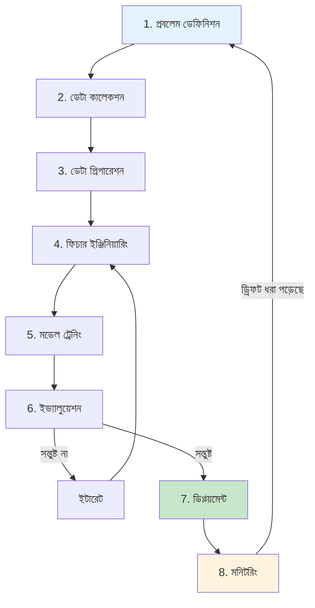
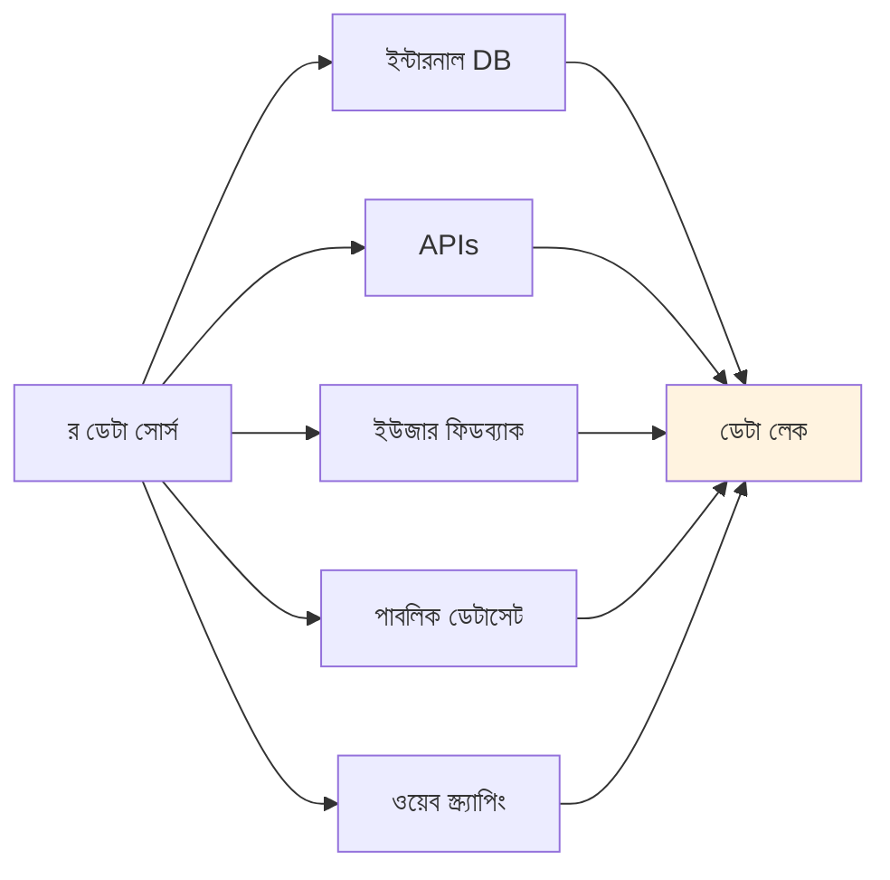
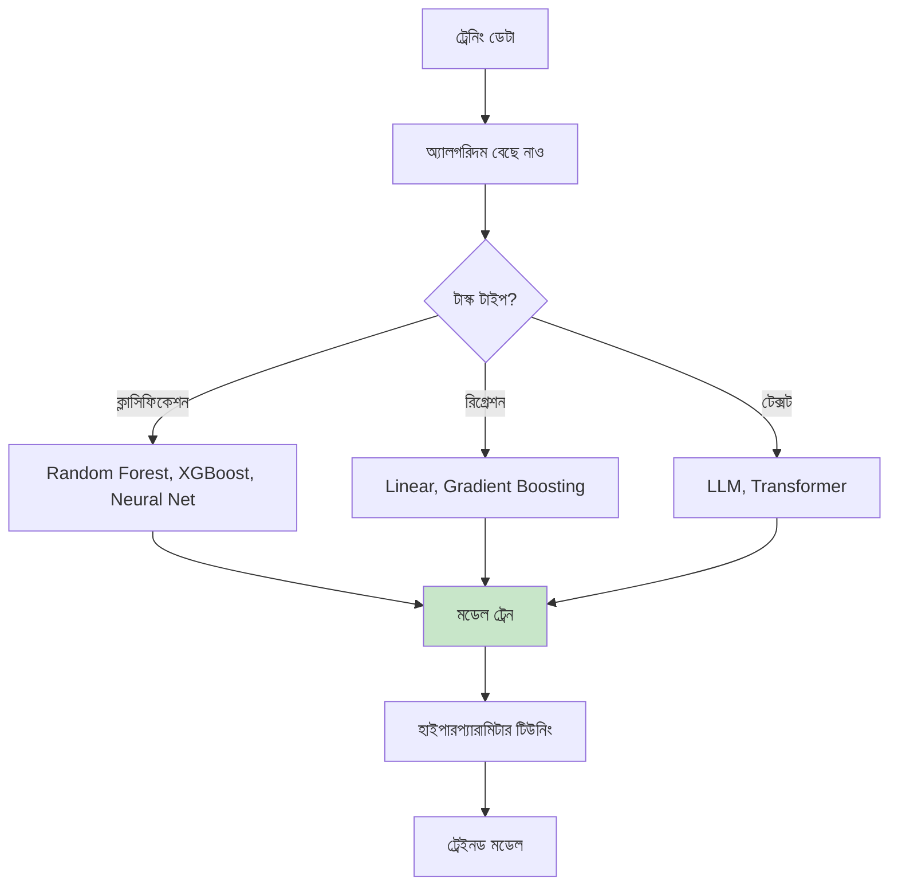
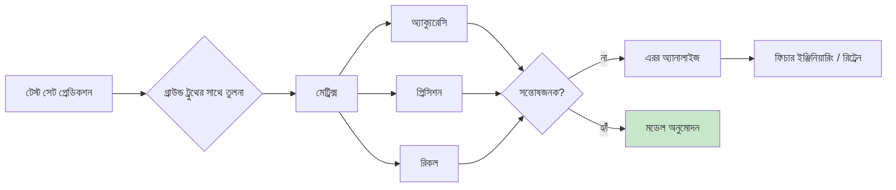
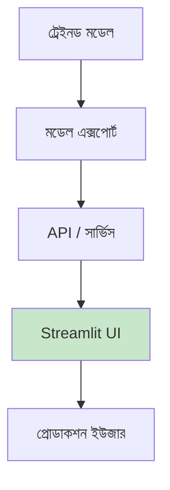
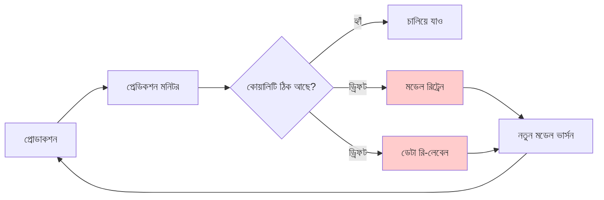
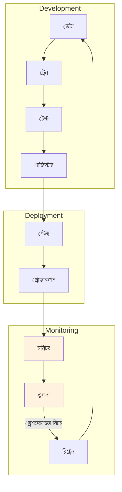

# AI Software Development Life Cycle (AI-SDLC)
*ইন্টেলিজেন্ট সিস্টেম বানানোর সিস্টেমেটিক অ্যাপ্রোচ*
---

## AI-SDLC ফ্রেমওয়ার্ক

ট্র্যাডিশনাল সফটওয়্যার ডেভেলপমেন্টের চেয়ে AI প্রজেক্টের চ্যালেঞ্জ আলাদা:

- **ডেটার ওপর নির্ভরতা**: আউটপুটের মান ইনপুটের মানের ওপর
- **প্রোবাবিলিস্টিক আউটপুট**: মডেলের কনফিডেন্সের ওপর ভিত্তি করে ফলাফল বদলায়
- **কন্টিনিউয়াস লার্নিং**: মডেলকে অ্যাডাপ্ট আর রিট্রেন করতে হয়
- **ইভ্যালুয়েশন কমপ্লেক্সিটি**: ML-তে "সঠিক" সাবজেক্টিভ



## ফেজ-বাই-ফেজ ব্রেকডাউন

### ফেজ ১: প্রবলেম ডেফিনিশন

**ট্র্যাডিশনাল**: রিকোয়ারমেন্টস ডকুমেন্ট লেখো
**AI-চালিত**: ML প্রবলেম টাইপ ডিফাইন করো

| প্রবলেম টাইপ | উদাহরণ | আউটপুট |
| --- | --- | --- |
| **ক্লাসিফিকেশন** | স্প্যাম ডিটেকশন | ক্যাটেগরি লেবেল |
| **রিগ্রেশন** | প্রাইস প্রেডিকশন | কন্টিনিউয়াস ভ্যালু |
| **ক্লাস্টারিং** | কাস্টমার সেগমেন্টেশন | গ্রুপ অ্যাসাইনমেন্ট |
| **জেনারেশন** | চ্যাটবট রেসপন্স | টেক্সট কনটেন্ট |

**কী কী প্রশ্ন:**

- AI কোন সিদ্ধান্তে সাহায্য করবে?
- কোন ডেটা অ্যাভেইলেবল?
- "সঠিক" বলতে কী বোঝায়?
- এরর কীভাবে হ্যান্ডেল হবে?

### ফেজ ২: ডেটা কালেকশন

**সবচেয়ে ক্রিটিক্যাল ফেজ** — আবর্জনা ঢুকলে আবর্জনা বের হয়।



**ডেটা কোয়ালিটি চেকলিস্ট:**

- [ ] যথেষ্ট ভলিউম (ন্যূনতম হাজার হাজার উদাহরণ)
- [ ] সুপারভাইজড লার্নিং-এর জন্য লেবেলড ডেটা
- [ ] কোনো সিস্টেমেটিক বায়াস নেই
- [ ] প্রোডাকশন ট্রাফিকের প্রতিনিধি
- [ ] প্রাইভেসি-কমপ্লায়েন্ট

### ফেজ ৩: ডেটা প্রিপারেশন

ML-এর জন্য ডেটা ক্লিন আর ট্রান্সফর্ম করা।

```python
# উদাহরণ: ডেটা প্রিপারেশন পাইপলাইন
def prepare_data(raw_data):
    # ডুপ্লিকেট সরাও
    data = remove_duplicates(raw_data)

    # মিসিং ভ্যালু হ্যান্ডেল
    data = fill_missing(data, strategy='mean')

    # ফিচার নরমালাইজ
    data = normalize(data, columns=['price', 'quantity'])

    # ইভ্যালুয়েশনের জন্য স্প্লিট
    train, test = split_data(data, test_size=0.2)

    return train, test
```

### ফেজ ৪: ফিচার ইঞ্জিনিয়ারিং

র ডেটাকে মডেল-ফ্রেন্ডলি ফরম্যাটে বদলাও।

| র ডেটা | ফিচার | কেন? |
| --- | --- | --- |
| "2024-01-15" | day_of_week=2 | দিনভেদে প্যাটার্ন বদলায় |
| "user@example.com" | is_corporate=True | বিজনেস বনাম পার্সোনাল |
| 1234.56 | log(price)=7.12 | ডিস্ট্রিবিউশন নরমালাইজ |

### ফেজ ৫: মডেল ট্রেনিং



**Citizen Developer-দের জন্য অ্যালগরিদম:**

- **scikit-learn**: বিগিনার-ফ্রেন্ডলি ML লাইব্রেরি
- **LangChain**: টেক্সট টাস্কের জন্য LLM ইন্টিগ্রেশন
- **LM Studio**: প্রাইভেসির জন্য লোকাল ইনফারেন্স

### ফেজ ৬: ইভ্যালুয়েশন

**ট্র্যাডিশনাল টেস্টিং থেকে মৌলিক পার্থক্য:**



**ইভ্যালুয়েশন মেট্রিক্স:**

| মেট্রিক | ইউজ কেস | ভালো ভ্যালু |
| --- | --- | --- |
| **অ্যাক্যুরেসি** | ব্যালেন্সড ক্লাস | >90% |
| **প্রিসিশন** | ফলস পজিটিভ মিনিমাইজ | >85% |
| **রিকল** | ট্রু কেস মিস করো না | >85% |
| **F1 Score** | প্রিসিশন/রিকল ব্যালেন্স | >80% |

### ফেজ ৭: ডিপ্লয়মেন্ট



**এই প্রজেক্টের জন্য:**

```python
# লোকাল LLM-সহ LangChain ব্যবহার
from langchain_openai import ChatOpenAI

llm = ChatOpenAI(
    base_url="http://localhost:1234/v1",
    model="qwen2.5:1.5b"
)
```

### ফেজ ৮: মনিটরিং

**AI সিস্টেমে চলমান মনোযোগ দরকার:**



**মনিটরিং মেট্রিক্স:**

- প্রেডিকশন ডিস্ট্রিবিউশন
- ইউজার স্যাটিসফ্যাকশন রেটিং
- এরর রেট ট্রেন্ড
- ডেটা ড্রিফট ডিটেকশন

## MLOps: AI-এর DevOps সমতুল্য



**মূল MLOps প্র্যাকটিস:**

1. **ভার্সন কন্ট্রোল** — মডেল, ডেটা, কোড
2. **অটোমেটেড পাইপলাইন** — ট্রেন → টেস্ট → ডিপ্লয়
3. **A/B টেস্টিং** — মডেল ভার্সন তুলনা
4. **রোলব্যাক ক্যাপাবিলিটি** — আগের মডেলে ফেরা

---

## এই প্রজেক্টে প্র্যাকটিক্যাল অ্যাপ্লিকেশন

এই ডকুমেন্টেশনের মডিউলগুলো AI-SDLC ফলো করে:

| মডিউল | AI-SDLC ফেজ |
| --- | --- |
| **ISP Classifier** | ডেটা → ট্রেন → ইভ্যালুয়েট |
| **Qwen + RAG** | নলেজ → এম্বেড → রিট্রিভ |
| **MLOps Pipeline** | মনিটর → ট্রিগার → রিট্রেন |

---

## পরবর্তী পদক্ষেপ

- [Citizen Developer Guide](citizen-developers.md) - গভীর ML এক্সপার্টাইজ ছাড়া AI-SDLC কীভাবে অ্যাপ্লাই করবে
- [Why Reasoning Matters](reasoning.md) - প্রতিটা SDLC ফেজে রিজনিং টেকনিক
- [ISP Classifier](../../isp-classifier/index.md) - AI-SDLC অ্যাকশনে দেখো
