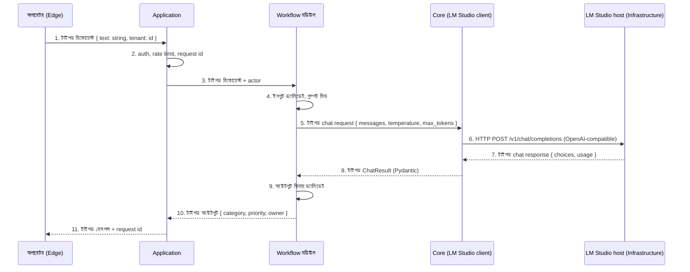
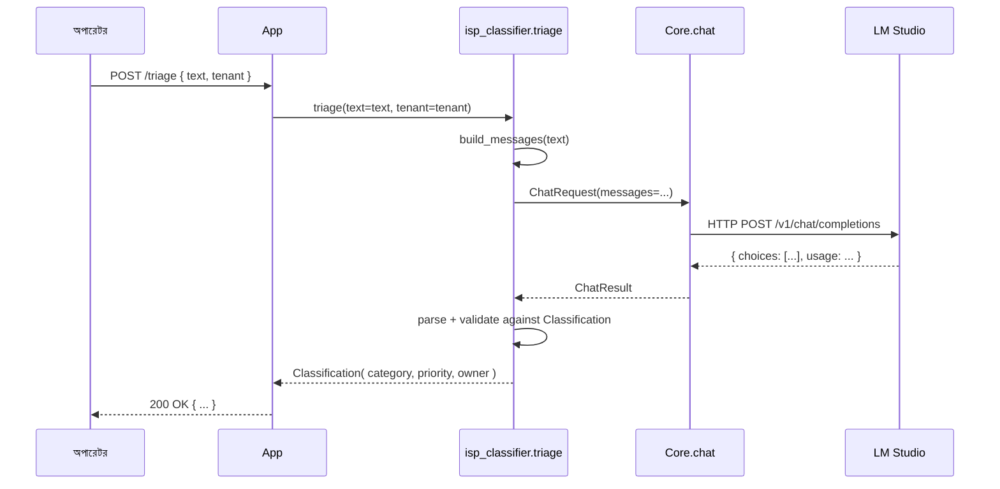
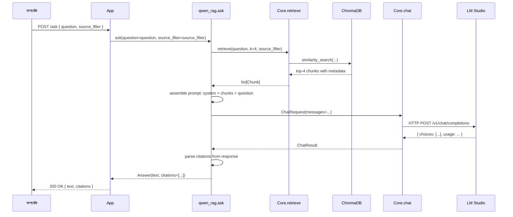

# ২. ডেটা প্রবাহ — কোন সীমানায় কী যায়

> **এক বাক্যে:** প্রতিটি স্তর সীমানায় টাইপড অবজেক্ট যায়, কখনো ফ্রি-ফর্ম টেক্সট নয়, আর কিছুই কখনো নেটওয়ার্ক পেরিমিটার ছাড়ে না।

স্তর পাতায় পাঁচটি স্তরের দায়িত্ব নির্ধারণ করা হয়েছে। এই পাতায় তাদের **সীমসমূহ** — কোন ডেটা কোন সীমে যায়, কোন ফরম্যাটে, আর কোন সীমানাগুলো কঠোর (ডেটা রেসিডেন্সি) আর কোনগুলো শুধু চুক্তি (টাইপড I/O)।

---

## একটি এন্ড-টু-এন্ড প্রবাহ

অপারেটর থেকে মডেল পর্যন্ত একটা রিকোয়েস্ট, পুরো ট্রেস। এটাই ক্যাননিকাল ছবি; এই পাতার বাকি সব এর একটা অংশের ক্লোজ-আপ।



তিনটি জিনিস খেয়াল করো:

1. **তীর 5, 7, 8, 10 টাইপড অবজেক্ট।** মডেল কখনো ডাউনস্ট্রিম সিস্টেমে ফ্রি-ফর্ম স্ট্রিং রিটার্ন করে না। ফ্রি-ফর্ম টেক্সট শুধু মডেলের নিজের রেসপন্স অবজেক্টের ভেতরে পারমিটেড, আর Workflow স্তর স্ট্রাকচার্ড ফিল্ড এক্সট্র্যাক্ট করে।
2. **মডেল কল প্রাইভেট সাবনেটে।** তীর 6 অ্যাপ্লিকেশন সার্ভার আর LM Studio host-এর মাঝে, দুটোই কর্পোরেট নেটওয়ার্কের ভেতরে। কোনো ইন্টারনেট হপ নেই।
3. **তীর 1 টাইপড ফর্ম, চ্যাট বক্স নয়।** Edge "প্রম্পট" পাঠায় না — এটা রিকোয়েস্ট পাঠায় যার ফিল্ড Workflow মডিউল আগে থেকেই ডিক্লেয়ার করেছে।

---

## প্রতিটি সীমানায় কী যায়

| সীমানা | কী যায় | ফরম্যাট | কে পড়তে পারে |
| --- | --- | --- | --- |
| Edge → Application | অপারেটর ফর্ম ফিল্ড, ওয়েবহুক পেলোড, CLI args | টাইপড JSON (Pydantic-ভ্যালিডেটেড) | Application সার্ভার, অডিট লগ |
| Application → Workflow | একই টাইপড অবজেক্ট + actor identity + request id | মডিউলের `run()` ফাংশনে টাইপড kwargs | Workflow মডিউল, অডিট লগ |
| Workflow → Core | Chat completion request (messages, params) | টাইপড dict (Pydantic `ChatRequest`) | LM Studio client |
| Core → Infrastructure | `/v1/chat/completions`-এ HTTP body | OpenAI-compatible JSON | LM Studio host প্রসেস |
| Infrastructure → Core | `/v1/chat/completions` থেকে HTTP response | OpenAI-compatible JSON | LM Studio client |
| Core → Workflow | Chat result, সম্ভব `usage` টোকেন সহ | টাইপড `ChatResult` (Pydantic) | Workflow মডিউল |
| Workflow → Application | চূড়ান্ত আউটপুট | মডিউলের আউটপুট স্কিমায় টাইপড অবজেক্ট | Application, অডিট লগ, ডাউনস্ট্রিম সিস্টেম |
| Application → Edge | চূড়ান্ত রেসপন্স | টাইপড JSON, সম্ভব HTML রেন্ডার | Edge, অপারেটর, টিকেটিং সিস্টেম |

সীমানায় যা যায় সব টাইপড অবজেক্ট। সিস্টেমে এমন কোনো জায়গা নেই যেখানে এক স্তর থেকে পরের স্তরে স্কিমাহীন স্ট্রিং প্রবাহিত হয়।

---

## যা কখনো তোমার নেটওয়ার্ক ছাড়ে না

পরিষ্কারভাবে — এই জিনিসগুলো তোমার পেরিমিটারের ভেতরে থাকবেই। এগুলো পলিসি পছন্দ নয়; আর্কিটেকচারের পরিণতি।

- **অপারেটর প্রম্পট।** অপারেটর যা জমা দেয় তা অ্যাপ্লিকেশন সার্ভারের নেটওয়ার্ক ছাড়ে না। একমাত্র গন্তব্য লোকাল LM Studio host।
- **মডেল রেসপন্স।** মডেলের টেক্সট আর tool call তোমার নেটওয়ার্ক ছাড়ে না। "vendor-এ telemetry" পাথ নেই।
- **রিট্রিভাল চাঙ্ক (RAG)।** রানবুক প্যারাগ্রাফ, SOP, আর পলিসি ডকুমেন্ট যা retriever মডেলে ফেরত দেয় তা মডেল host ছাড়ে না। মডেল পড়ে আর বর্জন করে।
- **অডিট লগ।** প্রতিটি লগ রো — ইনপুট, আউটপুট, লেটেন্সি, টোকেন, মডেল ভার্সন, request id, actor — **তোমার** লগ স্টোরে লেখা হয়। তোমার SIEM, তোমার রিটেনশন রুল, তোমার এখতিয়ার।

নেটওয়ার্ক পেরিমিটার ছাড়ে যা একমাত্র যায়:

- একবারের মডেল ওয়েট ডাউনলোড (LM Studio GGUF টানে, তারপর আর কখনো কানেক্ট করে না), আর
- তোমার মনিটরিং / CI ইনফ্রাস্ট্রাকচার থেকে অপশনাল আউটবাউন্ড ট্রাফিক (Prometheus, GitHub Actions — এগুলো AI ডেটা পাথে নেই)।

দুটোই কনফিগারেবল। তুমি সিস্টেম সম্পূর্ণ air-gapped চালাতে পারো।

---

## মডেল কল, টাইপড ফাংশন হিসেবে

এটাই Workflow মডিউল আর মডেলের একমাত্র চুক্তি। কোন মডিউল কল করছে বা কোন মডেল ওপরে আছে তা ধরে চুক্তি একই।

```python
# Core layer: typed LM Studio client (illustrative, not shipped yet)
class ChatRequest(BaseModel):
    messages: list[ChatMessage]   # system, user, assistant
    temperature: float = 0.0
    max_tokens: int = 512
    model: str | None = None      # None = whatever the host has loaded

class ChatResult(BaseModel):
    text: str
    finish_reason: str
    usage: TokenUsage             # prompt_tokens, completion_tokens, total
    latency_ms: int

def chat(req: ChatRequest) -> ChatResult: ...
```

```python
# Workflow layer: what a module actually does with it (illustrative)
def classify_complaint(text: str) -> Classification:
    messages = build_messages(text)            # system + user + few-shot
    raw = chat(ChatRequest(messages=messages)) # calls Core
    parsed = parse_classification(raw.text)    # extract typed fields
    return Classification.model_validate(parsed)  # validate
```

Core "complaint" কী তা জানে না। Workflow মডেল LM Studio-তে চলছে তা জানে না। দুটোর মাঝে একমাত্র কাপলিং `ChatRequest` / `ChatResult` জোড়া।

---

## দুটো ওয়ার্কড উদাহরণ

### উদাহরণ A — ISP classifier (RAG নেই)

সবচেয়ে সরল কল পাথ। মডেল প্রম্পটের ভেতরেই সব তথ্য পায়।



মডেল **প্রতি রিকোয়েস্টে একবার** কল হয়। লেটেন্সি বাজেট: 1.5B মডেলে 1 সেকেন্ড p95-এর নিচে।

### উদাহরণ B — Qwen RAG (Workflow আর Core-এর মাঝে রিট্রিভাল)

রিট্রিভাল-অগমেন্টেড কল। Workflow মডিউল Core-কে প্রাসঙ্গিক চাঙ্ক চায়, তারপর মডেলকে সেগুলো দিয়ে উত্তর দিতে বলে।



দুটো মডেল-টাচিং জিনিস ঘটে: ভেক্টর সার্চ (Core ↔ ChromaDB) আর chat completion (Core ↔ LM Studio)। Workflow স্তর দুটোকে অর্কেস্ট্রেট করে কিন্তু সরাসরি ChromaDB বা LM Studio ছোঁয় না।

---

## এই পাতা যা নয়

- **কোড টিউটোরিয়াল নয়।** Python স্নিপেট টাইপড চুক্তি দেখায়, রানেবল উদাহরণ নয়। রানেবল কোডের জন্য [ISP classifier মডিউল](../../isp-classifier/index.md) আর [Qwen RAG মডিউল](../../qwen-rag/index.md) দেখো।
- **ডিপ্লয়মেন্ট গাইড নয়।** নেটওয়ার্ক প্লেসমেন্ট, পোর্ট, আর ফায়ারওয়াল রুল [নিরাপত্তা](security.md)-তে আছে।
- **স্ট্রিমিং স্টোরি নয়।** ভবিষ্যতে স্ট্রিমড রেসপন্স সাপোর্ট আসবে; ওপরের চুক্তি নন-স্ট্রিমড কেস বর্ণনা করে, যা আজকের শিপড সব মডিউল ব্যবহার করে।

---

## আরও দেখো

- [আর্কিটেকচার ওভারভিউ](index.md) — পাঁচ-স্তর স্ট্যাক
- [স্তরসমূহ](layers.md) — প্রতিটি স্তরের দায়িত্ব
- [নিরাপত্তা](security.md) — থ্রেট মডেল আর নেটওয়ার্ক প্লেসমেন্ট
- [গ্রহণযাত্রা → বিল্ড](../adoption/build.md) — প্রোডাকশনে এই প্রবাহগুলোর অবজারভেবিলিটি
