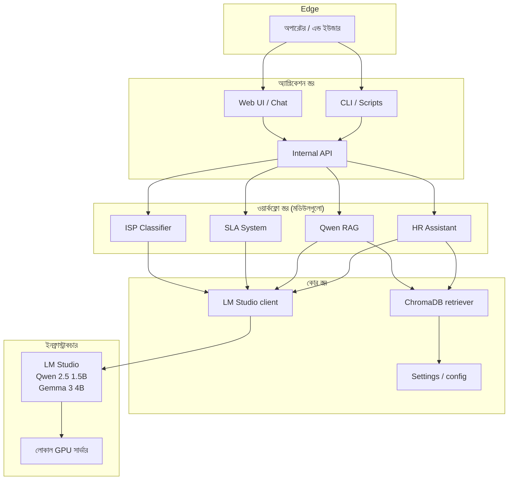

# আর্কিটেকচার

AI Work Flow for Business-এ ইচ্ছাকৃতভাবে স্তরের সংখ্যা কম রাখা হয়েছে। পুরো উদ্দেশ্য হলো — তুমি একটা সার্ভারে চালাতে পারো আর পুরো সিস্টেমটা মাথায় রাখতে পারো।

## পাঁচটি স্তর

| স্তর | কোথায় থাকে | উদ্দেশ্য |
| --- | --- | --- |
| **Edge** | অপারেটরের ব্রাউজার বা টার্মিনাল | প্রশ্ন করা বা ওয়ার্কফ্লো ট্রিগার করা ব্যক্তি |
| **Application** | তোমার চলতি সিস্টেম (intranet, Slack, ticketing) | AI-কে এন্ড ইউজারের সামনে আনে |
| **Workflow** | এই রেপোর মডিউলগুলো | সংকুচিত AI টাস্ক (শ্রেণীবিভাগ, রাউট, রিট্রিভ) |
| **Core** | এই রেপোর শেয়ার্ড লাইব্রেরি | LM Studio client, RAG retriever, settings |
| **Infrastructure** | তোমার সার্ভার রুম | GPU আর LM Studio রানটাইম |

## এই সেকশনের পাতাগুলো

- [স্তরসমূহ](layers.md) — প্রতিটি স্তর কী দায়িত্ব পালন করে, আর কী করে না
- [ডেটা প্রবাহ](data-flow.md) — কোন ডেটা কোথায় যায়, আর কী কখনো তোমার নেটওয়ার্ক ছাড়ে না
- [নিরাপত্তা](security.md) — থ্রেট মডেল, নেটওয়ার্ক প্লেসমেন্ট, অডিট লগিং

## ডিজাইন নীতিমালা

1. **লোকাল ডিফল্ট।** ক্লাউড API কল নেই। কোনো মডিউল যদি মডেল চায়, মডেল একই নেটওয়ার্কে থাকে।
2. **স্ট্রাকচার্ড I/O।** প্রতিটি মডিউলের টাইপড ইনপুট স্কিমা আর টাইপড আউটপুট স্কিমা আছে। মডেল একটা ফাংশন, কনভার্সেশন পার্টনার নয়।
3. **এক কাজ প্রতি মডিউল।** ISP Classifier শ্রেণীবিভাগ করে। SLA Classifier ঝুঁকি মাপে। Qwen RAG রিট্রিভ করে। কোনো মডিউল দুটো কাজ করে না।
4. **অবজারভেবল।** প্রতিটি মডেল কল লগ হয় — ইনপুট, আউটপুট, লেটেন্সি, টোকেন কাউন্ট। তুমি যা দেখতে পাও না, তা চালাতে পারো না।
5. **রিপ্লেসেবল।** LM Studio client যেকোনো OpenAI-compatible রানটাইম দিয়ে বদলানো যায়। ChromaDB যেকোনো ভেক্টর স্টোর দিয়ে বদলানো যায়। কোনো মডিউল নির্দিষ্ট টুলে টাইটলি কাপলড নয়।

## আরও দেখো

- [কেন AI Work Flow for Business?](../../why-ai-work-flow.md) — এই আর্কিটেকচারের পক্ষে যুক্তি
- [গ্রহণযাত্রা → বিল্ড](../adoption/build.md) — প্রোডাকশনে কীভাবে নামাবে
- [নিরাপত্তা পাতা](security.md) — থ্রেট মডেল, নেটওয়ার্ক প্লেসমেন্ট, প্রম্পট-ইঞ্জেকশন প্রতিরক্ষা
