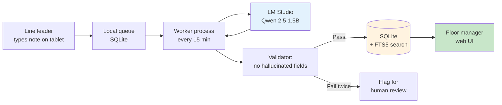

# কেস স্টাডি ৩ — ফ্যাক্টরি শিফট হ্যান্ডওভার সামারাইজেশন

> **ইন্ডাস্ট্রি:** গার্মেন্টস ম্যানুফ্যাকচারিং (অ্যানোনিমাইজড — ১,৮০০ শ্রমিক, দুটো
> প্রোডাকশন লাইন, ২৪/৭ শিফট, বাংলাদেশ)।
> **ওয়ার্কফ্লো:** লাইন-লিডার নোট থেকে শিফট হ্যান্ডওভার সামারাইজেশন + অ্যানোমালি ফ্ল্যাগিং।
> **ব্যবহৃত মডিউল:** কাস্টম সামারাইজেশন প্রম্পট সহ Qwen 2.5 1.5B; [আর্কিটেকচার](../../architecture/index.md)
> হলো [Build](../../adoption/build.md) রেফারেন্স, কিন্তু মডিউল কোড ইচ্ছাকৃতভাবে পাতলা।
> **অ্যাডপশন ফেজ ম্যাপিং:** [Build](../../adoption/build.md) (অবজারভেবিলিটি ওয়ার্কস্ট্রিমের গভীরে)।
> **স্ট্যাটাস:** ২০২৬-Q2 থেকে প্রোডাকশনে। দুই প্রোডাকশন লাইন জুড়ে প্রথম ৭৫ দিনের নম্বর।

তোমার অপারেশন যদি ২৪/৭ হয়, তোমার শ্রমিকরা যদি ডেস্ক-বাউন্ড না হয়, আর তোমার
"টিকিট" যদি আট-ঘণ্টার শিফটের শেষে একজন লাইন লিডারের হাতে লেখা নোট হয় — তাহলে
এই কেস স্টাডি পড়ো। লেটেন্সি আর আপটাইম বার এখানে ISP বা ব্যাংক স্টাডির চেয়ে
কঠোর।

---

## টিম আর সমস্যা

একটা গার্মেন্ট ফ্যাক্টরি দুটো প্রোডাকশন লাইন ২৪ ঘণ্টা চালায়, তিনটা শিফটে আট
ঘণ্টা করে। প্রতি শিফটের শেষে **লাইন লিডার** এক পাতার হ্যান্ডওভার নোট হাতে লেখে।
নোটে থাকে: মেশিনের স্ট্যাটাস, QA-তে ধরা ডিফেক্ট, শ্রমিকের উপস্থিতি, যেকোনো
সেফটি ইনসিডেন্ট, আর পরের শিফটের কোথায় ফোকাস করা উচিত।

নোটটা শিফট-চেঞ্জওভার স্টেশনের বোর্ডে পিন করা হয়। ইনকামিং লাইন লিডার পড়ে
(অথবা পড়ে না), লাইন বুঝে নেয়, আর আউটগোয়িং লিডার বাড়ি চলে যায়।

দুটো সমস্যা, দুটোই নিয়ে আগের লাইন লিডাররা বছরের পর বছর অভিযোগ করেছে:

1. **নোট স্ট্যান্ডার্ডাইজড না।** একজন লাইন লিডার কাটিং মেশিন নিয়ে দুই প্যারাগ্রাফ লেখে। আরেকজন পাঁচটা বুলেট লেখে। তৃতীয়জন একটা বাক্য লেখে ("সব ঠিক আছে")। ইনকামিং লাইন লিডারকে লেখকের স্টাইল জানতে হয় কোনটা গুরুত্বপূর্ণ আর কোনটা না।
2. **নোট সার্চেবল না।** ফ্লোর ম্যানেজার যদি জানতে চায় "গত ৩০ দিনে লাইন ২-এর ওভারলক মেশিন কতবার জ্যাম হয়েছে", তাহলে তাকে ৯০টা হাতে-লেখা নোট শারীরিকভাবে ঘাঁটতে হবে। কেউ করে না।

ফ্লোর ম্যানেজার সাধারণ ভাষায় যা চেয়েছিল: "আমি প্রতিটা শিফটের একটা স্ট্রাকচার্ড,
সার্চেবল, কোয়েরিবল রেকর্ড চাই — ইংরেজিতে — যেটা আমি লাইন, মেশিন, আর তারিখ
দিয়ে সার্চ করতে পারি।"

## যেটা শিপ হলো

একটা ছোট সিস্টেম যেটা প্রতি শিফটের শেষে রান করে:

1. লাইন লিডার নোটটা **ওয়াল-মাউন্টেড ট্যাবলেটে** লেখে হ্যান্ডওভার রুমে, একটা টেক্সট বক্সে। (আগের সিস্টেম ছিল হাতে-লেখা নোট; ট্যাবলেটটাই শ্রমিকদের থেকে চাওয়া একমাত্র আচরণগত পরিবর্তন।)
2. একটা ছোট সার্ভিস প্রতি ১৫ মিনিটে রান করে, নতুন নোটগুলো পড়ে, আর স্ট্রাকচার্ড সামারি বানাতে লোকাল Qwen 2.5 1.5B মডেলকে কল করে।
3. সামারিটা SQLite ডেটাবেজে (Postgres ছিল ওভারকিল — দুটো লাইন × তিন শিফট × ৩৬৫ দিন = ২,১৯০ সারি/বছর) ফুল-টেক্সট সার্চ চালু রেখে লেখা হয়।
4. ফ্লোর ম্যানেজারের কাছে একটা ওয়েব UI আছে: লাইন, তারিখের রেঞ্জ, মেশিন, বা ফ্রি-টেক্সট দিয়ে সার্চ। প্রতিটা সার্চ রেজাল্ট আসল হাতে-লেখা নোট আর স্ট্রাকচার্ড সামারিতে লিংক করে।

স্ট্রাকচার্ড সামারিতে ঠিক পাঁচটা ফিল্ড, বেশি না:

```python
class ShiftSummary(BaseModel):
    line: Literal["L1", "L2"]
    shift: Literal["morning", "afternoon", "night"]
    machine_issues: list[MachineIssue]   # machine_id, severity (1-3), note
    qa_defects: list[str]                 # free-text, 1 line each
    safety_incidents: list[str]           # free-text, 1 line each
    focus_for_next_shift: str             # 1-2 sentences
```

নোটে নেই এমন কোনো ফিল্ড ইনভেন্ট করা মডেলের জন্য **কঠোরভাবে নিষিদ্ধ**। নোট যদি
বলে "সব ঠিক আছে", তাহলে `machine_issues`, `qa_defects`, আর `safety_incidents`
সব খালি থাকে, আর `focus_for_next_shift` হলো ইনপুটের এক-বাক্যের ইকো। পোস্ট-জেনারেশন
ভ্যালিডেটর রিজেক্ট করে এমন যেকোনো সামারি যেটায় ইনপুট নোটে নেই এমন তথ্য আছে,
আর মডেলকে একবার রি-প্রম্পট করে। (দ্বিতীয় ফেইলিওরেও নোটটা ফ্ল্যাগ হয় হিউম্যান
রিভিউ-এর জন্য, অটো-সামারাইজড হয় না।)

সিস্টেম লেআউট:



মূল ডিজাইন কনস্ট্রেইন্ট — আর এটাই কারণ এটা [Build](../../adoption/build.md) ফেজে
আছে, [Pilot](../../adoption/pilot.md)-এ না — হলো **আপটাইম**। লাইন লিডারদের নোট
মডেল চালু থাক বা না থাক, লেখা হয়। মডেল ডাউন থাকলে নোট কিউ-তে জমা হয়, ওয়ার্কার
রিট্রাই করে, আর মডেল ফিরে আসলে সামারি দেখা যায়। LLM-এর উপর কোনো রিয়েল-টাইম
নির্ভরশীলতা নেই।

## "সাকসেস" বলতে যেটা বোঝানো হলো

বারটা ফ্লোর ম্যানেজারের সাথে বসানো হয়েছিল, **যেকোনো কোড লেখার আগেই**:

> ৯৫% শিফট নোটকে এমন সামারি প্রোডিউস করতে হবে যেখানে কোনো হ্যালুসিনেটেড ফিল্ড নেই;
> ০% সেফটি ইনসিডেন্ট মিস বা ডাউনগ্রেড হতে পারবে না; ফ্লোর ম্যানেজারকে শুধু সার্চ
> UI ব্যবহার করে "গত ৩০ দিনে মেশিন X কতবার জ্যাম হয়েছে" ৩০ সেকেন্ডের মধ্যে
> উত্তর দিতে পারতে হবে।

রোলআউট-এর পর প্রথম ৭৫ দিনে টিম যা মেজার করেছে:

| মেট্রিক | বার | আসল (৭৫ দিন) | নোট |
| --- | --- | --- | --- |
| সামারাইজেশন কমপ্লিশন রেট | ≥ ৯৫% | ৯৭.২% | সব শিফট নোটের মধ্যে সফলভাবে সামারাইজড % |
| হ্যালুসিনেটেড ফিল্ড রেট | ০% | ০% | ভ্যালিডেটর + ডাবল-চেক স্যাম্পলিং দিয়ে এনফোর্সড |
| সেফটি-ইনসিডেন্ট রিকল | ১০০% | ১০০% (n=৮) | ৭৫ দিনে সব ৮টা সেফটি ইনসিডেন্ট ক্যাপচার হয়েছে |
| সার্চ রেসপন্স টাইম | ≤ ৩০ সে. | ১.৮ সে. | SQLite + FTS5, দুই লাইনের ডেটা |
| শ্রমিকের নোট-লেখার সময় | (বারে নেই) | মিডিয়ান ৩.২ মিনিট | আগের হাতে-লেখা ৪.১ মিনিট থেকে কমেছে |
| ম্যানেজারের সার্চ টাইম | (বারে নেই) | মিডিয়ান ১৮ সে. | আগের ~১০ মিনিট (বোর্ডের কাছে শারীরিকভাবে যাওয়া) থেকে কমেছে |
| LLM ডিপেন্ডেন্সির আপটাইম | (বারে নেই) | ৯৯.৪% | ৭৫ দিনে, মডেল বক্স মেইনটেনেন্সে মোট ৪ ঘণ্টা ডাউনটাইম |

০% হ্যালুসিনেটেড-ফিল্ড রেট — এই লাইনটাই সবচেয়ে বেশি গুরুত্ব পেয়েছিল। টিম
দুই জায়গায় এনফোর্স করে: (১) সিস্টেম প্রম্পট স্পষ্ট যে প্রতিটা ফিল্ড অবশ্যই
ইনপুট নোটের একটা স্প্যানে ট্রেসেবল হতে হবে, আর (২) ভ্যালিডেটর একটা স্ট্রিক্ট
কন্টেইনমেন্ট চেক করে — প্রতিটা নন-এম্পটি ফিল্ডের জন্য, ভ্যালিডেটরকে ইনপুট
নোটে একটা সাবস্ট্রিং খুঁজে পেতে হবে। সামারিতে কোনো ফ্রেজ যদি নোটে না থাকে,
সামারি রিজেক্ট হয়।

## কী ভুল হলো

তিনটা ফেইলিওর মোড, খরচের ক্রমানুসারে:

1. **ট্যাবলেট কীবোর্ড।** প্রথম রোলআউট একটা ট্যাবলেট ব্যবহার করেছিল অন-স্ক্রিন বাংলা কীবোর্ড সহ। লাইন লিডাররা মিক্সড বাংলা + ইংরেজিতে লিখেছিল (হাতেও যা করতো), কিন্তু কোড-মিক্সড ইনপুটে মডেলের টোকেনাইজেশন ছিল খারাপ — কোন মেশিনে ডিফেক্ট পড়বে সেটায় এগ্রিমেন্ট ৭৮%-এ নেমে গিয়েছিল। ফিক্স: ট্যাবলেটকে ফিজিক্যাল বাংলা কীবোর্ড লেআউটে সুইচ করা, আর একটা "এটা কি ইংরেজিতে বোঝাতে চেয়েছেন?" অটো-সাজেস্ট যোগ করা। মেশিন আইডেন্টিফিকেশনে এগ্রিমেন্ট আবার ৯৬% পর্যন্ত উঠলো। লেসন: ইনপুট কোয়ালিটি মডেল সাইজের চেয়ে বেশি গুরুত্বপূর্ণ, আর ইনপুট কোয়ালিটি হলো হার্ডওয়্যার সমস্যা, সফটওয়্যার সমস্যা না।
2. **প্রথম দুই সপ্তাহে শ্রমিকই বটলেনেক ছিল।** লাইন লিডাররা সিস্টেমকে ট্রাস্ট করেনি। তারা ট্যাবলেটে নোট লিখতো *আর* কাগজেও লিখতো, "যদি কিছু হয়"। ফ্লোর ম্যানেজারকে স্পষ্টভাবে বলতে হয়েছিল: কাগজ যাচ্ছে। সপ্তাহ ১-এ ৪০% ট্যাবলেট-অনলি থেকে সপ্তাহ ৪-এ ৯৯% ট্যাবলেট-অনলি। লেসন: পুরনো সিস্টেমের সাথে প্যারালালে চলা নতুন সিস্টেম রোলআউট না — এটা সহাবস্থান, আর পুরনো সিস্টেম সবসময় জিতে যদি না স্পষ্টভাবে রিটায়ার করা হয়।
3. **একটা সেফটি ইনসিডেন্ট প্রায় মিস হয়ে গিয়েছিল।** দ্বিতীয় সপ্তাহে, একজন লাইন লিডার লিখেছিল "machine 3 had a small problem, will check tomorrow"। মডেল এটাকে সামারাইজ করেছিল `machine_issues: [{machine_id: "M3", severity: 1, note: "small problem"}]` হিসেবে। ভ্যালিডেটর পাস করেছিল। ফ্লোর ম্যানেজার এটাকে "লো-প্রায়োরিটি মেইনটেনেন্স আইটেম" হিসেবে পড়তেন। এটা ছিল একটা ছেঁড়া ড্রাইভ বেল্ট যেটা রিপ্লেস না করলে পরের দিন ৪ ঘণ্টার লাইন স্টপেজ হতো। ফ্লোর ম্যানেজার ধরেছিলেন কারণ তিনি তাঁর মেশিন চেনেন; নতুন ম্যানেজার ধরতো না। ফিক্স: ভ্যালিডেটরে একটা দ্বিতীয় রুল যোগ করা — "problem", "issue", বা "check" শব্দ ধারণকারী যেকোনো বাক্য সেভারিটি ১-এর বদলে ২ পায়, আর একটা ডেইলি ডাইজেস্ট সব সেভারিটি-২ আইটেম ফ্লোর ম্যানেজারকে সারফেস করে। সিস্টেম এখন নতুন ম্যানেজার মেশিন না চিনলেও এই ধরনের সিগন্যাল হারায় না।

## কী শেখা হলো

- **২৪/৭ অপারেশন হলো Build-ফেজ সমস্যা, Pilot-ফেজ সমস্যা না।** ৯৯.৪% আপটাইম ফিগার ভালো দেখায়, কিন্তু এটাতে লেগেছে ডেডিকেটেড হোস্ট, রিস্টার্ট ক্রন, হেলথ চেক, আর একটা কিউ যেটা LLM-এর উপর নির্ভরশীল না। এর কিছুই ইন্টারেস্টিং না; সবটাই বাধ্যতামূলক।
- **ফ্যাক্টরি-ফ্লোর AI-এর সবচেয়ে কঠিন অংশ মডেল না।** এটা ট্যাবলেট, কীবোর্ড, ভাষা, আর ট্রাস্ট। মডেল হলো সহজ ২০%। ইনপুট ডিভাইস আর চেঞ্জ-ম্যানেজমেন্ট কথোপকথন হলো কঠিন ৮০%।
- **"সব ঠিক আছে" একটা ভ্যালিড আউটপুট।** ৩০% নোটের জন্য, সব ফিল্ড খালি আর ইনপুটের এক-বাক্যের ইকো সহ একটা সামারি হলো সঠিক উত্তর। "সব ঠিক আছে" নোটে মডেলের কাছ থেকে বেশি চাওয়া একটা সিস্টেম যেটা সমস্যা ইনভেন্ট করে।
- **স্ট্রিক্ট কন্টেইনমেন্ট করা একটা ভ্যালিডেটর (প্রতিটা আউটপুট ফ্রেজ অবশ্যই ইনপুটে থাকতে হবে) হলো সামারাইজেশন টাস্কের জন্য সবচেয়ে সিম্পল, সবচেয়ে শক্তিশালী হ্যালুসিনেশন ডিফেন্স।** এটা টাইপড স্কিমার সাবস্টিটিউট না, কিন্তু দুটো একসাথে "আমি কিছু যোগ করেছি" আর "আমি মানে বদলে দিয়েছি" — দুটো ফেইলিওর মোডই ধরে।

## এরপর কী

- স্ট্রাকচার্ড সামারিগুলোর উপর একটা ছোট অ্যানোমালি ডিটেক্টর যোগ করা: কোনো মেশিনের জন্য `machine_issues` ফ্রিকোয়েন্সিতে ঝাঁপ দিলে, মেইনটেনেন্স লিডকে অটো-পেজ করা। সিগন্যাল ইতিমধ্যে ডেটাবেজে আছে; এর জন্য মডেল লাগে না।
- গ্রুপের দ্বিতীয় ফ্যাক্টরিতে একই প্যাটার্ন রোল করা। একমাত্র পার্থক্য হলো SQLite ডেটাবেজে একটা নতুন টেন্যান্ট আর ট্যাবলেটের Wi-Fi নেটওয়ার্ক।
- কোড-মিক্সড ইনপুট স্লাইসের জন্য Gemma 3 4B ইভ্যালুয়েট করা। ISP আর ব্যাংক কেস স্টাডি ৪B-তে আপগ্রেড হচ্ছে; ফ্যাক্টরির মিক্সড বাংলা/ইংরেজি ইনপুটও উপকৃত হতে পারে।

## আরও দেখো

- [কেস স্টাডি ১ — ISP সাপোর্ট](isp-support.md) — সবচেয়ে ছোট, সবচেয়ে দ্রুত-শিপ রেফারেন্স
- [কেস স্টাডি ২ — ব্যাংক IT হেল্পডেস্ক](bank-it.md) — ডেটা-রেসিডেন্সি আর্গুমেন্টের সবচেয়ে পরিষ্কার টেস্ট
- [অ্যাডপশন: Build](../../adoption/build.md) — চার-ওয়ার্কস্ট্রিম স্ট্রাকচার যেটা এটাকে পাইলট থেকে প্রোডাকশনে নিয়ে গেছে
- [আর্কিটেকচার: লেয়ার](../../architecture/layers.md) — LLM কেন Workflow লেয়ারে আছে, Core-তে না
