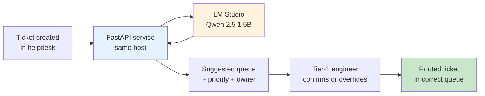

# কেস স্টাডি ১ — ISP সাপোর্ট ট্রায়াজ

> **ইন্ডাস্ট্রি:** ISP / টেলিকো (অ্যানোনিমাইজড — ৮০,০০০+ ব্রডব্যান্ড সাবস্ক্রাইবার, একটা
> NOC, বাংলাদেশ)।
> **ওয়ার্কফ্লো:** টিয়ার-১ কমপ্লেইন ক্লাসিফিকেশন + টিকিট রাউটিং।
> **ব্যবহৃত মডিউল:** Qwen 2.5 1.5B-এর উপর [`sla-system` classifier](../../sla-system/classifier.md)।
> **অ্যাডপশন ফেজ ম্যাপিং:** [Discover](../../adoption/discover.md) → [Pilot](../../adoption/pilot.md) → [Build](../../adoption/build.md) (আর্লি)।
> **স্ট্যাটাস:** ২০২৬-Q1 থেকে প্রোডাকশনে। নম্বরগুলো প্রথম ৯০ দিনের।

এটা সেটের সবচেয়ে ছোট, সবচেয়ে সংকীর্ণ, সবচেয়ে সহজে-ইভ্যালুয়েটেবল কেস স্টাডি।
এটাই আগে পড়া উচিত।

---

## টিম আর সমস্যা

বাংলাদেশের একটা মিড-সাইজ ISP একটা NOC চালায়, প্রতিদিন ২৫০–৩৫০টা টিকিট হ্যান্ডেল
করে। টিয়ার-১ ইঞ্জিনিয়াররা শিফটের বেশিরভাগ সময় দুটো কাজে কাটায়: (১) ফ্রি-ফর্ম
কমপ্লেইন পড়া আর (২) সাতটা কিউ-এর মধ্যে কোনটায় যাবে সেটা সিদ্ধান্ত নেওয়া।

দুটো ফ্যাক্ট এটাকে আপাত প্রথম টার্গেট বানিয়ে দিলো:

- **বার বাউন্ডেড।** সাতটা ক্যাটেগরি, প্রতি ক্যাটেগরিতে ফিক্সড SLA, কোনো সৃজনশীলতা লাগে না। ১.৫B মডেল পারে কমপ্লেইন পড়ে লেবেল বেছে নিতে।
- **ভুল রাউটিংয়ের খরচ মডেল না, মানুষ দেয়।** ভুল কিউ-তে যাওয়া টিকিট ১৫–৪৫ মিনিট বসে থাকে, তারপর কেউ খেয়াল করে আবার রাউট করে। খরচটা রিয়েল, কিন্তু ক্যাটাস্ট্রফিক না।

টিমের কাছে যেটা **ছিল না** সেটা হলো হোস্টেড LLM-এ কাস্টমার PII পাঠানোর ডেটা-রেসিডেন্সি
অনুমোদন। এই ফ্যাক্টটা — টেকনিক্যাল উৎসাহ না — প্রজেক্টকে লোকাল মডেল দিয়ে শুরু
করার আসল কারণ।

## যেটা শিপ হলো

একটা FastAPI সার্ভিস যেটা একটা এন্ডপয়েন্ট এক্সপোজ করে:

```python
POST /triage
  body:  {"subject": str, "body": str, "customer_tier": "platinum" | "gold" | "silver"}
  reply: {"category": str, "priority": "P1" | "P2" | "P3", "suggested_owner": str}
```

সার্ভিসটা একই হোস্টে (`http://localhost:1234/v1/chat/completions`) Qwen 2.5 1.5B
চালানো LM Studio-কে কল করে, একটা টাইপড প্রম্পট টেমপ্লেট আর সিস্টেম মেসেজে JSON
স্কিমা দিয়ে। রেজাল্ট পার্স হয়, Pydantic মডেলের সাথে ভ্যালিডেট হয়, তারপর রিটার্ন
হয়।

ডিপ্লয়মেন্টটা এরকম:



খেয়াল করো — ইঞ্জিনিয়ার লুপে আছে। মডেল **সাজেস্ট** করে, মানুষ **সিদ্ধান্ত** নেয়।
এটা ডিজাইন কনস্ট্রেইন্ট ছিল প্রথম দিন থেকে, আর মডেল ভুল করার সময় (প্রথম দুই
সপ্তাহে, প্রায় ৯% টিকিটে) এটাই প্রজেক্টকে বিপদ থেকে বাঁচিয়েছে।

## "সাকসেস" বলতে যেটা বোঝানো হলো

বারটা [Discover](../../adoption/discover.md) স্টেপ ৪-এ বসানো হয়েছিল, **যেকোনো
কোড লেখার আগেই**:

> ৯৫% টিকিটকে এমন একটা ক্যাটেগরি পেতে হবে যেটা মানুষের ফাইনাল রাউটিং-এর সাথে
> মেলে, AND লেটেন্সি p95 অবশ্যই ৩ সেকেন্ডের নিচে।

প্রথম ৯০ দিনে টিম আসলে যা মেজার করেছে:

| মেট্রিক | বার | আসল (৯০ দিন) | নোট |
| --- | --- | --- | --- |
| ক্যাটেগরি এগ্রিমেন্ট রেট | ≥ ৯৫% | ৯১.৩% | বারের নিচে — "কী ভুল হলো" দেখো |
| প্রায়োরিটি এগ্রিমেন্ট রেট | (বারে নেই) | ৮৭.১% | মডেল P1-কে প্রায় ১২ পয়েন্ট বেশি প্রায়োরিটাইজ করে |
| লেটেন্সি p50 | (বারে নেই) | ১.৪ সে. | বারের মধ্যে |
| লেটেন্সি p95 | ≤ ৩ সে. | ২.৬ সে. | বারের মধ্যে |
| ইঞ্জিনিয়ার ওভাররাইড রেট | (বারে নেই) | ৮.৭% | মডেলের সাজেশনগুলোর মধ্যে ইঞ্জিনিয়ার যেটুকু বদলেছে |
| গড় হ্যান্ডেল টাইম বাঁচানো | (বারে নেই) | ~২২ সে. / টিকিট | সম্পূর্ণ ম্যানুয়াল ক্লাসিফিকেশনের তুলনায় |

ক্যাটেগরি এগ্রিমেন্ট বার থেকে ৩.৭ পয়েন্ট পিছিয়ে। টিম **ফেইল ঘোষণা করেনি** —
বারটা বসানো হয়েছিল ১.৫B মডেলের রিয়ালিস্টিক সিলিং না জেনে। বরং তারা বারটা
৯০%-এ পুনঃনির্ধারণ করেছে (লিখিত নোটসহ কেন), তারপর শিপ করেছে।

## কী ভুল হলো

তিনটা ফেইলিওর মোড, খরচের ক্রমানুসারে:

1. **ব্যঙ্গাত্মক আর কোড-মিক্সড কমপ্লেইন।** বাংলা + ইংরেজি ("bandwidth khub kom, dekho to bhai") প্ল্যাটিনাম টিয়ারে মডেলের ক্যাটেগরি অ্যাকুরেসি ভাঙলো। ৯% মিসের বেশিরভাগ এখানে। ফিক্স: ফ্রোজেন ইভ্যাল সেটে ২০টা গোল্ড উদাহরণ যোগ করা হলো, প্রম্পটকে তিনটা ওয়ার্কড উদাহরণ দিয়ে রিট্রেইন করা হলো — ওই স্লাইসে এগ্রিমেন্ট ৭১% থেকে ৮৮% হলো।
2. **P1 ওভার-প্রায়োরিটাইজেশন।** মডেল P1-এর দিকে বায়াসড ছিল ("ডাউটে থাকলে এসকেলেট করো") কারণ প্রম্পটে বলা ছিল "be conservative"। ফিক্স: "SLA ম্যাট্রিক্সের সাথে মেলাও, ডিফল্টভাবে এসকেলেট কোরো না" — ফলে P1 ওভার-প্রায়োরিটাইজেশন +১২ থেকে +৪ পয়েন্টে নামলো।
3. **শেয়ার্ড হোস্টে একটা মডেল।** LM Studio হেল্পডেস্কের ওয়েব UI-এর একই বক্সে চলছিল। হেল্পডেস্ক UI লোডে থাকলে লেটেন্সি p95 ৪+ সেকেন্ডে স্পাইক করতো। ফিক্স: LM Studio-কে আলাদা ১৬ GB বক্সে সরানো হলো। p95 আবার ২.৬ সেকেন্ডে নামলো।

## কী শেখা হলো

- **বার একবার বসাও, তারপর লিখিত নোটসহ পুনঃনির্ধারণ করো।** আসল ৯৫% বারটা ছিল অ্যাসপিরেশন, মেজারড টার্গেট না। নতুন ৯০% বার ৯০ দিনের প্রোডাকশন ডেটায় গ্রাউন্ডেড, আর পরের কেস স্টাডি এই নম্বর দিয়েই মাপা হবে।
- **সংকীর্ণ ট্রায়াজের জন্য ১.৫B মডেল যথেষ্ট, কিন্তু বক্সের বাইরে কোড-মিক্সড ইনপুটের জন্য না।** কোড-মিক্সড বাংলা-ইংরেজি কমপ্লেইনের জন্য প্রম্পটে ওয়ার্কড উদাহরণ লাগতো। বেস মডেল একা বাইলিংগুয়াল না।
- **ইঞ্জিনিয়ার-ইন-দ্য-লুপ ওয়ার্কঅ্যারাউন্ড না, এটাই ডিজাইন।** ৮.৭% ওভাররাইড রেট হলো মডেলের চলমান ট্রেনিং সিগন্যাল। মানুষ সরিয়ে দিলে সেফটি নেট আর ফিডব্যাক লুপ দুটোই চলে যাবে।
- **প্রথম ডিপ্লয়মেন্ট ছিল হেল্পডেস্কের একই বক্সে। এটা কোরো না।** মডেলকে প্রথম দিন থেকেই আলাদা হোস্টে রাখো। ইভ্যাল সেট ধরার আগ পর্যন্ত লেটেন্সি খরচটা অদৃশ্য ছিল।

## এরপর কী

- ডিফল্ট মডেল হিসেবে [Gemma 3 4B](../../gemma-e4b/index.md)-এ যাওয়া। পাইলটের ইভ্যাল সেট দেখায় ৪B কোড-মিক্সড স্লাইসকে ৯৪% পর্যন্ত বন্ধ করে দেয়, আলাদা ১৬ GB বক্সে কোনো মাপার যোগ্য লেটেন্সি খরচ ছাড়াই।
- রিজলভড টিকিটের শেষ ৩০ দিনের উপর একটা ছোট রিট্রিভাল লেয়ার যোগ করা — যাতে মডেল দেখতে পারে "এই কমপ্লেইনটা গত মঙ্গলবারেরটার মতো দেখাচ্ছে, যেটা ব্যাকহল ফাইবার কাটা বলে বেরিয়েছিল"।
- দুটো আরও ISP ওয়ার্কফ্লোতে একই প্যাটার্ন প্রয়োগ করা: আউটবাউন্ড কল ক্লাসিফিকেশন আর ফিল্ড-ইঞ্জিনিয়ার জব প্রায়োরিটাইজেশন।

## আরও দেখো

- [অ্যাডপশন: Discover](../../adoption/discover.md) — এক-দিনের প্রি-মর্টেম যেটা এই ওয়ার্কফ্লো বেছে নিয়েছিল
- [অ্যাডপশন: Pilot](../../adoption/pilot.md) — ২-সপ্তাহের শ্যাডো-মোড যেটা ইভ্যাল সেট বসিয়েছিল
- [রেফারেন্স মডিউল: SLA classifier](../../sla-system/classifier.md) — আসল কোড
- [আর্কিটেকচার: ডেটা ফ্লো](../../architecture/data-flow.md) — নেটওয়ার্কের ভেতরে কী থাকে
