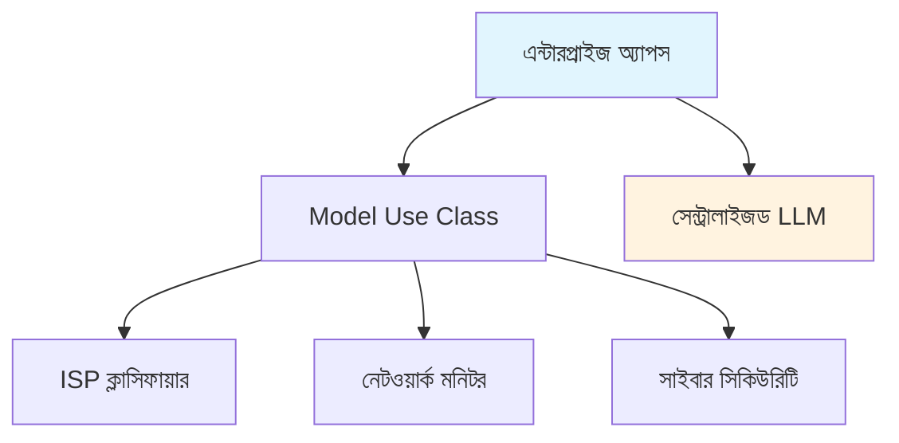
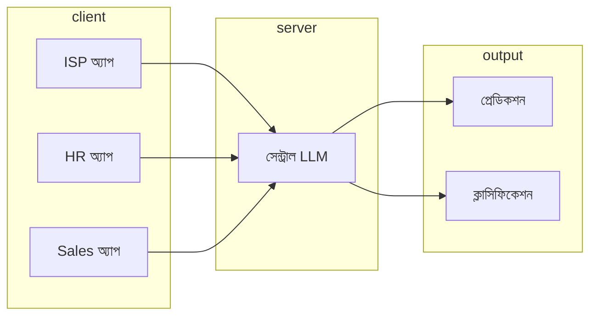

# এন্টারপ্রাইজ অ্যাপস - বাংলা

এন্টারপ্রাইজ-গ্রেড AI অটোমেশন অ্যাপ্লিকেশন। একটা বিস্তারিত উদাহরণ দিচ্ছি - ধরো তুমি একটা ISP-র CTO। তোমার টিম প্রতিদিন শত শত টিকিট হ্যান্ডেল করে। প্রতিটা টিকিটে কী সমস্যা, কোন টায়ার, কাকে এসাইন করতে হবে - এগুলো ম্যানুয়ালি বুঝতে হয়। এই সিস্টেমে AI সব অটোমেটিক করে দেয় - সমস্যা বুঝে, টায়ার নির্ধারণ করে, আর সঠিক টিমে পাঠায়।

## অ্যাপ্লিকেশন ওভারভিউ

অ্যাপসগুলো বিভিন্ন কাজের জন্য তৈরি। Model Use Class হলো সেন্ট্রাল ক্লাসিফিকেশন মডিউল, যা সব অ্যাপে ব্যবহার হয়। Centralized LLM হলো একটা লোকাল LLM সার্ভার, যার সাথে সব অ্যাপ কানেক্ট করে। এছাড়া ISP Classifier, Network Monitor, আর Cyber Security অ্যাপস আছে।

## আর্কিটেকচার

আর্কিটেকচারে তিনটা স্তর আছে। ক্লায়েন্ট স্তরে ISP অ্যাপ, HR অ্যাপ, আর Sales অ্যাপ আছে। সার্ভার স্তরে সেন্ট্রাল LLM আছে। আউটপুট স্তরে প্রেডিকশন আর ক্লাসিফিকেশন আছে। সব ক্লায়েন্ট সার্ভারের সাথে কানেক্ট করে, আর সার্ভার সব অ্যাপকে রেসপন্স দেয়।

## Model Use Class

Model Use Class কিছু মূল ক্লাস নিয়ে তৈরি। ModelUse হলো সেন্ট্রাল ক্লাসিফিকেশন মডিউল, সব ক্লাসিফিকেশন এখান থেকে হয়। LLMInterface হলো API ইন্টারফেস, LLM-এর সাথে কমিউনিকেশন এখানে হয়। CacheManager হলো রেসপন্স ক্যাশিং, যাতে একই প্রশ্নের জন্য আবার API কল না করতে হয়।

| ক্লাস | বিবরণ |
|-------|--------|
| ModelUse | সেন্ট্রাল ক্লাসিফিকেশন মডিউল |
| LLMInterface | API ইন্টারফেস |
| CacheManager | রেসপন্স ক্যাশিং |