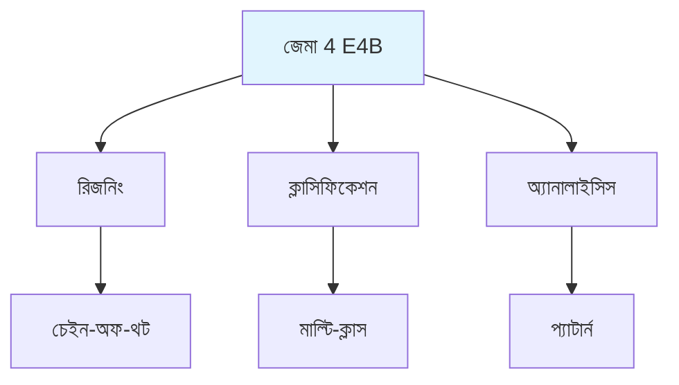
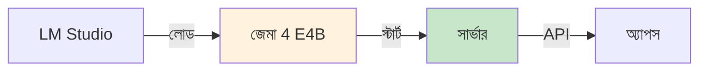

# জেমা E4B - বাংলা

জেমা 4 E4B মডেল ব্যবহার করে এন্টারপ্রাইজ অ্যাপ্লিকেশন। একটা উদাহরণ দিচ্ছি - জেমা হলো গুগলের ওপেন-সোর্স মডেল, যা অনেক ভালো reasoning করতে পারে। ISP টিকিটের জটিল সমস্যা সমাধানে এটা বিশেষ কাজে আসে।

## মডেল ক্যাপাবিলিটি

জেমা 4 E4B কিছু বিশেষ কাজ করতে পারে। Reasoning হলো ধাপে ধাপে চিন্তা করা, জটিল সমস্যার কারণ বুঝতে পারা। Classification হলো টিকিট শ্রেণীবদ্ধ করা, কোন ক্যাটাগরিতে পড়ে সেটা বুঝতে পারা। Analysis হলো প্যাটার্ন খোঁজা, ডেটার মধ্যে ট্রেন্ড বুঝতে পারা।

## ইউজ কেস

মডেলটা বিভিন্ন কাজে ব্যবহার হয়। Classification-এ টিকিট সর্টিং হয়, প্রায় ৯৫% accuracy পাওয়া যায়। Reasoning-এ সমস্যা সমাধান হয়, সিদ্ধান্ত আরও ভালো হয়। Analysis-এ ট্রেন্ড চিহ্নিত করা হয়, দ্রুত প্রসেসিং হয়।

| ইউজ কেস | অ্যাপ্লিকেশন | পারফরম্যান্স |
|---------|-------------|------------|
| Classification | টিকিট সর্টিং | প্রায় ৯৫% accuracy |
| Reasoning | সমস্যা সমাধান | সিদ্ধান্ত উন্নত |
| Analysis | ট্রেন্ড চিহ্নিত | দ্রুত প্রসেসিং |

## সেটআপ

সেটআপের ধাপ আছে। প্রথমে LM Studio ইনস্টল করতে হবে। তারপর জেমা 4 E4B মডেল লোড করতে হবে। এরপর সার্ভার স্টার্ট করতে হবে। আর শেষে অ্যাপস থেকে API কল করা যাবে।

