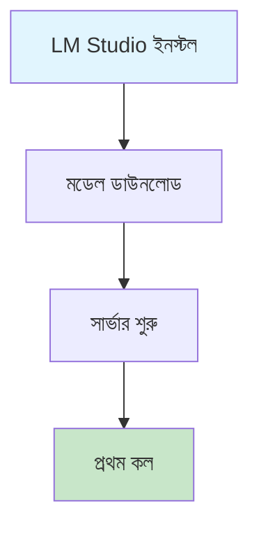
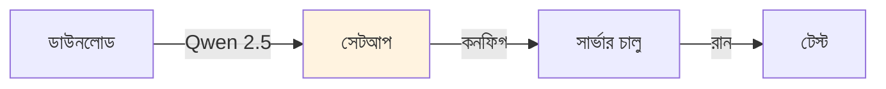

# শুরু করুন

লোকাল LLM দিয়ে শুরু করার জন্য এখানে সম্পূর্ণ গাইড আছে। পরিবর্তে Qwen 2.5-1.5B ব্যবহার করা হয়েছে, যা ছোট কিন্তু কার্যকর মডেল।

## সেটআপ প্রবাহ

শুরু করার আগে ধাপগুলো জানা দরকার। প্রথমে LM Studio ইনস্টল করতে হবে, তারপর মডেল ডাউনলোড করতে হবে, এরপর সার্ভার শুরু করতে হবে, আর শেষে প্রথম কল করা যাবে।

## পূর্বশর্ত

কাজ শুরু করার আগে কিছু জিনিস থাকা দরকার। LM Studio স্থানীয় LLM সার্ভার হিসেবে কাজ করবে। Python 3.8+ প্রোগ্রামিং ল্যাঙ্গুয়েজ হিসেবে দরকার। আর network access লোকালhost কানেকশনের জন্য দরকার।

| কম্পোনেন্ট | বিবরণ |
|-----------|--------|
| LM Studio | স্থানীয় LLM সার্ভার |
| Python 3.8+ | প্রোগ্রামিং ল্যাঙ্গুয়েজ |
| Network access | localhost কানেকশন |

## দ্রুত ধাপ

শুরু করতে প্রথমে Qwen 2.5 মডেল ডাউনলোড করো, তারপর সেটআপ করো, এরপর কনফিগ করো, এরপর সার্ভার চালু করো, আর শেষে টেস্ট করো।

## পরিবর্তন ধাপ

এখান থেকে weitermachen করা যাবে। LM Studio-এ কথা বলার জন্য interactive chat সেকশন আছে। ISP classifier দিয়ে প্রথম classifier train করা যাবে। আর stress testing দিয়ে model performance টেস্ট করা যাবে।

- [ISP classifier](../isp-classifier/index.md) - প্রথম classifier train করুন