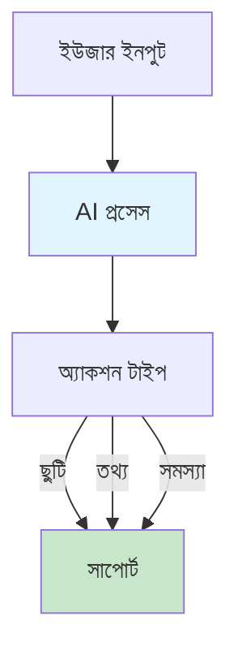

# HR অ্যাসিস্ট্যান্ট - বাংলা

AI-পাওয়ার্ড হিউম্যান রিসোর্স অটোমেশন সিস্টেম। একটা উদাহরণ দিই - তুমি একজন এমপ্লয়ি, ছুটি চাইবে। সাধারণত অফিসে গিয়ে ফর্ম ফিল করতে হয়, ম্যানেজারের সাইন নিতে হয়, এক সপ্তাহ লাগতে পারে। এই সিস্টেমে তুমি সরাসরি অ্যাপ্লিকেশন দিতে পারো, AI সেটা প্রসেস করবে, আর অটোমেটিক অ্যাপ্রুভাল হবে।

## ইউজার ইন্টারঅ্যাকশন

ইউজার ইনপুট দিলে AI প্রসেস করে, তারপর অ্যাকশন টাইপ বুঝে নেয়। ছুটির অ্যাপ্লিকেশন হলে অ্যাপ্রুভাল প্রসেস হয়। তথ্য চাইলে তথ্য দেয়। সমস্যা থাকলে সাপোর্ট দেয়।

## সাপোর্ট করা কমান্ড

কিছু বেসিক কমান্ড আছে যা সিস্টেম বুঝে। /leave দিলে ছুটির অ্যাপ্লিকেশন হয়। /balance দিলে ব্যালেন্স দেখায়। /policy দিলে পলিসি জানায়। /status দিলে অ্যাপ্লিকেশনের স্ট্যাটাস দেখায়।

| কমান্ড | বিবরণ | উদাহরণ |
|--------|--------|---------|
| /leave | ছুটির জন্য আবেদন | I want 5 days leave |
| /balance | ব্যালেন্স দেখা | How much leave left? |
| /policy | পলিসি জানা | What is leave policy? |
| /status | স্ট্যাটাস চেক | Where is my application? |

## অ্যাপ্লিকেশন

বিভিন্ন অ্যাপ আছে বিভিন্ন কাজের জন্য। HR Manager অ্যাপটা ছুটি অ্যাপ্রুভালের জন্য, ম্যানেজার অটোমেশন করে। HR Assistant অ্যাপটা রিক্রুটমেন্টের জন্য, ক্যান্ডিডেট স্ক্রিনিং করে। Sales Funnel অ্যাপটা লিড ক্লোজিংয়ের জন্য, সেলস অটোমেশন করে।

| অ্যাপ | বিবরণ | ইউজ কেস |
|-----|--------|---------|
| HR Manager | ছুটি অ্যাপ্রুভাল | ম্যানেজার অটোমেশন |
| HR Assistant | রিক্রুটমেন্ট | ক্যান্ডিডেট স্ক্রিনিং |
| Sales Funnel | লিড ক্লোজিং | সেলস অটোমেশন |