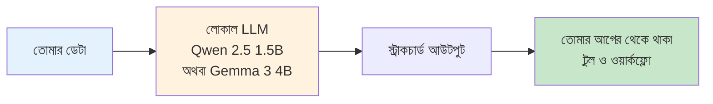

# AI Work Flow for Business

> **এন্টারপ্রাইজ অটোমেশন, ক্লাউড ছাড়াই।**
> লোকাল LLM, আসল ওয়ার্কফ্লো, কোনো ডেটা আপনার নেটওয়ার্কের বাইরে যায় না।

AI Work Flow for Business হলো **লোকাল ল্যাঙ্গুয়েজ মডেল** দিয়ে আসল এন্টারপ্রাইজ অপারেশন, ISP সাপোর্ট, ব্যাংক IT, কারখানার শিফট হ্যান্ডওভার — এসব অটোমেট করার প্যাটার্ন ও রেফারেন্স ইমপ্লিমেন্টেশনের একটা লাইব্রেরি।

এটা তাদের জন্য যাদের AI সাহায্য দরকার, কিন্তু কাস্টমার ডেটা, নেটওয়ার্ক লগ, বা ইন্টারনাল ডকুমেন্ট পাবলিক API-তে পাঠানোর উপায় নেই।

---

## ক্লাউড LLM কি এড়ানো সম্ভব?

কখনো কখনো **না**। সেনসিটিভ বিজনেস ডেটা এক্সপোজ না করে ক্লাউড LLM সেফলি ব্যবহার করতে একটা হাইব্রিড **"লোকাল গেটওয়ে"** আর্কিটেকচার দরকার।

একটা এন্টারপ্রাইজ তার প্রাইভেট লোকাল নেটওয়ার্কে একটা ছোট ওপেন-সোর্স AI মডেল (যেমন Llama 3) ডিপ্লয় করে — সিকিউরিটি ফায়ারওয়াল হিসেবে। ইউজার প্রশ্ন করলে:

1. লোকাল মডেল প্রাইভেট ডেটাবেসে সার্চ করে।
2. কাস্টমার নেম, IP অ্যাড্রেস, ইন্টারনাল ID — সব সেনসিটিভ তথ্য সরিয়ে জেনেরিক টোকেন দিয়ে রিপ্লেস করে।
3. শুধু অ্যানোনিমাইজড, অ্যাবস্ট্রাক্ট লজিক প্রবলেমটা এন্টারপ্রাইজ-গ্রেড ক্লাউড API-তে (Azure OpenAI, AWS Bedrock) পাঠানো হয় — যেটা জিরো-ডেটা-রিটেনশন পলিসিতে আবদ্ধ।
4. ক্লাউড LLM স্ট্রাকচার্ড রেসপন্স ফেরত পাঠায় লোকাল নেটওয়ার্কে।
5. লোকাল গেটওয়ে আবার আসল ডেটা বসিয়ে ইউজারকে ফাইনাল উত্তর দেয়।

ক্লাউড LLM কখনো র, সেনসিটিভ ডেটা দেখে না।

## এখান থেকে শুরু করো

-   :material-rocket-launch:{ .lg .middle } **[কেন AI Work Flow for Business?](../why-ai-work-flow.md)**

    ---

    এই প্রজেক্ট কী, কাদের জন্য, আর লোকাল-ফার্স্ট ডিজাইন কেন দরকার।

-   :material-play-circle:{ .lg .middle } **[চলতে দেখো](../demo.md)**

    ---

    ১.৫B-প্যারামিটার লোকাল মডেল দিয়ে আজকেই যা অটোমেট করতে পারো — কংক্রিট উদাহরণ।

-   :material-map:{ .lg .middle } **[অ্যাডপশন যাত্রা](../adoption/index.md)**

    ---

    "এটা কী" থেকে ৫+ টিমে প্রোডাকশনে চালানো পর্যন্ত চার-ধাপের পথ।

-   :material-sitemap:{ .lg .middle } **[আর্কিটেকচার](../architecture/index.md)**

    ---

    লেয়ারগুলো কীভাবে জোড়া লাগে: LM Studio, FastAPI, ChromaDB, আর তার উপরের মডিউলগুলো।

## কাদের জন্য এটা

| শ্রোতা | যা পাবে |
| --- | --- |
| **ISP / টেলকো অপারেশন** (NOC, ফিল্ড অপস, সাপোর্ট) | কমপ্লেইন ক্লাসিফিকেশন, টিকিট রাউটিং, রানবুক Q&A |
| **ব্যাংক IT টিম** | ইন্টারনাল হেল্পডেস্ক ট্রায়াজ, নেটওয়ার্ক অপস লগ বিশ্লেষণ, SOP লুকআপ |
| **কারখানার অপারেশন** | শিফট হ্যান্ডওভার সামারি, অ্যানোমালি ফ্ল্যাগিং, মেইনটেন্যান্স টিকিট ড্রাফট |
| **ইউনিভার্সিটি IT** *(পরের ধাপে)* | ল্যাব শিডিউলিং হেল্পডেস্ক, অ্যাডমিশন Q&A |

যদি তুমি সেনসিটিভ অপারেশনাল ডেটা হ্যান্ডেল করো, এই সাইট তোমার জন্য।

## কীভাবে কাজ করে

কোনো ডেটা তোমার নেটওয়ার্কের বাইরে যায় না। কোনো API কী নেই। কোনো ভেন্ডর লক-ইন নেই। তোমার ল্যাপটপে যে Python কোড চলে, সার্ভারেও সেটাই চলে।

## বক্সে কী কী আছে

| মডিউল | কী করে | ডক |
| --- | --- | --- |
| ISP Classifier | টপিক ও প্রায়োরিটি অনুযায়ী কাস্টমার কমপ্লেইন রাউট করে | [docs](../isp-classifier/index.md) |
| SLA System | SLA ব্রিচ ও ERP অ্যাপ্রুভাল মূল্যায়ন করে | [docs](../sla-system/index.md) |
| Qwen + RAG | তোমার রানবুক থেকে রিট্রিভাল-অগমেন্টেড উত্তর | [docs](../qwen-rag/index.md) |
| HR Assistant | ছুটি, উপস্থিতি, ও HR FAQ অটোমেশন | [docs](../hr-assistant/index.md) |
| Smart Gift AI | লোকাল LLM-এর উপর রেকমেন্ডেশন ইঞ্জিন | [docs](../smart-gift/index.md) |
| MLOps | মডেল রেজিস্ট্রি, মনিটরিং, A/B টেস্টিং, রিট্রেনিং | [docs](../mlops/index.md) |
| LLM Demos | প্যাটার্নের কাজ করা উদাহরণ (হায়ারার্কি, মিনি-কুইক, স্ট্রেস টেস্ট) | [docs](../llm-demos/index.md) |

## প্রজেক্ট পরিকল্পনা

এটা একটা চলমান প্রজেক্ট। লক করা সিদ্ধান্ত, শ্রোতা, আর বর্তমানে চলা আট-সেশনের ডকস পরিকল্পনার জন্য [ROADMAP.md](../ROADMAP.md) দেখো।

বর্তমান অবস্থা: **A2** (নতুন ইনফরমেশন আর্কিটেকচার + Why + Demo পেজ)। আগের A1 অডিট আর্কাইভ করা আছে `archive/AUDIT-2026-06-06.md`-এ, ঐতিহাসিক রেফারেন্সের জন্য।

## দ্রুত শুরু

1. [LM Studio](https://lmstudio.ai/) ইনস্টল করে **Qwen 2.5 1.5B Instruct** লোড করো (অথবা কঠিন রিজনিংয়ের জন্য **Gemma 3 4B**)।
2. লোকাল সার্ভার `http://localhost:1234/v1`-এ স্টার্ট করো।
3. [Getting Started](../getting-started/index.md) গাইড ওপেন করে তোমার প্রথম স্ক্রিপ্ট চালাও।

ব্যস। কোনো ক্লাউড অ্যাকাউন্ট নেই, কোনো API কী নেই, কোনো টেলিমেট্রি নেই।

!!! note "আমাদের এই টুলকিট আপনারা বাংলায় পড়তে পারেন"

    আমাদের এই টুলকিট আপনারা বাংলায় পড়তে পারেন — [PROJECT_SUMMARY_bangla.md](../PROJECT_SUMMARY_bangla.md) ফাইলে এক্সিকিউটিভ সামারি, টেক স্ট্যাক, আর ডিপ্লয়মেন্ট চেকলিস্ট আছে। সেখান থেকে যেকোনো মডিউলে যাও — ISP ক্লাসিফায়ার, RAG, HR অ্যাসিস্ট্যান্ট, SLA সিস্টেম, MLOps।

!!! question "কথা বলতে চাচ্ছেন?"

    আমাকে WhatsApp-এ মেসেজ করতে পারেন: [+8801713095767](https://wa.me/+8801713095767)। আমি যেহেতু রোবট, কল থেকে মেসেজেই অভ্যস্ত৷ আমার সব আলাপ [Medium](https://medium.com/@raqueeb), [Facebook](https://www.facebook.com/raqueeb) এবং [LinkedIn](https://www.linkedin.com/in/raqueeb/)-এ পাবেন। এর পাশাপাশি [YouTube](https://www.youtube.com/@raqueeb)-এ ভিডিও দেখতে পারেন।

    আমার মাথায় আর কী কী ঘোরে সেটাও পাবেন [এখানে](https://medium.com/@raqueeb/print-media-write-ups-2024-25-f2896ce92f7b)।
