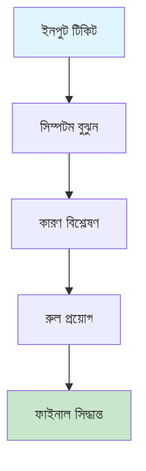
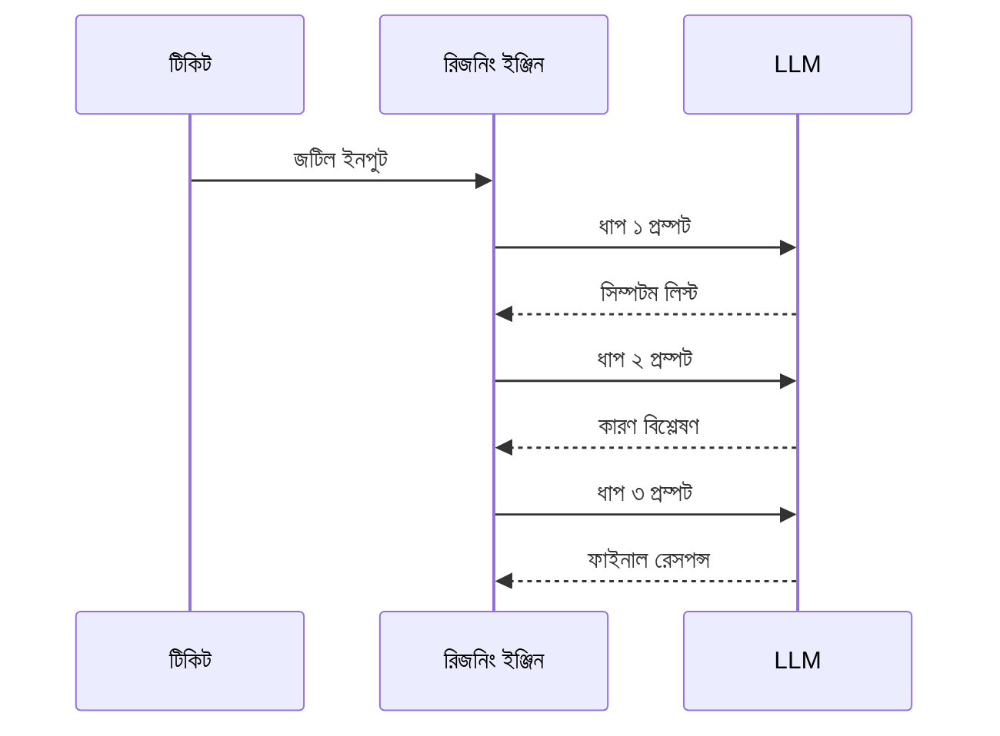

# ISP রিজনিং - বাংলা

AI-পাওয়ার্ড রিজনিং সিস্টেম, জটিল টিকিট রেজোলিউশনের জন্য। একটা উদাহরণ দিচ্ছি - গ্রাহক বলছে "আমার নেটওয়ার্ক কাজ করছে না"। এখন এটা বিভিন্ন কারণে হতে পারে - মডেম প্রোবলেম, কেবল কাটা, ISP সার্ভার ডাউন, বা গ্রাহকের রাউটার সমস্যা। সাধারণ সিস্টেমে যেকোনো একটা কারণ ধরে নেওয়া হয়, কিন্তু এই সিস্টেমে প্রতিটা সম্ভাবনা পরীক্ষা করে, আর সবচেয়ে সম্ভাবিত সমাধান দেয়।

## রিজনিং আর্কিটেকচার

রিজনিং প্রসেসে কয়েকটা ধাপ আছে। প্রথমে ইনপুট টিকিট থেকে সিম্পটম বুঝতে হয় - গ্রাহক আসলে কী সমস্যা বলছে। তারপর কারণ বিশ্লেষণ করতে হয় - কেন এই সমস্যা হতে পারে। এরপর রুল অ্যাপ্লাই করতে হয় - কোন রুল অনুযায়ী সিদ্ধান্ত নেওয়া হবে। আর শেষে ফাইনাল সিদ্ধান্ত দিতে হয় - গ্রাহককে কী উত্তর দেওয়া হবে।

## চেইন-অফ-থট প্রসেস

চেইন-অফ-থট প্রসেসে AI ধাপে ধাপে চিন্তা করে। টিকিট থেকে সিম্পটম লিস্ট বের করে, তারপর প্রতিটা সিম্পটমের কারণ বিশ্লেষণ করে, আর শেষে সব তথ্য মিলিয়ে ফাইনাল রেসপন্স দেয়। এতে সিদ্ধান্তের পেছনে যুক্তি থাকে, স্বচ্ছতা বাড়ে।

## সুবিধা

এই সিস্টেমের কিছু সুবিধা আছে। Improved Accuracy হলো মাল্টি-স্টেপ রিজনিং দিয়ে সঠিক সিদ্ধান্ত নেওয়া। Transparency হলো ডিসিশন লজিক দেখাতে পারা, কেন এই সিদ্ধান্ত নেওয়া হয়েছে সেটা বোধগম্য। Error Reduction হলো স্টেপ-বাই-স্টেপ ভেরিফিকেশন দিয়ে ভুল কমানো।

| সুবিধা | বিবরণ |
|--------|---------|
| Improved Accuracy | মাল্টি-স্টেপ রিজনিং |
| Transparency | ডিসিশন লজিক দেখায় |
| Error Reduction | স্টেপ-বাই-স্টেপ ভেরিফিকেশন |