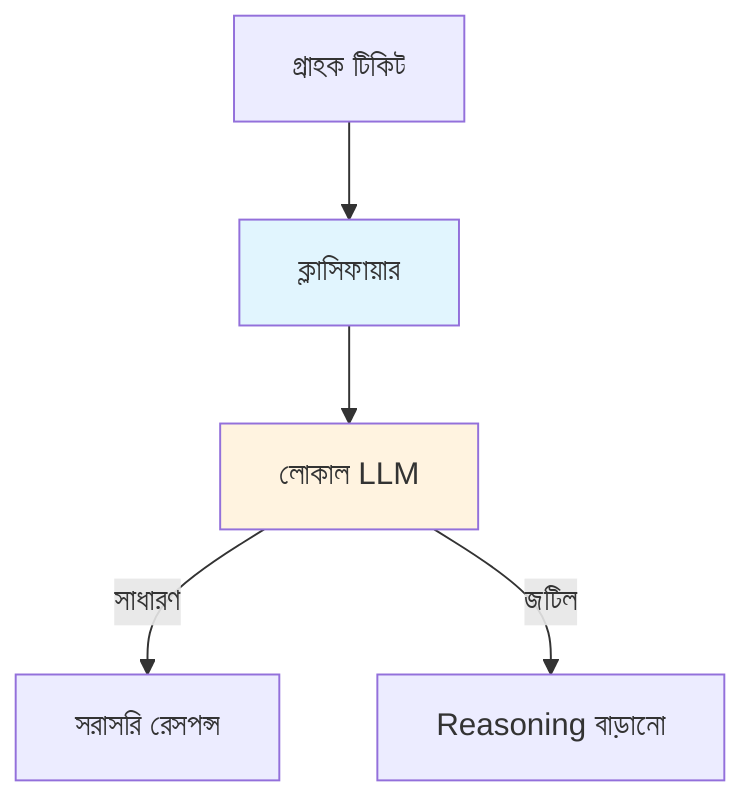

# ISP ক্লাসিফায়ার - বাংলা

ইন্টারনেট সার্ভিস প্রোভাইডার টিকিট ক্লাসিফিকেশন সিস্টেম। মনে করো একজন গ্রাহক কল করলো, বলছে "আমার ইন্টারনেট ধীরে চলছে"। এখন সেই টেক্সট থেকে সমস্যাটা বুঝতে হবে - এটা স্পিড সমস্যা নাকি বিলিং সমস্যা? এই সিস্টেম সেটাই করে।

## সিস্টেম ওভারভিউ

কাজের ফ্লো এমন - গ্রাহকের টিকিট আসে, ক্লাসিফায়ার সেটা নেয়, লোকাল LLM সেটা বিশ্লেষণ করে, আর সিদ্ধান্ত দেয়। সাধারণ সমস্যা হলে সরাসরি রেসপন্স দেয়, জটিল সমস্যা হলে reasoning enhanced মডেল ব্যবহার করে।

## ISP কোড সাপোর্ট করে

সিস্টেমে কিছু স্ট্যান্ডার্ড কোড আছে যা সমস্যার ধরন বোঝায়। ISP-001 হলো বিলিং সমস্যা - যেমন পেমেন্ট প্রসেস হয়নি। ISP-006 হলো কানেকশন সমস্যা - যেমন ডিসকানেকশন হয়ে গেছে। ISP-047 হলো স্পিড সমস্যা - যেমন ধীরে চলছে। ISP-089 হলো সার্ভার সমস্যা - যেমন সার্ভার ডাউন।

| কোড | ক্যাটাগরি | উদাহরণ |
|-----|----------|---------|
| ISP-001 | বিলিং | পেমেন্ট প্রসেস হয়নি |
| ISP-006 | কানেকশন | ডিসকানেকশন |
| ISP-047 | স্পিড | ধীরে চলছে |
| ISP-089 | সার্ভার | সার্ভার ডাউন |

## কন্টেন্ট

আরও বিস্তারিত জানতে ISP ক্লাসিফায়ার ডকুমেন্টেশন দেখো।