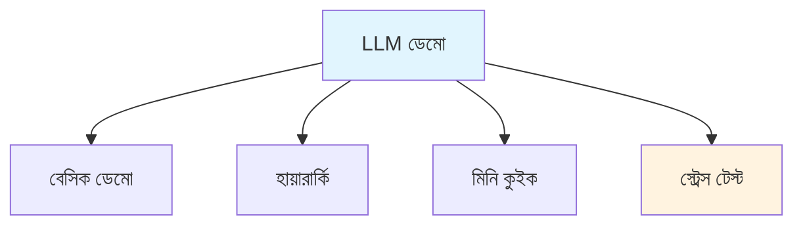
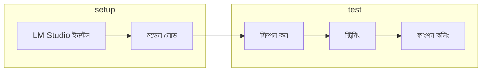

# LLM ডেমো - বাংলা

লোকাল LLM ডেমো আর টেস্টিং কালেকশন। এখানে বিভিন্ন ধরনের ডেমো আছে - বেসিক থেকে অ্যাডভান্সড। তুমি চাইলে সিম্পল API কল দিয়ে শুরু করো, ধীরে ধীরে জটিল ফিচারে যাও।

## ডেমো টাইপ

ডেমোগুলো বিভিন্ন ধরনের। বেসিক ডেমোতে প্রাথমিক কলের উদাহরণ আছে। হায়ারার্কি ডেমোতে মাল্টি-লেভেল ক্লাসিফিকেশনের উদাহরণ আছে। মিনি কুইক ডেমোতে দ্রুত প্রোটোটাইপিংয়ের উদাহরণ আছে। আর স্ট্রেস টেস্ট ডেমোতে পারফরম্যান্স বেঞ্চমার্কের উদাহরণ আছে।

## LM Studio ডেমো

LM Studio দিয়ে ডেমো চালানোর ফ্লো আছে। শুরুতে LM Studio ইনস্টল করতে হবে, তারপর মডেল লোড করতে হবে। এরপর সিম্পল কল, স্ট্রিমিং, আর ফাংশন কলিং টেস্ট করা যাবে।

## ডেমো কন্টেন্ট

প্রতিটা ডেমোর নিজস্ব স্কিল লেভেল আছে। LM Demo হলো বেসিক API কল, বিগিনাররা শুরু করুক এখান থেকে। Hierarchy হলো মাল্টি-লেভেল ক্লাসিফিকেশন, ইন্টারমিডিয়েটদের জন্য। Mini Quick হলো র‍্যাপিড প্রোটোটাইপিং, বিগিনারদের জন্যও সহজ। Stress Test হলো পারফরম্যান্স বেঞ্চমার্ক, অ্যাডভান্সডদের জন্য।

| ডেমো | বিবরণ | স্কিল লেভেল |
|------|--------|------------|
| LM Demo | বেসিক API কল | বিগিনার |
| Hierarchy | মাল্টি-লেভেল ক্লাসিফিকেশন | ইন্টারমিডিয়েট |
| Mini Quick | দ্রুত প্রোটোটাইপিং | বিগিনার |
| Stress Test | পারফরম্যান্স বেঞ্চমার্ক | অ্যাডভান্সড |