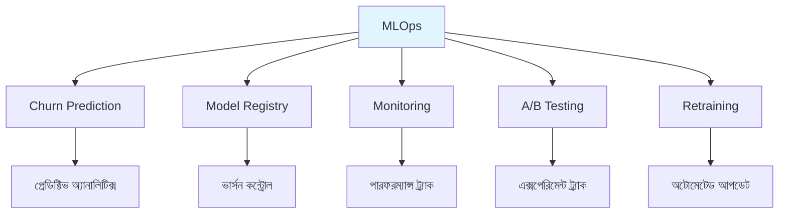

# MLOps - বাংলা

মেশিন লার্নিং অপারেশনস আর মডেল ম্যানেজমেন্টের বিস্তারিত গাইড। একটা মডেল তৈরি করা কঠিন না, কিন্তু সেটাকে প্রোডাকশনে রাখা, মনিটর করা, আর আপডেট রাখা - এগুলোই আসল চ্যালেঞ্জ। এই সেকশনে সেই চ্যালেঞ্জগুলো সমাধান করার উপায় আছে।

## টপিক্স ওভারভিউ

MLOps-এ কয়েকটা মূল বিষয় আছে। প্রথমত churn prediction - গ্রাহকদের চলে যাওয়ার সম্ভাবনা আগে থেকে বুঝে নেওয়া। দ্বিতীয়ত model registry - কোন মডেল কখন ব্যবহার করা হয়েছে সেটা ট্র্যাক করা। তৃতীয়ত monitoring - মডেলের পারফরম্যান্স পর্যবেক্ষণ করা। চতুর্থত A/B testing - দুটো মডেলের মধ্যে তুলনা করা। আর পঞ্চমত retraining - ডেটা বদলালে মডেলকে আপডেট করা।

## টপিক্স বিস্তারিত

প্রতিটা টপিকের নিজস্ব কাজ আছে। Churn prediction-এ কাস্টমার টার্নওভার প্রেডিক্ট করা হয়। Model registry-এ মডেলের ভার্সন আর ট্র্যাকিং থাকে। Monitoring-এ মডেলের পারফরম্যান্স অবজার্ভ করা হয়। A/B testing-এ মডেল তুলনা আর ভ্যালিডেশন করা হয়। Retraining-এ ডেটা ড্রিফট হ্যান্ডলিং করা হয়।

| টপিক | বিবরণ |
|-----|--------|
| Churn Prediction | কাস্টমার টার্নওভার প্রেডিকশন |
| Model Registry | মডেল ভার্সনিং আর ট্র্যাকিং |
| Monitoring | মডেল পারফরম্যান্স অবজার্ভেশন |
| A/B Testing | মডেল তুলনা আর ভ্যালিডেশন |
| Retraining | ডেটা ড্রিফট হ্যান্ডলিং |