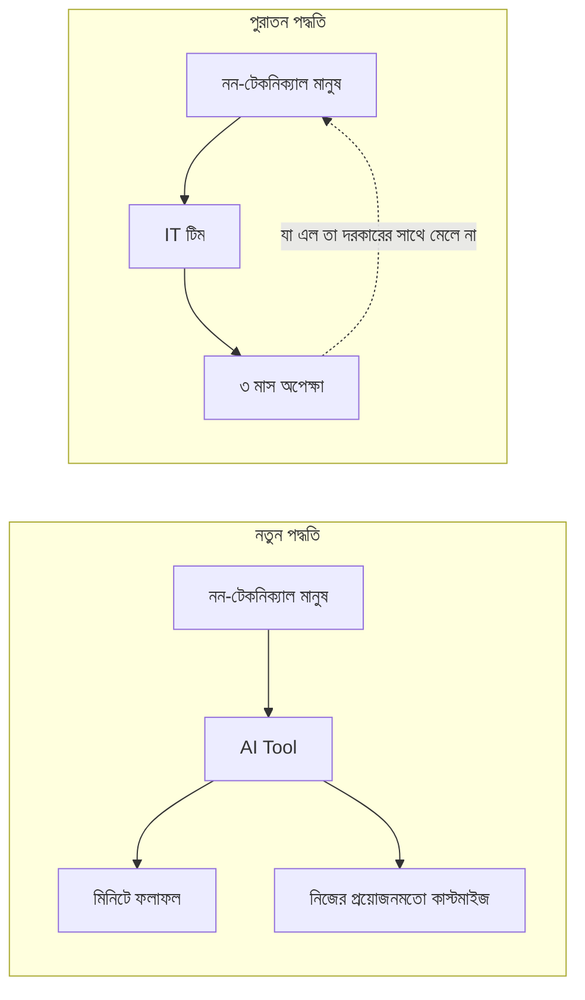
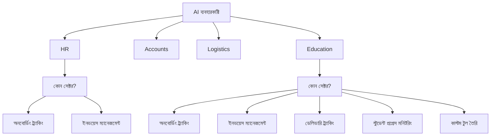
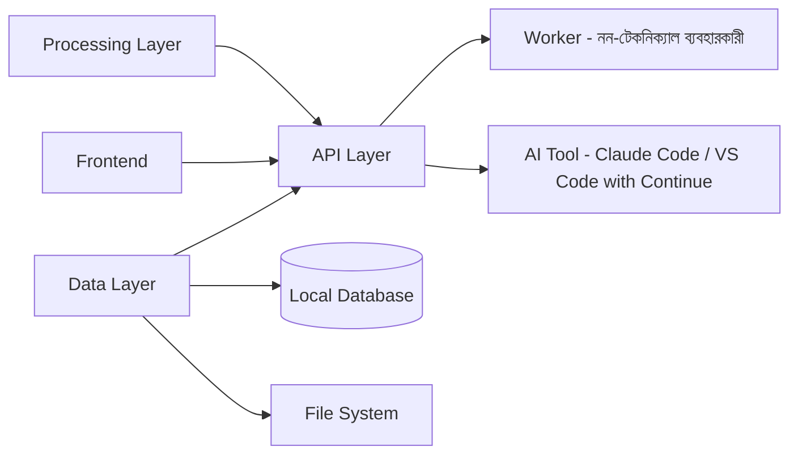

# সহজ আলাপ

## কেন এই প্রজেক্ট?

এই ডকুমেন্টেশন প্রজেক্টের মূল উদ্দেশ্য হলো **নন-টেকনিক্যাল মানুষদের** জন্য AI এবং SLM (Small Language Model) এর সুযোগ তুলে ধরা।

## পুরাতো ও নতুন স্টাইল / Old vs New Approach

## AI এর সুবিধা / AI Benefits

| আগে থেকে দক্ষতা | ছিল | ছিল না |
|------------------|-----|--------|
| AI এর সাহায্যে | আরো দ্রুত | একদম নতুন সুযোগ |
| সময় বাঁচায় | হ্যাঁ | হ্যাঁ |

## যে কাজে AI সাহায্য করতে পারে / Use Cases

## সিস্টেম আর্কিটেকচার / System Architecture

## শুরু করুন / Quick Start

- **AI Tool বাছাই করুন** — Claude Code, Cursor, Continue, বা Windsurf
- **নিজের সমস্যা বলুন** — সহজ বাংলায় বা ইংরেজিতে
- **ফলাফল পরীক্ষা করুন** — নিজের ল্যাপটপে চালান
- **আবশ্যক হলে IT সাহায্য নিন** — শুধু ইন্টিগ্রেশনের জন্য

## প্রযুক্তি স্ট্যাক / Tech Stack

- **LLM**: Gemma 2B, Qwen, Llama (Local)
- **Framework**: Python, React
- **Database**: SQLite, PostgreSQL
- **Documentation**: MkDocs (Material theme)
- **Deployment**: GitHub Pages

## ইন্টিগ্রেশনের জন্য

## গুরুত্বপূর্ণ বিষয় / Key Points

> **এটা ধরতে পারলে খেলা পাল্টে যাবে**

AI টেকনিক্যাল মানুষের চেয়ে নন-টেকনিক্যাল মানুষদের বেশি সাহায্য করবে। এটা একটা আশীর্বাদের মতো।

এই কথাটা বললে সবাই হাসে। যারা আমাকে গুরু মানে তারাও আমার পাগলামিকে প্রশয় দেয়। হাসার কারণটা বুঝি। আমরা ভাবি AI মানেই কোড, সার্ভার, ডেটা সায়েন্স। মানে টেকনিক্যাল মানুষের জিনিস।

নন-টেকনিক্যাল মানুষ এটা দিয়ে কী করবে?

হুম। থিঙ্ক অ্যাগেইন। একজন সফটওয়্য্যার ডেভেলপার আগেও কোড লিখতে পারতেন। AI আসার পরে তিনি আরো দ্রুত লিখতে পারছেন। তার দক্ষতা বাড়ল, সময় বাঁচল। ভালো হলো সবার জন্য। কিন্তু একজন HR ম্যানেজার যিনি কোড জানেন না - তিনি আগে কী করতেন? IT টিমের কাছে যেতেন। বলতেন একটা ছোট টুল লাগবে - নতুন মানুষকে অনবোর্ডিং ট্র্যাক করার জন্য। IT বলত - সিরিয়ালে আসেন মিয়া, তিন মাস লাগবে। তিন মাস পরে যা আসত সেটা আবার তাঁর দরকারের সাথে মেলাতে আরেকটা পিচডি লাগবে। এখন সেই HR ম্যানেজার Claude Code খুলে বলতে পারেন - "আমার একটা টুল দরকার যেটায় নতুন কর্মীর নাম, জয়েনিং ডেট, কোন ডকুমেন্ট জমা দিয়েছে, কোনটা বাকি - এগুলো দেখা যাবে।" AI সেটা বানিয়ে দেবে। ওটা নিজের ল্যাপটপে সুন্দর চলবে। সিস্টেমে চালাতে হয়তোবা দরকার IT এ ইন্টিগ্রেশন, তবে তিন মাস লাগবে না। এটাই পার্থক্য।

টেকনিক্যাল মানুষ আগেও পারতেন, এখন আরো ভালো পারছেন। কিন্তু নন-টেকনিক্যাল মানুষ আগে পারতেনই না। এখন পারছেন। এটা দক্ষতা বৃদ্ধি না - এটা সম্পূর্ণ নতুন সুযোগ। একটা আশির্বাদ। টেকনিক্যাল মানুষদের আর তেল দিতে হবে না।

তবে, আমি কখনো তেল খেতাম না। আসল কথা হচ্ছে, একজন অ্যাকাউন্টস ম্যানেজার জানেন ইনভয়েস কোথায় আটকায়। একজন লজিস্টিকস অফিসার জানেন কোন ডেলিভারিতে বারবার সমস্যা হয়। একজন স্কুলে প্রিন্সিপাল জানেন কোন ছাত্র কোন বিষয়ে পিছিয়ে পড়ছে। এই জ্ঞানটা সবচেয়ে দামি। কিন্তু আগে এই জ্ঞানকে কাজে লাগানোর জন্য একজন ডেভেলপার লাগত।

এখন আর লাগে না। আর সেই কারণেই নন-টেকনিক্যাল মানুষের জন্য AI-এর সুযোগটা অনেক বড়। তাঁরা হঠাৎ এমন একটা ক্ষমতা পেয়েছেন যেটা আগে শুধু টেকনিক্যাল মানুষের কাছে ছিল। হেসে নিন আপাতত। বরং আমি বলবো - এটা ধরতে পারলে খেলা পাল্টে যাবে।

আগে শুধু টেকনিক্যাল মানুষের কাছে ছিল। হেসে নিন আপাতত। বরং আমি বলবো - এটা ধরতে পারলে খেলা পাল্টে যাবে।
