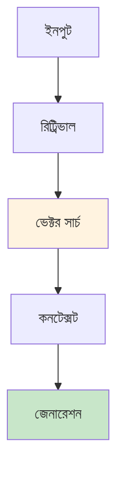
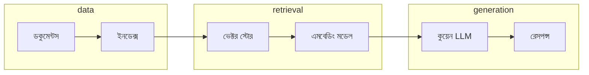
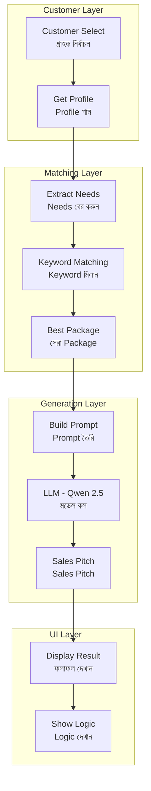
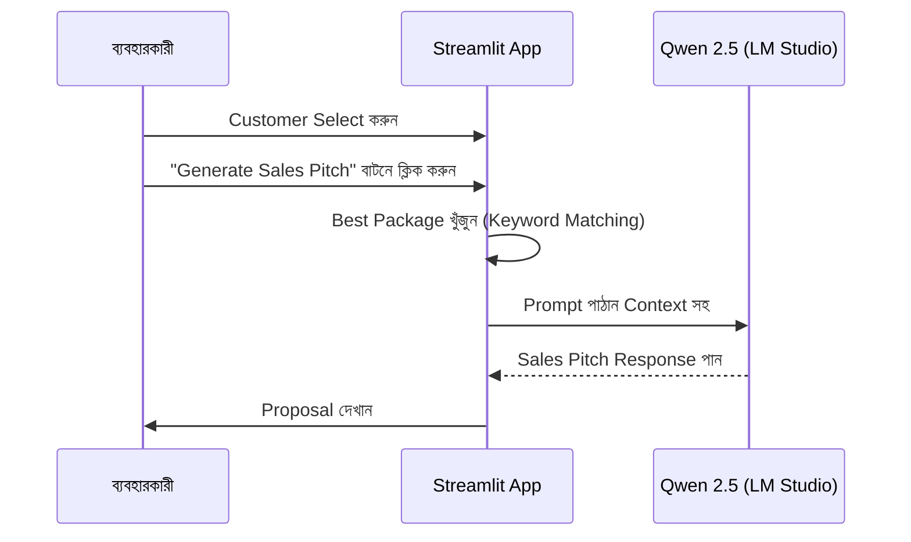

# কুয়েন RAG - বাংলা

Retrieval-Augmented Generation সিস্টেম, কুয়েন মডেল ব্যবহার করে। একটা উদাহরণ দিচ্ছি - তুমি একটা কোম্পানি চালাও, হাজার হাজার ডকুমেন্ট আছে। গ্রাহক জিজ্ঞেস করলো "আমার বিল কবে জমা হয়েছে?" সাধারণ সিস্টেমে শুধু কীওয়ার্ড খোঁজে, কিন্তু এই সিস্টেমে সামগ্রিক বুঝে, ডকুমেন্টের মধ্যে সঠিক তথ্য খুঁজে বের করে, আর সেই তথ্য দিয়ে উত্তর তৈরি করে।

## RAG আর্কিটেকচার

RAG প্রসেসে কয়েকটা ধাপ আছে। প্রথমে ইনপুট নেওয়া হয় - গ্রাহকের প্রশ্ন। তারপর retrieval হয় - প্রাসঙ্গিক ডকুমেন্ট খোঁজা। এরপর vector search হয় - ডকুমেন্টের মধ্যে সবচেয়ে মিল খোঁজা। তারপর context তৈরি হয় - প্রাসঙ্গিক অংশ বের করা। আর শেষে generation হয় - উত্তর তৈরি করা।



## কম্পোনেন্ট

সিস্টেমে তিনটা মূল অংশ আছে। ডেটা অংশে Documents আর Index আছে, যেখানে ডকুমেন্ট সংরক্ষণ করা হয়। retrieval অংশে Vector Store আর Embedding Model আছে, যেখানে সার্চ করা হয়। generation অংশে Qwen LLM আছে, যেখানে উত্তর তৈরি হয়।



## ফিচার

সিস্টেমে কিছু মূল ফিচার আছে। Semantic Search মানে প্রশ্নের অর্থ বোঝা, শুধু কীওয়ার্ড না। Context-Aware মানে ডকুমেন্ট থেকে রেফারেন্স নেওয়া, পুরো পরিপ্রেক্ষিত বোঝা। Fact-Based মানে সঠিক তথ্য দেওয়া, নিশ্চিত করা যে উত্তর সঠিক।

| ফিচার | বিবরণ |
|--------|---------|
| Semantic Search | প্রশ্নের অর্থ বোঝা |
| Context-Aware | ডকুমেন্ট থেকে রেফারেন্স |
| Fact-Based | সঠিক তথ্য দেওয়া |

## ISP Sales Bot (isp_sales.py)

এটা একটা intelligent sales assistant যেটা ISP customers-দের জন্য personalized Bangla/English sales pitches তৈরি করে।

### বৈশিষ্ট্যগুলো

- **Customer Profiles**: গ্রাহকের বর্তমান plan এবং requirements track করুন
- **Product Catalog**: Keywords সহ একাধিক ISP packages
- **Smart Matching**: Keyword-ভিত্তিক package recommendation
- **Bilingual Output**: Bangla + English sales pitches

### Architecture বা কাঠামো



### ব্যাখ্যা

এই ডায়াগ্রামে চারটি layer আছে:
1. **Customer Layer (গ্রাহক স্তর)**: এখানে customer select করা হয় এবং তাদের profile fetch করা হয়
2. **Matching Layer (মিলকরণ স্তর)**: এখানে customer's needs বের করা হয় এবং keyword matching দিয়ে best package খুঁজে বের করা হয়
3. **Generation Layer (তৈরির স্তর)**: এখানে prompt build করা হয়, LLM call করা হয় এবং sales pitch তৈরি হয়
4. **UI Layer (ইউজার ইন্টারফেস)**: এখানে result এবং internal logic দেখানো হয়

### Workflow বা কাজের প্রক্রিয়া



### Workflow ব্যাখ্যা

এই ডায়াগ্রামে দেখুন কি কি ধাপ আছে:
1. Customer Select করুন - dropdown থেকে একটি customer বেছে নিন
2. বাটনে ক্লিক - "Generate Sales Pitch" বাটনে ক্লিক করুন
3. Package খুঁজুন - Appটা keyword matching দিয়ে best package খুঁজে বের করে
4. Prompt পাঠান - Appটা LLM কে prompt পাঠায়
5. Response পান - LLM থেকে sales pitch ফিরে আসে
6. Proposal দেখান - Streamlit interface-এ result দেখায়

### Sample Customer Profiles

| Customer | Current Plan | Needs | Best Match |
|----------|--------------|-------|------------|
| Arif Ahmed | 5 Mbps | YouTube, browsing | Standard Plan (P1) |
| Sultana Razia | 10 Mbps | Netflix, 4K movies | Entertainment Pro (P2) |
| Tanvir Hasan | 20 Mbps | Work from home, VPN | Business Executive (P3) |
| Farhana Islam | None (New) | Social media, research | Student Starter (P4) |

### Product Catalog বা পণ্য তালিকা

| Package | Speed | Keywords |
|---------|-------|----------|
| P1: Standard | 10 Mbps | YouTube, browsing |
| P2: Entertainment Pro | 20 Mbps | Netflix, 4K, streaming |
| P3: Business Executive | 100 Mbps | VPN, business, Zoom |
| P4: Student Starter | 5 Mbps | student, affordable |

### App চালানো

```bash
cd c:\Downloads\classifier-app\qwen-rag
streamlit run isp_sales.py
```

Access করুন: http://localhost:8501

### Requirements বা প্রয়োজনীয়তা

- LM Studio `http://localhost:1234` তে চালু থাকতে হবে
- Qwen 2.5 1.5B model load করা থাকতে হবে
- Streamlit install করা থাকতে হবে

### সুবিধাগুলো

| সুবিধা | বিবরণ |
|--------|------------|
| Personalization | গ্রাহকের needs অনুযায়ী tailored pitches |
| Bilingual | Bangla trust বাড়ায়, English details ব্যাখ্যা করে |
| Speed | local LLM দিয়ে real-time generation |
| Privacy | সব processing local machine-এ হয় |

---

## সম্পর্কিত ডকুমেন্টেশন

- [শুরু করুন](../../getting-started/index.md)
- [ISP Classifier](../isp-classifier/index.md)
- [Enterprise Apps](../enterprise-apps/index.md)