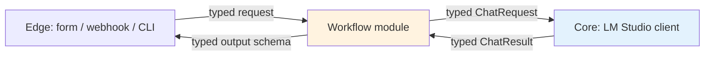

# Reference — Python API

> **পাঠক:** যে ইঞ্জিনিয়ার একটা Workflow মডিউলকে নিজের অ্যাপ্লিকেশনে integrate করছে, অথবা কোনো মডিউলে নতুন output type যোগ করছে। সিস্টেমটা শুধু **ব্যবহার** করতে চাইলে, [CLI](cli.md) হলো higher-level entry point।

এই পেজ ডকুমেন্ট করে প্রতিটা মডিউল যে typed contract expose করে। লেয়ার বাউন্ডারি পার করে এমন সবকিছু ([Architecture: data flow](../../architecture/data-flow.md)) একটা Pydantic মডিউল — free-form string না। এই contract-ই হলো single source of truth।

---

## Typed contract

পাঁচ-লেয়ার আর্কিটেকচারে তিনটা বাউন্ডারি আছে যেখানে typed object পার হয়:



`Core` বাউন্ডারির মালিক এই প্রজেক্ট (LM Studio client wrapper)। `Workflow` বাউন্ডারি প্রতিটা মডিউল প্যাকেজ expose করে। `Edge` বাউন্ডারি তোমার অ্যাপ্লিকেশন কোড consume করে।

তোমাকে প্রায় কখনো নিজে `ChatRequest` বানাতে হবে না — `Core` wrapper বানায়। কিন্তু `ChatResult` consumer (validator) আর `TriageRequest` / `RAGRequest` / `ShiftNote` অ্যাপ্লিকেশন বাউন্ডারিতে তুমি বানাও।

---

## LM Studio client

> **Source:** `aiwf.core.lm_studio`
> **Stability:** stable (`ChatRequest` ও `ChatResult` shape frozen ও ভার্সনযুক্ত)।

### `ChatRequest`

Workflow লেয়ার Core লেয়ারের কাছে হাতে দেয় সেই object — মডেল কল করতে।

```python
from pydantic import BaseModel, Field
from typing import Literal

class ChatRequest(BaseModel):
    messages: list[dict[str, str]]   # [{"role": "system|user|assistant", "content": "..."}]
    temperature: float = Field(0.0, ge=0.0, le=2.0)
    max_tokens: int = Field(512, ge=1, le=4096)
    stop: list[str] | None = None
    seed: int | None = None          # reproducible eval-এর জন্য
    response_format: Literal["text", "json_object"] = "text"
```

`messages` লিস্ট OpenAI-compatible: প্রতিটা মেসেজে `role` (`system` / `user` / `assistant`) আর `content` স্ট্রিং। Workflow লেয়ার এই লিস্ট বানানোর দায়িত্বে (system prompt + user content + optional few-shot examples)।

### `ChatResult`

Core লেয়ার Workflow লেয়ারে ফেরত দেয় সেই object।

```python
class TokenUsage(BaseModel):
    prompt_tokens: int
    completion_tokens: int
    total_tokens: int

class ChatResult(BaseModel):
    content: str                            # raw model text
    finish_reason: Literal["stop", "length", "error"]
    usage: TokenUsage
    model_id: str                           # e.g. "qwen2.5-1.5b-instruct"
    latency_ms: int                         # HTTP call-এর wall-clock
    request_id: str                         # audit log correlation-এ
```

Raw `content` হলো মডেল যা ফেরত দিয়েছে। **এটা এখনো ব্যবহার করা safe না।** Edge-এ পাঠানোর আগে Workflow লেয়ারকে validator (JSON parse, Pydantic validate, containment check ইত্যাদি) চালাতে হবে।

### `LMStudioClient`

```python
from aiwf.core.lm_studio import LMStudioClient, ChatRequest, ChatResult

client = LMStudioClient(
    base_url="http://localhost:1234/v1",  # default
    timeout_s=10.0,                       # default
    max_retries=2,                        # default; শুধু 5xx ও connection error-এ
    healthcheck_on_init=True,             # default; LM Studio না পেলে raise করে
)

result: ChatResult = client.chat(ChatRequest(
    messages=[{"role": "user", "content": "Classify this ticket…"}],
    temperature=0.0,
    max_tokens=256,
    response_format="json_object",
    seed=42,
))
```

**Error semantics।** Client transport / 5xx / 4xx (429 বাদে)-তে raise করে। কিন্তু refusal সহ 200-এ raise করে না — সেগুলো `finish_reason="stop"` দিয়ে যেটুকু `content` মডেল দিয়েছে সেটা নিয়ে ফেরত আসে। Refusal সামলানো validator-এর কাজ।

**Retries।** Retries bounded (default 2) এবং connection error, 5xx, 429 (`Retry-After` সহ) — এই তিনটাতে fire করে। Client 4xx-এ (429 বাদে) retry করে না — এগুলো caller error।

**Health check।** `healthcheck_on_init=True` constructor-এ একবার `/v1/models` কল করে। LM Studio পাওয়া না গেলে client তোমার অ্যাপ্লিকেশন import-এর সময়ই `LMStudioUnreachable` raise করে, প্রথম request-এ না। এটা intentional — boot-এ fail করো, request-এর মাঝখানে না।

---

## `Workflow.run()` contract

প্রতিটা মডিউল প্যাকেজ (`isp_classifier`, `sla_system`, `qwen_rag`, `factory_summary` ইত্যাদি) এই signature-সহ একটা top-level function expose করে:

```python
from aiwf.core.types import ModuleMeta

def run(request: <ModuleInput>, *, actor: Actor, request_id: str) -> <ModuleOutput>:
    # Bengali gloss: 'মডিউলটা request-এ চালাও। Pure (LM Studio call ছাড়া কোনো I/O নেই)।'
    pass
```

প্রতিটা মডিউলের জন্য `run()` contract একই। যেটা আলাদা সেটা **type**।

### Common types

```python
from pydantic import BaseModel
from datetime import datetime

class Actor(BaseModel):
    user_id: str               # কে জিজ্ঞেস করছে
    tenant_id: str             # multi-tenant বাউন্ডারি
    role: str                  # "operator", "service", "system"

class ModuleMeta(BaseModel):
    # Bengali gloss: 'প্রতিটা মডিউল output-এ audit ও debugging-এর জন্য attached।'
    pass
    module_name: str           # "sla_system.classifier"
    module_version: str        # semver
    request_id: str
    started_at: datetime
    finished_at: datetime
    model_id: str
    usage: TokenUsage
    latency_ms: int
```

`ModuleMeta` সবসময় মডিউলের output-এ sibling field হিসেবে থাকে (যেমন `result.meta`)। Audit log পড়ে, test harness পড়ে, রাত ২টায় on-call ইঞ্জিনিয়ার পড়ে।

### `run()` pure

`run()` LM Studio-এর call ছাড়া অন্য কোনো I/O করে না। Environment variable পড়ে না, filesystem স্পর্শ করে না, database connection খোলে না, log-ও করে না। এগুলো সব অ্যাপ্লিকেশনের কাজ।

এই property-ই `run()`-কে stub client দিয়ে testable আর machine-এ machine-এ reproducible বানায়।

---

## মডিউল contract

প্রতিটা মডিউলের input ও output type। মডিউলের নামের পাশের বন্ধনীতে Python import path।

### `sla_system.classifier` — tier-1 complaint triage

```python
class TriageRequest(BaseModel):
    subject: str
    body: str
    customer_tier: Literal["platinum", "gold", "silver"]
    timestamp: datetime | None = None   # SLA calculation-এর জন্য

class TriageOutput(BaseModel):
    category: Literal[
        "connectivity", "hardware", "billing",
        "service_request", "complaint", "outage", "other"
    ]
    priority: Literal["P1", "P2", "P3"]
    suggested_owner: str                # queue name বা role
    confidence: float                   # 0.0 থেকে 1.0
    rationale: str                      # এক বাক্য; মডেল output থেকে cited

class TriageResult(BaseModel):
    output: TriageOutput
    meta: ModuleMeta
```

**Source।** [ISP support case study](../../case-studies/isp-support.md) ব্যবহার করে।

### `qwen_rag.answer` — RAG over an internal corpus

```python
class RAGRequest(BaseModel):
    question: str
    corpus_id: str                      # কোন ChromaDB collection
    top_k: int = 4
    min_score: float = 0.0              # cosine threshold; নিচে গেলে "I don't know"
    require_citation: bool = True       # True হলে answer-এ citation_id থাকতেই হবে

class Citation(BaseModel):
    chunk_id: str                       # retrieved set-এ থাকতে হবে
    source_doc: str                     # filename বা SOP id
    version: str                        # semver বা date

class RAGOutput(BaseModel):
    answer: str
    citations: list[Citation]           # 1..top_k, relevance অনুসারে
    retrieval_trace: list[str]          # মডেল যে chunk_id দেখেছে, audit-এর জন্য

class RAGResult(BaseModel):
    output: RAGOutput
    meta: ModuleMeta
```

**Validation rule** (মডিউলের output validator enforce করে, type system না):

- প্রতিটা `citation.chunk_id` অবশ্যই `retrieval_trace`-এ থাকতে হবে। লঙ্ঘনে validator `CitationNotInRetrieval` raise করে।
- `require_citation=True` হলে `citations` খালি থাকলে result-কে "I don't have that information" দিয়ে প্রতিস্থাপন করা হয় ([bank case study](../../case-studies/bank-it.md)-এর CISO bar)।
- মডেলের `answer`-এ retrieved chunk-এর union-এ নেই এমন phrase থাকলে result reject হয়, একবার re-prompt হয়। দ্বিতীয়বারও fail হলে request human review-এ flag হয়।

**Source।** [bank IT case study](../../case-studies/bank-it.md) ব্যবহার করে।

### `factory_summary.summarize` — shift handover summarization

```python
class ShiftNote(BaseModel):
    line: Literal["L1", "L2"]
    shift: Literal["morning", "afternoon", "night"]
    raw_text: str                       # line leader-এর note
    written_at: datetime
    author_id: str

class MachineIssue(BaseModel):
    machine_id: str
    severity: Literal[1, 2, 3]         # 1 = cosmetic, 2 = needs attention, 3 = safety
    note: str

class ShiftSummary(BaseModel):
    line: Literal["L1", "L2"]
    shift: Literal["morning", "afternoon", "night"]
    machine_issues: list[MachineIssue]
    qa_defects: list[str]
    safety_incidents: list[str]
    focus_for_next_shift: str

class SummaryResult(BaseModel):
    output: ShiftSummary
    meta: ModuleMeta
    validated: bool                     # False → human review-এ গেছে
```

**Validation rule (containment check)।** `ShiftSummary`-এর প্রতিটা non-empty field-এর জন্য validator-কে `ShiftNote.raw_text`-এ substring খুঁজতে হবে। Summary-র কোনো phrase ইনপুটে না থাকলে summary reject হয়, একবার re-prompt হয়। দ্বিতীয়বারও fail হলে note human review-এ flag হয় এবং `validated=False`।

Summarization টাস্কে hallucination-এর বিরুদ্ধে এটাই সবচেয়ে শক্তিশালী একক ঢাল, আর [factory case study](../../case-studies/factory-it.md)-তে 0% hallucinated-field rate এটা থেকেই এসেছে।

---

## অ্যাপ্লিকেশন বাউন্ডারি

অ্যাপ্লিকেশন লেয়ারে তুমি সরাসরি `run()` কল করো না। CLI বা FastAPI service-কে কল করো।

### FastAPI

```python
# main.py
from fastapi import FastAPI, Depends
from aiwf.core.actor import get_actor
from sla_system.classifier import run, TriageRequest, TriageResult
from aiwf.core.audit import log_module_call

app = FastAPI()

@app.post("/triage", response_model=TriageResult)
def triage(req: TriageRequest, actor: Actor = Depends(get_actor)):
    request_id = new_request_id()
    result = run(req, actor=actor, request_id=request_id)
    log_module_call(actor, request_id, result)
    return result
```

`get_actor` dependency request থেকে authenticated user পড়ে (JWT, mTLS, বা যাই হোক)। `log_module_call` audit row লেখে ([conventions](conventions.md) দেখো)।

### Direct (শুধু tests-এ)

```python
from unittest.mock import patch
from sla_system.classifier import run, TriageRequest

req = TriageRequest(subject="...", body="...", customer_tier="platinum")

with patch("sla_system.classifier.client") as mock_client:
    mock_client.chat.return_value = ChatResult(content='{"category": "connectivity", ...}', ...)
    result = run(req, actor=test_actor, request_id="test-1")
```

Direct call শুধু unit test-এ। Production কোড FastAPI service বা CLI-এর মধ্য দিয়ে যায়।

---

## Versioning

Contract দুই জায়গায় ভার্সন করা হয়:

1. **Python প্যাকেজ ভার্সন।** `aiwf.core` semver-এ। `ChatRequest` / `ChatResult`-এ breaking change মানে major version bump।
2. **`ModuleMeta.module_version` field।** প্রতিটা মডিউলের নিজস্ব semver। মডিউলের input বা output type-এ breaking change মানে সেই মডিউলের major version bump।

`1.4.2`-এর একটা মডিউল `aiwf.core`-এর `1.x` ও `2.x`-এর সাথে call-compatible থাকবে বলে আশা করা হয়। `2.0.0` মডিউলের `aiwf.core`-এর `2.x` লাগতে পারে।

Audit log প্রতিটা call-এ দুই ভার্সনই রেকর্ড করে। এটাই তোমাকে নতুন মডিউল ভার্সন roll out করতে আর eval set-এ regression দেখলে roll back করতে দেয়।

---

## আরও পড়ার জন্য

- [Architecture: data flow](../../architecture/data-flow.md) — লেয়ারের seam, পুরো call-এর sequence diagram-সহ
- [Reference: CLI](cli.md) — `aiwf` সাবকমান্ডের higher-level entry point
- [Reference: prompts](prompts.md) — প্রতিটা মডিউলের exact system prompt
- [Reference: conventions](conventions.md) — file layout, env vars, log format
- [Reference: benchmarks](benchmarks.md) — প্রতিটা মডিউল যে frozen eval set-এর against measure হয়
- [Case study: ISP support](../../case-studies/isp-support.md) — production-এ `TriageRequest` / `TriageResult`
- [Case study: bank IT](../../case-studies/bank-it.md) — production-এ `RAGRequest` / `RAGResult`
- [Case study: factory IT](../../case-studies/factory-it.md) — production-এ `ShiftNote` / `ShiftSummary`
