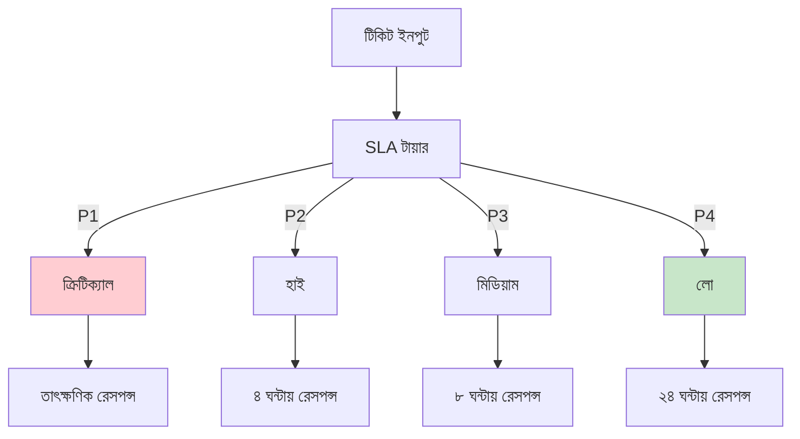
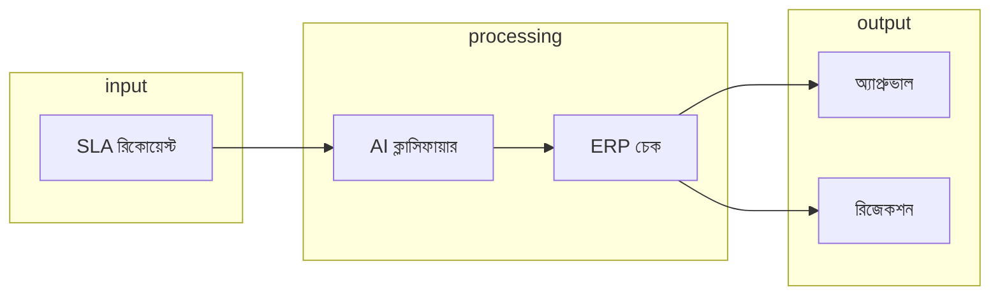

# SLA সিস্টেম - বাংলা

SLA মনিটরিং আর অটোমেটেড অ্যাপ্রুভাল সিস্টেম। SLA মানে Service Level Agreement - কোন সমস্যার জন্য কতক্ষণের মধ্যে রেসপন্স দিতে হবে, কতক্ষণে সমাধান করতে হবে। এই সিস্টেম সেই SLA অনুযায়ী টিকিট শ্রেণীবদ্ধ করে, আর অটোমেটিক অ্যাপ্রুভাল দেয়।

## SLA টায়ার ক্লাসিফিকেশন

টিকিট ইনপুট হলে SLA টায়ার বুঝে নেওয়া হয়। P1 হলো ক্রিটিক্যাল - সার্ভার পুরো ডাউন হলে বা বড় ডেটা লস হলে। P2 হলো হাই - কানেকশন সমস্যা বা সার্ভিস স্লো হলে। P3 হলো মিডিয়াম - মাইনর ইস্যু বা রিসার্চের জন্য। P4 হলো লো - জেনারেল ইনকোয়ারি বা ফিচার রিকোয়েস্ট হলে।

## অটোমেটেড ওয়ার্কফ্লো

ওয়ার্কফ্লো অটোমেটিক চলে। ইনপুটে SLA রিকোয়েস্ট আসে, তারপর AI ক্লাসিফায়ার টায়ার বুঝে নেয়, এরপর ERP চেক হয়, আর শেষে অ্যাপ্রুভাল বা রিজেকশন হয়।

## SLA মেট্রিক্স

প্রতিটা টায়ারের জন্য কিছু মেট্রিক্স আছে। রেসপন্স টাইম, রেজোলিউশন টাইম, আর বট-অ্যাপ্রুভাল রেট। P1-এ রেসপন্স ১৫ মিনিট, রেজোলিউশন ৪ ঘন্টা, আর ৯০% বট অ্যাপ্রুভাল। P4-এ রেসপন্স ২৪ ঘন্টা, রেজোলিউশন ১ সপ্তাহ, আর ৩০% বট অ্যাপ্রুভাল।

| টায়ার | রেসপন্স টাইম | রেজোলিউশন টাইম | বট-অ্যাপ্রুভাল |
|------|---------------|-----------------|--------------|
| P1 | ১৫ মিনিট | ৪ ঘন্টা | ৯০% |
| P2 | ৪ ঘন্টা | ২৪ ঘন্টা | ৭০% |
| P3 | ৮ ঘন্টা | ৭২ ঘন্টা | ৫০% |
| P4 | ২৪ ঘন্টা | ১ সপ্তাহ | ৩০% |