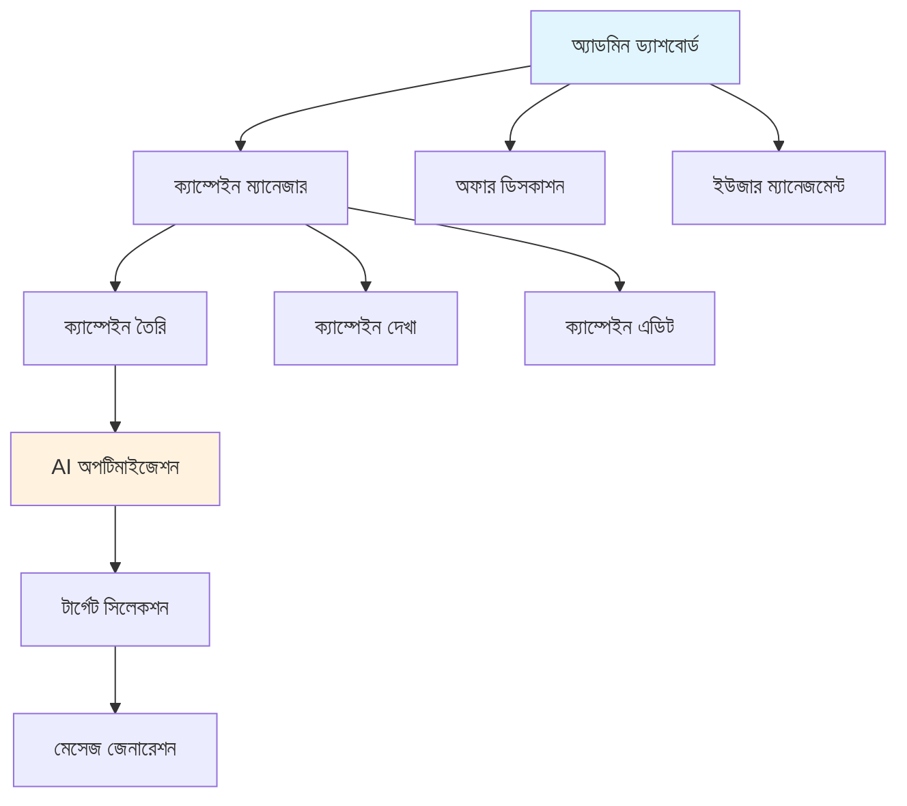
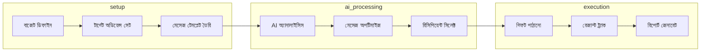

# স্মার্ট গিফট AI - বাংলা

প্রমোশনাল AI-পাওয়ার্ড অ্যাডমিনিস্ট্রেশন প্ল্যাটফর্ম। একটা উদাহরণ দিই - তুমি একটা ই-কমার্স কোম্পানি চালাও, গ্রাহকদের জন্মদিনে গিফট দিতে চাও। সাধারণত ম্যানুয়ালি সিলেক্ট করতে হয় কাকে দেওয়া হবে, কী মেসেজ দেওয়া হবে। এই সিস্টেমে AI সেটা অটোমেটিক করে দেয় - গ্রাহকের পছন্দ বুঝে, বাজেট অনুযায়ী সিলেক্ট করে, আর পার্সোনালাইজড মেসেজ জেনারেট করে।

## সিস্টেম আর্কিটেকচার

সিস্টেমে কয়েকটা মূল কম্পোনেন্ট আছে। অ্যাডমিন ড্যাশবোর্ড থেকে সব ম্যানেজ করা হয়। ক্যাম্পেইন ম্যানেজার দিয়ে ক্যাম্পেইন তৈরি, দেখা, এডিট করা যায়। অফার ডিসকাশন দিয়ে AI-র সাথে কথা বলে অফার ডিজাইন করা যায়। আর ইউজার ম্যানেজমেন্ট দিয়ে গ্রাহকদের ট্র্যাক করা যায়।

## AI ফিচার

AI ফিচারগুলো মূল কাজ করে। Smart Targeting-এ AI অ্যাসিস্ট্যান্ট দিয়ে সেগমেন্ট রিসিপিয়েন্ট সিলেক্ট করা হয়। Personalized Messages-এ টার্গেট অনুযায়ী গিফট মেসেজ কাস্টমাইজ করা হয়। Performance Prediction-এ ক্যাম্পেইনের সাকসেস ফোরকাস্ট করা হয়।

## ক্যাম্পেইন ফ্লো

ক্যাম্পেইন চালানোর প্রসেস কয়েকটা ধাপে হয়। শুরুতে বাজেট ডিফাইন করতে হয়, তারপর টার্গেট অডিয়েন্স সেট করতে হয়, তারপর মেসেজ টেমপ্লেট তৈরি করতে হয়। এরপর AI অ্যানালাইসিস হয়, মেসেজ অপটিমাইজ হয়, রিসিপিয়েন্ট সিলেক্ট হয়। শেষে গিফট পাঠানো হয়, রেজাল্ট ট্র্যাক হয়, আর রিপোর্ট জেনারেট হয়।

