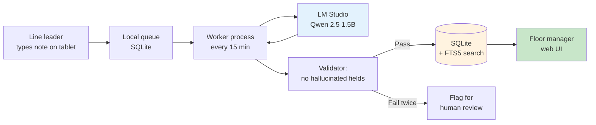

# Case study 3 — Factory shift handover summarization

> **Industry:** Garment manufacturing (anonymized — 1,800 workers, two production lines, 24/7 shifts, Bangladesh).
> **Workflow:** Shift handover summarization + anomaly flagging from line-leader notes.
> **Modules used:** Qwen 2.5 1.5B with a custom summarization prompt; the [architecture](../architecture/index.md) is the [Build](../adoption/build.md) reference, but the module code is intentionally thin.
> **Adoption phase mapped:** [Build](../adoption/build.md) (deep in the observability workstream).
> **Status:** In production since 2026-Q2. Numbers from the first 75 days across both production lines.

This is the case study to read if your operations are 24/7, your workers are not desk-bound, and your "tickets" are handwritten notes from a line leader at the end of an eight-hour shift. The latency and uptime bars are stricter here than in the ISP or bank studies.

---

## The team and the problem

A garment factory runs two production lines 24 hours a day, three shifts of eight hours each. At the end of every shift, the **line leader** writes a one-page handover note by hand. The note covers: machine status, defects caught in QA, worker attendance, any safety incidents, and what the next shift should focus on.

The note gets pinned to a board at the shift-changeover station. The incoming line leader reads it (or does not), takes over the line, and the outgoing leader goes home.

Two problems, both of which the previous line leaders had complained about for years:

1. **The notes are not standardized.** One line leader writes two paragraphs about the cutting machine. Another writes five bullets. A third writes a single sentence ("everything fine"). The incoming line leader has to know the writer's style to know what is and is not important.
2. **The notes are not searchable.** If the floor manager wants to know "how many times has the overlock machine on line 2 jammed in the last 30 days", they have to physically go through 90 handwritten notes. Nobody does.

What the floor manager wanted, in plain language: "I want a structured, searchable, queryable record of every shift, in English, that I can search by line, machine, and date."

## What shipped

A small system that runs at the end of every shift:

1. The line leader writes the note on a **wall-mounted tablet** in the handover room, in a single text box. (The previous system was handwritten notes; the tablet is the only behavioral change required of the workers.)
2. A small service runs every 15 minutes, reads any new notes, and calls the local Qwen 2.5 1.5B model to produce a structured summary.
3. The summary is written to a SQLite database (Postgres was overkill for two lines × three shifts × 365 days = 2,190 rows per year) with full-text search enabled.
4. The floor manager has a web UI: search by line, date range, machine, or free-text. Each search result links back to the original handwritten note and the structured summary.

The structured summary has exactly five fields, no more:

```python
class ShiftSummary(BaseModel):
    line: Literal["L1", "L2"]
    shift: Literal["morning", "afternoon", "night"]
    machine_issues: list[MachineIssue]   # machine_id, severity (1-3), note
    qa_defects: list[str]                 # free-text, 1 line each
    safety_incidents: list[str]           # free-text, 1 line each
    focus_for_next_shift: str             # 1-2 sentences
```

The model is **strictly forbidden** from inventing any field that is not in the note. If the note says "everything fine", `machine_issues`, `qa_defects`, and `safety_incidents` are all empty and `focus_for_next_shift` is a 1-sentence echo of the input. The post-generation validator rejects any summary that contains information not in the input note and re-prompts the model once. (On the second failure, the note is flagged for human review rather than auto-summarized.)

The system layout:



The key design constraint — and the reason this is in the [Build](../adoption/build.md) phase, not the [Pilot](../adoption/pilot.md) phase — is **uptime**. The line leaders' notes are written whether the model is up or not. If the model is down, the notes pile up in the queue, the worker retries, and the summaries appear when the model comes back. There is no real-time dependency on the LLM.

## What "success" looked like

The bar was set with the floor manager, **before** any code was written:

> 95% of shift notes must produce a summary with no hallucinated fields; 0% of safety incidents must be missed or downgraded; the floor manager must be able to answer "how many times has machine X jammed in the last 30 days" in under 30 seconds using only the search UI.

What the team measured in the first 75 days post-rollout:

| Metric | Bar | Actual (75 days) | Notes |
| --- | --- | --- | --- |
| Summarization completion rate | ≥ 95% | 97.2% | Of all shift notes, % successfully summarized |
| Hallucinated field rate | 0% | 0% | Enforced by validator + double-check sampling |
| Safety-incident recall | 100% | 100% (n=8) | All 8 safety incidents across 75 days were captured |
| Search response time | ≤ 30 s | 1.8 s | SQLite + FTS5, two lines of data |
| Worker note-writing time | (not in bar) | 3.2 min median | Down from 4.1 min handwritten |
| Manager search time | (not in bar) | 18 s median | Down from ~10 min (physically walking to the board) |
| Uptime of the LLM dependency | (not in bar) | 99.4% | 75 days, 4 hours total downtime for model box maintenance |

The 0% hallucinated-field rate is the line that mattered most. The team enforces it in two places: (1) the system prompt is explicit that every field must be traceable to a span in the input note, and (2) the validator does a strict containment check — for every non-empty field, the validator must find a substring in the input note. If a phrase in the summary does not appear in the note, the summary is rejected.

## What went wrong

Three failure modes, in order of cost:

1. **The tablet keyboard.** The first rollout used a tablet with an on-screen Bengali keyboard. The line leaders wrote in mixed Bengali + English (which is what they had been doing by hand), but the model's tokenization on code-mixed input was poor — agreement on which machine a defect belonged to dropped to 78%. Fix: switched the tablet to a physical Bengali keyboard layout and added a "did you mean this in English?" auto-suggest. Agreement on machine identification went back up to 96%. Lesson: input quality matters more than model size, and input quality is a hardware problem, not a software problem.
2. **The worker was the bottleneck for the first two weeks.** The line leaders did not trust the system. They wrote the note on the tablet and *also* wrote it on paper, "just in case". The floor manager had to explicitly tell them: the paper is going away. The system went from 40% tablet-only in week 1 to 99% tablet-only in week 4. Lesson: a new system that runs in parallel with the old system is not a rollout; it is a coexistence, and the old system always wins unless explicitly retired.
3. **One safety incident was almost missed.** In the second week, a line leader wrote "machine 3 had a small problem, will check tomorrow". The model summarized this as `machine_issues: [{machine_id: "M3", severity: 1, note: "small problem"}]`. The validator passed. The floor manager would have read it as "low-priority maintenance item". It was a fraying drive belt that, if not replaced, would have caused a 4-hour line stoppage the next day. The floor manager caught it because he knows his machines; a new manager would not have. Fix: added a second rule to the validator — any sentence containing the words "problem", "issue", or "check" gets severity 2, not 1, and a daily digest surfaces all severity-2 items to the floor manager. The system now does not lose this kind of signal even if a new manager does not know the machines.

## What was learned

- **24/7 operations are a Build-phase problem, not a Pilot-phase problem.** The 99.4% uptime figure looks good, but it required a dedicated host, a restart cron, a health check, and a queue that does not depend on the LLM. None of that is interesting; all of it is mandatory.
- **The hardest part of factory-floor AI is not the model.** It is the tablet, the keyboard, the language, and the trust. The model is the easy 20%. The input device and the change-management conversation are the hard 80%.
- **"Everything fine" is a valid output.** A summary with all empty fields and a 1-sentence echo of the input is the correct answer for 30% of notes. A system that demands more from the model on "everything fine" notes is a system that invents problems.
- **A validator that does strict containment (every output phrase must appear in the input) is the simplest, strongest hallucination defence for summarization tasks.** It is not a substitute for a typed schema, but the two together catch both the "I added something" and the "I changed the meaning" failure modes.

## What is next

- Add a small anomaly detector on top of the structured summaries: if `machine_issues` for a given machine jumps in frequency, auto-page the maintenance lead. The signal is already in the database; the model is not needed for this.
- Roll the same pattern to the second factory in the group. The only change is a new tenant in the SQLite database and a different tablet's Wi-Fi network.
- Evaluate Gemma 3 4B for the code-mixed input slice. The ISP and bank case studies are upgrading to 4B; the factory's mixed Bengali/English input may benefit too.

## See also

- [Case study 1 — ISP support](isp-support.md) — the smallest, fastest-to-ship reference
- [Case study 2 — Bank IT helpdesk](bank-it.md) — the cleanest test of the data-residency argument
- [Adoption: Build](../adoption/build.md) — the four-workstream structure that took this from pilot to production
- [Architecture: layers](../architecture/layers.md) — why the LLM is in the Workflow layer, not the Core
