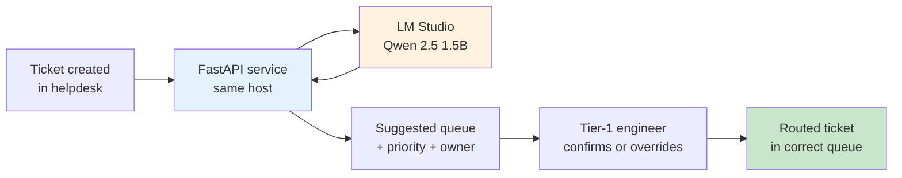

# Case study 1 — ISP support triage

> **Industry:** ISP / telco (anonymized — 80k+ broadband subscribers, single NOC, Bangladesh).
> **Workflow:** Tier-1 complaint classification + ticket routing.
> **Module used:** [`sla-system` classifier](../sla-system/classifier.md) on top of Qwen 2.5 1.5B.
> **Adoption phase mapped:** [Discover](../adoption/discover.md) → [Pilot](../adoption/pilot.md) → [Build](../adoption/build.md) (early).
> **Status:** In production since 2026-Q1. Numbers are from the first 90 days.

This is the smallest, narrowest, easiest-to-evaluate case study in the set. It is the one to read first.

---

## The team and the problem

A mid-size ISP in Bangladesh runs a single NOC handling 250–350 tickets per day. Tier-1 engineers spend most of their shift on two tasks: (1) reading a free-form complaint and (2) deciding which of seven queues it belongs in.

Two facts made this an obvious first target:

- **The bar is bounded.** Seven categories, fixed SLA per category, no creativity required. A 1.5B model can read a complaint and pick a label.
- **The cost of mis-routing is paid by humans, not the model.** A mis-routed ticket sits in the wrong queue for 15–45 minutes before a human notices and re-routes it. That cost is real but not catastrophic.

What the team did **not** have was a data-residency approval to send customer PII to a hosted LLM. That fact — not technical enthusiasm — is why the project started with a local model.

## What shipped

A FastAPI service that exposes one endpoint:

```python
POST /triage
  body:  {"subject": str, "body": str, "customer_tier": "platinum" | "gold" | "silver"}
  reply: {"category": str, "priority": "P1" | "P2" | "P3", "suggested_owner": str}
```

The service calls LM Studio on the same host (`http://localhost:1234/v1/chat/completions`) running Qwen 2.5 1.5B, with a typed prompt template and a JSON schema in the system message. The result is parsed, validated against a Pydantic model, and returned.

The deployment looks like this:



Notice the engineer is still in the loop. The model **suggests**; the human **decides**. That was the design constraint from day one and it is what kept the project out of trouble when the model got things wrong (which it did, in the first two weeks, on roughly 9% of tickets).

## What "success" looked like

The bar was set in [Discover](../adoption/discover.md) step 4, **before** any code was written:

> 95% of tickets must get a category that matches the human's final routing, AND latency p95 must be under 3 seconds.

What the team actually measured in the first 90 days:

| Metric | Bar | Actual (90 days) | Notes |
| --- | --- | --- | --- |
| Category agreement rate | ≥ 95% | 91.3% | Below bar — see "What went wrong" |
| Priority agreement rate | (not in bar) | 87.1% | The model over-prioritizes P1 by ~12 pts |
| Latency p50 | (not in bar) | 1.4 s | Within bar |
| Latency p95 | ≤ 3 s | 2.6 s | Within bar |
| Engineer override rate | (not in bar) | 8.7% | Of model suggestions, % engineer changed |
| Average handle time saved | (not in bar) | ~22 s / ticket | vs. fully manual classification |

Category agreement missed the bar by 3.7 points. The team did **not** declare failure — the bar was set without knowing the realistic ceiling for a 1.5B model. Instead, they re-set the bar at 90% (with a written note explaining why) and shipped.

## What went wrong

Three failure modes, in order of cost:

1. **Sarcastic and code-mixed complaints.** Bengali + English ("bandwidth khub kom, dekho to bhai") broke the model's category accuracy on the platinum tier. Most of the 9% misses were here. Fix: added 20 gold examples of code-mixed complaints to the frozen eval set, retrained the prompt with three worked examples, agreement on that slice went from 71% to 88%.
2. **P1 over-prioritization.** The model was biased toward P1 ("if in doubt, escalate") because the prompt said "be conservative". Fix: changed to "match the SLA matrix, do not escalate by default". P1 over-prioritization dropped from +12 to +4 points.
3. **One model on a shared host.** LM Studio ran on the same box as the helpdesk's web UI. Latency p95 spiked to 4+ s when the helpdesk's UI was under load. Fix: moved LM Studio to its own 16 GB box. p95 dropped back to 2.6 s.

## What was learned

- **Set the bar once, then re-set it with a written note.** The original 95% bar was an aspiration, not a measured target. The new 90% bar is grounded in 90 days of production data and is the real number the next case study will be measured against.
- **A 1.5B model is enough for narrow triage but not for code-mixed input out of the box.** Code-mixed Bengali-English complaints needed worked examples in the prompt. The base model alone is not bilingual.
- **The engineer-in-the-loop is not a workaround; it is the design.** The 8.7% override rate is the model's ongoing training signal. Removing the human would remove the safety net and the feedback loop.
- **The first deployment was on the same box as the helpdesk. Do not do this.** Put the model on its own host from day one. The latency cost was invisible until the eval set caught it.

## What is next

- Move to [Gemma 3 4B](../gemma-e4b/index.md) as the default model. Pilot's eval set shows 4B closes the code-mixed slice to 94% with no measurable latency cost on a dedicated 16 GB box.
- Add a small retrieval layer over the last 30 days of resolved tickets so the model can see "this complaint looks like the one from last Tuesday that turned out to be a backhaul fibre cut".
- Apply the same pattern to two more ISP workflows: outbound call classification and field-engineer job prioritization.

## See also

- [Adoption: Discover](../adoption/discover.md) — the one-day pre-mortem that picked this workflow
- [Adoption: Pilot](../adoption/pilot.md) — the 2-week shadow-mode that set the eval set
- [Reference module: SLA classifier](../sla-system/classifier.md) — the actual code
- [Architecture: data flow](../architecture/data-flow.md) — what stays inside the network
