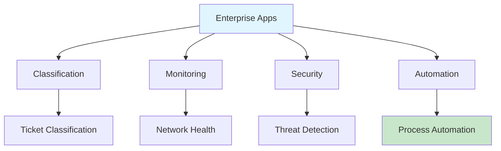

# Enterprise Apps Overview

Enterprise-level applications using local LLM for privacy-first operations.

## App Categories

## Common Features

- **Privacy-First**: All data processed locally
- **Real-time Processing**: Immediate response to requests
- **Scalable Architecture**: Handle increasing load
- **Integration Ready**: Connect with existing systems

## Application List

| App | Purpose | Model |
|-----|---------|-------|
| Model Use Class | Core classification | Qwen 2.5 |
| Network Monitor | System monitoring | Gemma 4 |
| Security Analyzer | Threat detection | Gemma 4 |
| Ticket Classifier | Support automation | Qwen 2.5 |