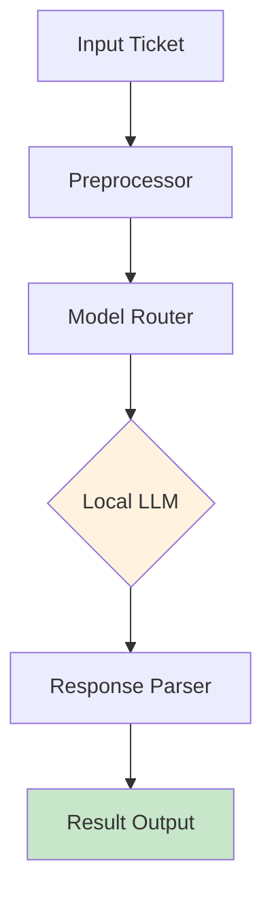
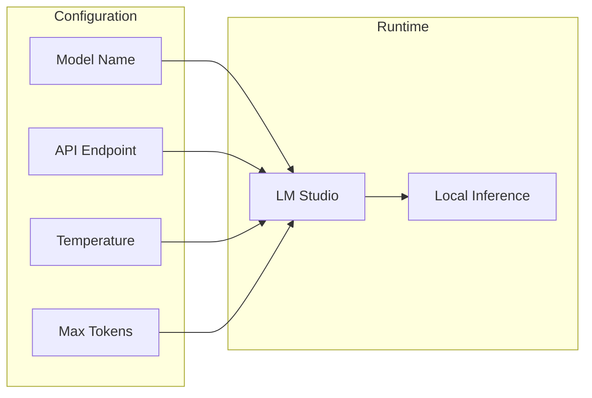

# Model Use Class

Central classification module for enterprise ticket handling.

## Architecture



## Model Configuration



## Class Implementation

```python
class ModelUseClass:
    def __init__(self, model_name, api_endpoint):
        self.model = model_name
        self.endpoint = api_endpoint
        self.temperature = 0.3
        self.max_tokens = 500
    
    def classify(self, ticket_text):
        prompt = self.build_prompt(ticket_text)
        response = self.call_llm(prompt)
        return self.parse_response(response)
```

## Configuration Options

| Parameter | Default | Description |
|-----------|---------|-------------|
| model_name | Qwen2.5-1.5B | Model identifier |
| api_endpoint | localhost:1234 | LM Studio server |
| temperature | 0.3 | Response randomness |
| max_tokens | 500 | Response length limit |