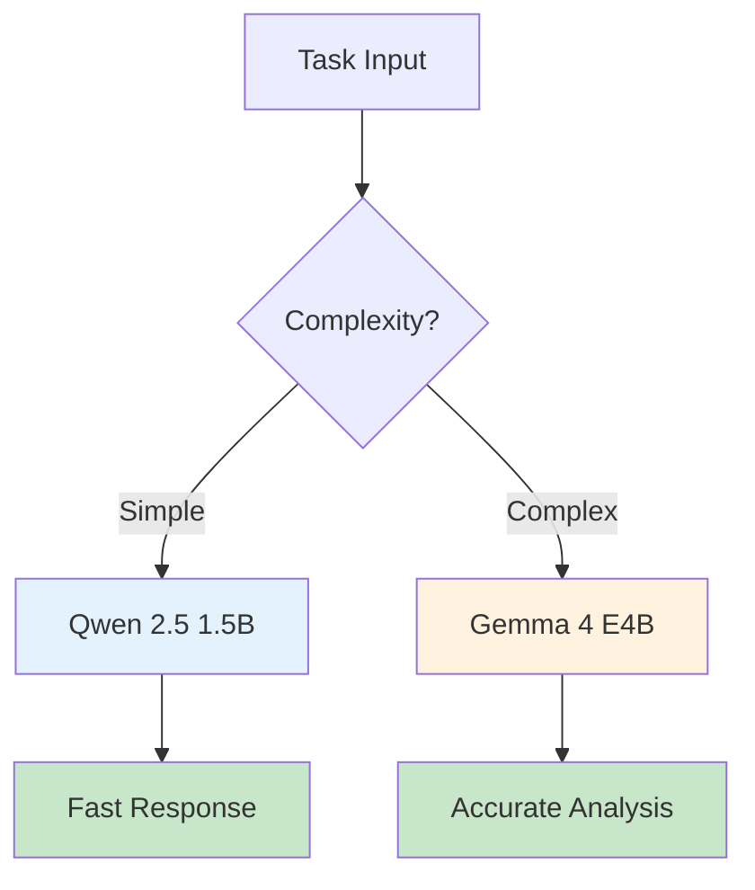
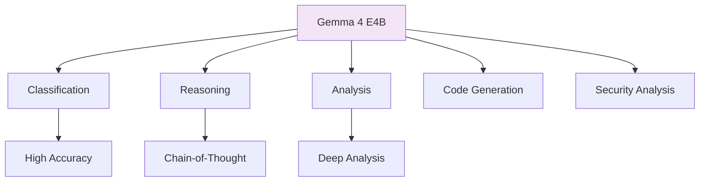
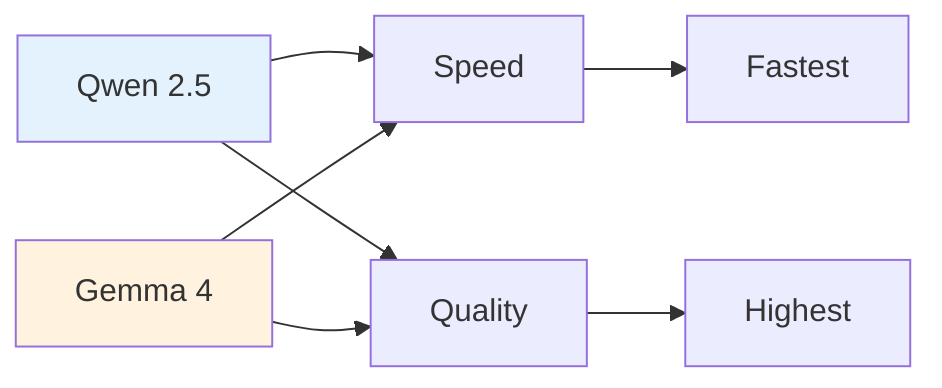

# Gemma E4B Demos

Google's Gemma 4-bit quantized model offers higher quality for complex reasoning tasks.

## Model Comparison



## Gemma Capabilities



## When to Use Gemma

| Task Type | Qwen | Gemma |
|-----------|------|-------|
| Fast classification | Yes | Yes |
| Multi-step reasoning | No | Yes |
| Security analysis | No | Yes |
| Complex patterns | No | Yes |

## Performance Trade-offs



## Demo Scripts

```bash
# Quick classification demo
python gemma-4-e4b-llm_mini_demo_5cases.py

# Full stress test
python gemma-4-e4b-llm_stress_test_class.py

# Security analysis
python gemma-4-e4b-cybersec_analysis.py

# Network monitoring
python gemma-4-e4b-network_monitor.py
```

## Setup

```bash
# 1. Download Gemma 4 E4B from LM Studio
# 2. Load model in LM Studio
# 3. Start server on port 1234
# 4. Run demos
```

## Results Comparison

```
Task: Classify 55 ISP complaints

Qwen 2.5 1.5B:
- Accuracy: 85%
- Avg Time: 0.6s
- Total: 33s

Gemma 4 E4B:
- Accuracy: 92%
- Avg Time: 1.2s
- Total: 66s
```
