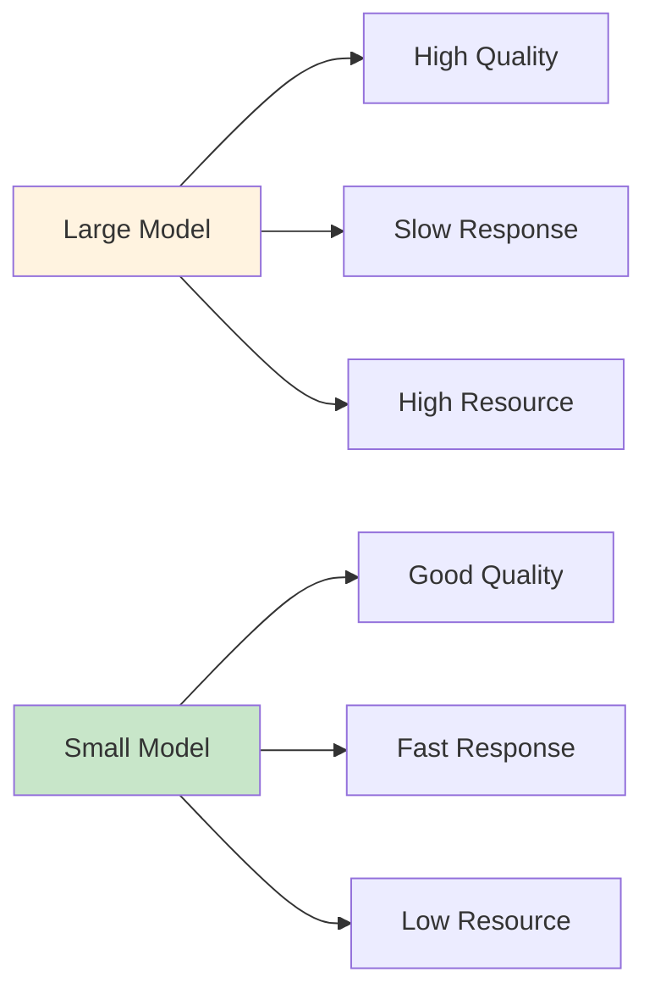
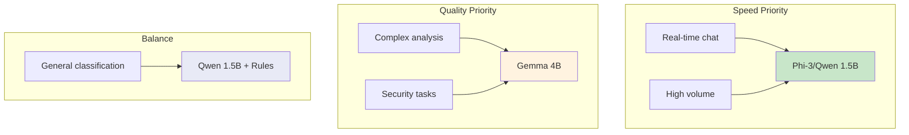
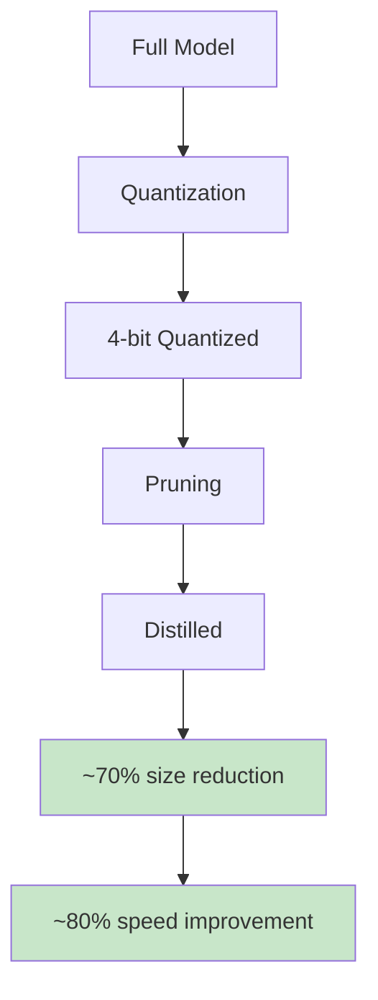
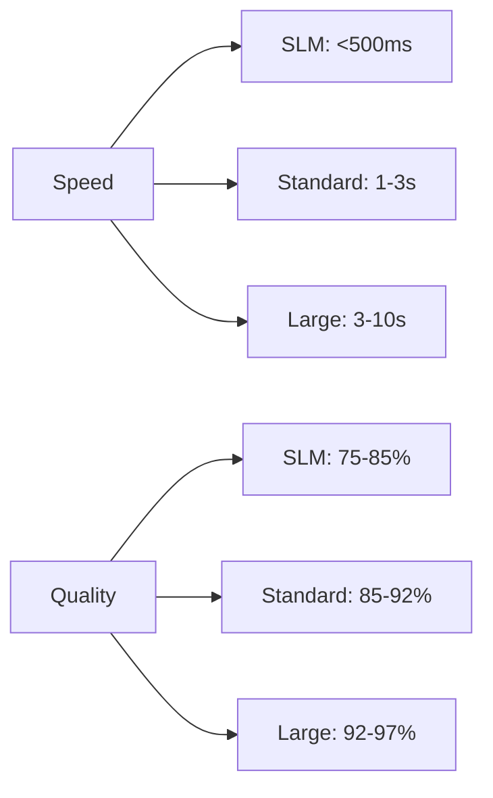

# SLM Apps

Small Language Models (SLMs) optimized for speed and resource efficiency.

## SLM Philosophy



## Resource Comparison

| Model | Size | RAM | VRAM | Speed |
|-------|------|-----|------|-------|
| Qwen 7B | 7GB | 8GB | 6GB | Medium |
| Qwen 1.5B | 1.5GB | 4GB | 2GB | Fast |
| Gemma 4B | 2.5GB | 6GB | 4GB | Medium |
| Phi-3 Mini | 2GB | 4GB | 2GB | Very Fast |

## Use Case Matrix



## SLM Optimization



## When to Use SLM

| Scenario | Recommendation |
|----------|----------------|
| <100ms latency needed | ✅ SLM |
| Resource constrained | ✅ SLM |
| Simple tasks | ✅ SLM |
| Complex reasoning | ❌ Use Gemma |
| Security analysis | ❌ Use Gemma |

## Speed vs Quality Tradeoff



## Demo Scripts

```bash
# Run SLM demo
python apps-slm.py

# Compare with standard
python apps-standard.py
```

## Best SLM Candidates

| Model | Context | Strength |
|-------|---------|----------|
| Phi-3 Mini | 4K | Code, fast tasks |
| Qwen 1.5B | 8K | General, fast |
| Gemma 2B | 8K | Balanced |
| TinyLlama | 2K | Prototyping |

## Next Steps

- [Standard Apps](./standard-apps.md) - Full Gemma demos
- [Enterprise Apps](../enterprise-apps/index.md) - Production setup