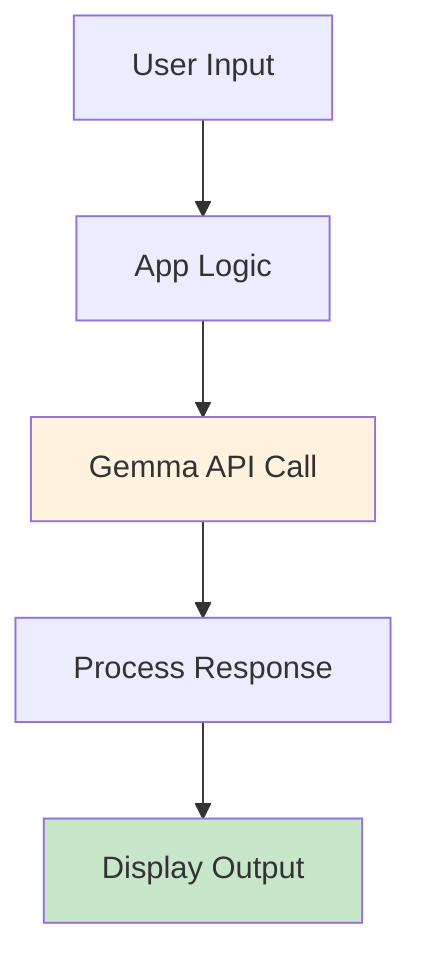
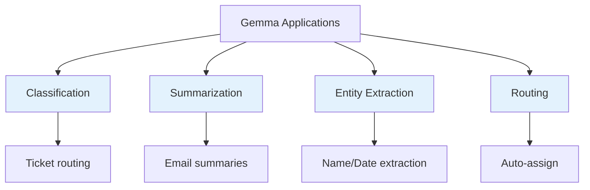

# Standard Apps

Gemma-powered applications using standard LLM calls.

## Standard Architecture



## Demo Scripts

| Script | Purpose | Speed |
|--------|---------|-------|
| `llm_quick_demo_base.py` | Basic Qwen demo | Fast |
| `llm_mini_demo_5cases.py` | Quick classification | Fast |
| `llm_stress_test_class.py` | Load testing | Medium |
| `llm_hierarchical_demo.py` | Multi-level routing | Medium |

## Code Pattern

```python
import requests

def call_gemma(prompt, model="gemma-4b-e4b"):
    url = "http://localhost:1234/v1/chat/completions"
    payload = {
        "model": model,
        "messages": [{"role": "user", "content": prompt}],
        "temperature": 0.7
    }
    response = requests.post(url, json=payload)
    return response.json()["choices"][0]["message"]["content"]
```

## Use Cases



## Performance Characteristics

| Aspect | Value |
|--------|-------|
| Latency | 1-3 seconds |
| Quality | High (4-bit optimized) |
| Context | 8K tokens |
| Accuracy | 90%+ on classification |

## Comparison: Qwen vs Gemma

| Task | Qwen 1.5B | Gemma 4B E4B |
|------|-----------|--------------|
| Simple classification | ✅ Fast | ✅ Good |
| Complex reasoning | ❌ Limited | ✅ Excellent |
| Security analysis | ❌ Poor | ✅ Great |
| Long context | ❌ 2K | ✅ 8K |

## Best Practices

| Tip | Description |
|-----|-------------|
| Batch requests | Process multiple at once |
| Cache responses | Avoid repeated calls |
| Use streaming | Better UX for long outputs |
| Monitor latency | Track performance |

## Next Steps

- [SLM Apps](./slm-apps.md) - Smaller, faster models
- [MLOps](../mlops/index.md) - Production deployment