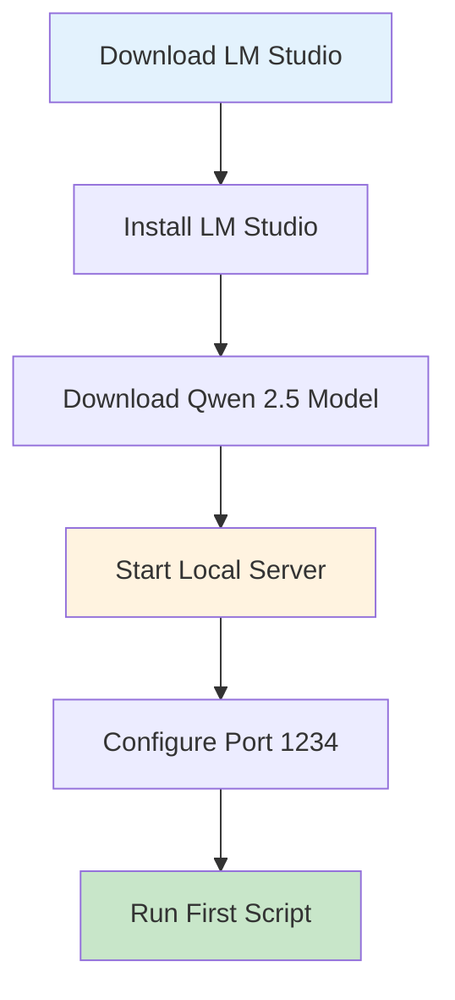
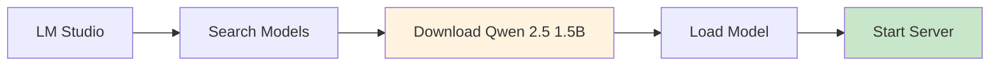
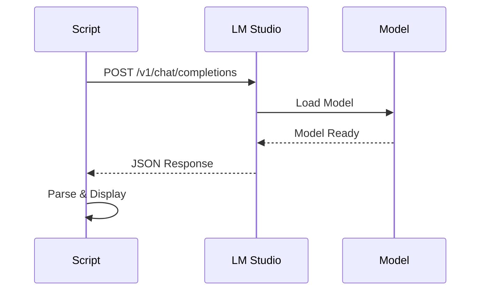
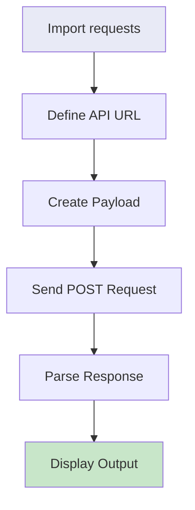

# Getting Started

This guide helps you set up LM Studio and run your first local LLM script. Perfect for beginners exploring enterprise automation.

## Setup Flow



## Model Download Process



## Script Execution Sequence



## Prerequisites

- Windows 10/11 or macOS
- 8GB+ RAM recommended
- 4GB+ VRAM for 4-bit models

## Quick Start Commands

```bash
# 1. Download LM Studio from lmstudio.ai
# 2. Search and download "Qwen 2.5 1.5B"
# 3. Start server (click "Start Server" button)
# 4. Run your first script

python llm_quick_demo_base.py
```

## First Script Structure



## Next Steps

- Try [ISP Classifier](../isp-classifier/index.md) - Classify customer complaints
- Explore [Qwen + RAG](../qwen-rag/index.md) - Knowledge-augmented responses
- Check [Gemma E4B](../gemma-e4b/index.md) - Advanced reasoning
